# Phase 2: Authentication (BetterAuth-Compatible)

## Overview

This phase implements the complete authentication system for Familiarise Mobile. The mobile app uses a **custom Dart Frog backend** that is **schema-compatible with BetterAuth** — both the web (Next.js + BetterAuth) and mobile (Flutter + Dart Frog) applications share the **same Supabase PostgreSQL database** and the **same Prisma schema** (symlinked between repos).

This means two independent auth implementations read and write the same database tables. A user who registers on mobile can immediately sign in on web, and vice versa.

**Prerequisites:** Phase 1 (Core Infrastructure) must be completed
**Platforms:** iOS 14+, Android API 24+
**Related:** [BetterAuth Migration Decision](/docs/roadmap/auth/betterauth-migration.md) (web repo)

---

## Table of Contents

- [Architecture Overview](#architecture-overview)
- [Shared Database Schema](#shared-database-schema)
- [Schema Compatibility Matrix](#schema-compatibility-matrix)
- [Authentication Flows](#authentication-flows)
- [Session Management](#session-management)
- [Frontend (Flutter) Implementation](#frontend-flutter-implementation)
- [Backend (Dart Frog) Implementation](#backend-dart-frog-implementation)
- [Profile & Account Management](#profile--account-management)
- [Security Architecture](#security-architecture)
- [Testing Strategy](#testing-strategy)

---

## Architecture Overview

### High-Level System Diagram

```
┌──────────────────────────────────────────────────────────────────────────────────┐
│                              SHARED INFRASTRUCTURE                                │
│                                                                                   │
│  ┌────────────────────────────────────────────────────────────────────────────┐   │
│  │                     Supabase PostgreSQL (shared DB)                         │   │
│  │                                                                            │   │
│  │   ┌──────────┐  ┌──────────┐  ┌──────────┐  ┌──────────────────┐         │   │
│  │   │  user     │  │ account  │  │ session  │  │  verification    │         │   │
│  │   │  (users)  │  │(accounts)│  │(sessions)│  │(verificationtokens)│       │   │
│  │   └────▲─────┘  └────▲─────┘  └────▲─────┘  └───────▲──────────┘         │   │
│  │        │              │              │                │                     │   │
│  └────────┼──────────────┼──────────────┼────────────────┼─────────────────────┘   │
│           │              │              │                │                         │
│     ┌─────┴──────────────┴──────────────┴────────────────┴──────────┐             │
│     │                    Prisma ORM (shared schema)                   │             │
│     └──────────┬─────────────────────────────────┬──────────────────┘             │
│                │                                  │                                │
└────────────────┼──────────────────────────────────┼────────────────────────────────┘
                 │                                  │
    ┌────────────┴────────────┐       ┌─────────────┴───────────────┐
    │   MOBILE APPLICATION    │       │     WEB APPLICATION          │
    │                         │       │                              │
    │  ┌──────────────────┐   │       │  ┌────────────────────────┐ │
    │  │   Flutter App    │   │       │  │   Next.js App          │ │
    │  │   (Frontend)     │   │       │  │   (Frontend)           │ │
    │  └────────┬─────────┘   │       │  └──────────┬─────────────┘ │
    │           │              │       │             │                │
    │  ┌────────▼─────────┐   │       │  ┌──────────▼─────────────┐ │
    │  │   Dart Frog      │   │       │  │   BetterAuth           │ │
    │  │   (Custom Auth)  │   │       │  │   (Auth Framework)     │ │
    │  │                  │   │       │  │                        │ │
    │  │  • BCrypt hash   │   │       │  │  • BCrypt hash         │ │
    │  │  • JWT tokens    │   │       │  │  • Cookie sessions     │ │
    │  │  • Bearer auth   │   │       │  │  • OAuth providers     │ │
    │  └──────────────────┘   │       │  │  • Enterprise plugins  │ │
    │                         │       │  └────────────────────────┘ │
    └─────────────────────────┘       └────────────────────────────┘
```

### Key Architecture Decisions

| Decision | Choice | Rationale |
|----------|--------|-----------|
| Mobile auth implementation | Custom Dart Frog (not BetterAuth SDK) | BetterAuth is TypeScript-only; Dart Frog gives us full control |
| Database sharing | Same PostgreSQL via Prisma symlink | Single source of truth for users, sessions, accounts |
| Password hashing | BCrypt on both sides | Must match; BetterAuth defaults to scrypt but can be configured for BCrypt |
| Mobile session transport | JWT Bearer token in Authorization header | Mobile apps can't use HTTP-only cookies like web |
| Web session transport | Cookie-based (BetterAuth default) | Standard for web applications |
| Schema migration | Align Prisma schema to BetterAuth conventions | BetterAuth field mapping as fallback, but prefer clean migration |

### Why Two Independent Auth Implementations?

BetterAuth is a TypeScript/Node.js framework — it cannot run on Dart Frog. Rather than proxying every mobile auth request through the Next.js web server (adding latency and a single point of failure), the mobile backend implements the same auth logic directly and reads/writes the same database tables. This gives us:

1. **Independence** — Mobile and web can deploy separately
2. **Performance** — No extra network hop through the web server
3. **Flexibility** — Mobile can add mobile-specific auth features (biometrics, device tokens)
4. **Resilience** — Web downtime doesn't affect mobile auth

The contract between them is the **database schema** — as long as both write compatible data to the same tables, cross-platform authentication works seamlessly.

---

## Shared Database Schema

### BetterAuth's 4 Core Tables

BetterAuth requires 4 core tables to function. Our Prisma schema must align with these. After migration, the schema will match BetterAuth conventions:

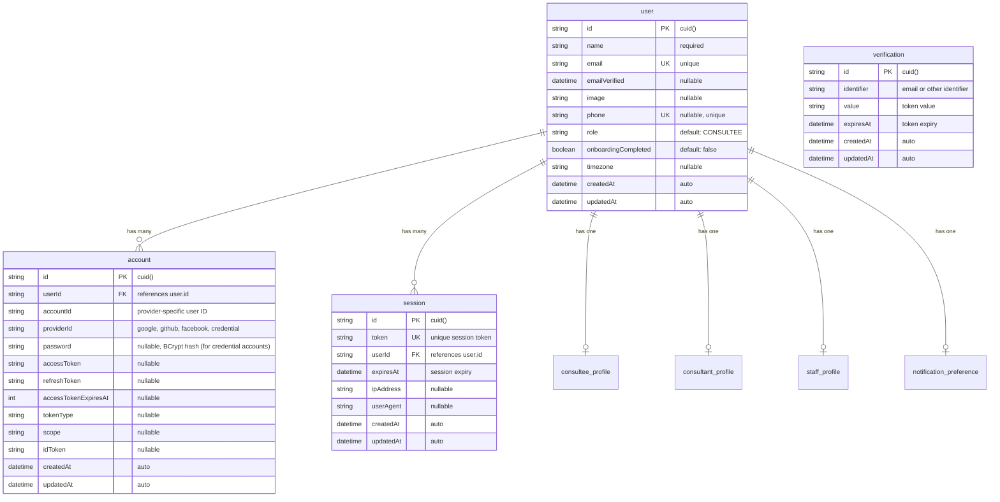

### Current Schema vs BetterAuth Schema

The current Prisma schema uses NextAuth conventions. The migration to BetterAuth requires the following changes:

#### User Table (`users`)

```
Current (NextAuth)                    → Target (BetterAuth-Compatible)
─────────────────────────────────────────────────────────────────────
id (cuid)                             → id (cuid) — NO CHANGE
name (String)                         → name (String) — NO CHANGE
email (String, unique)                → email (String, unique) — NO CHANGE
emailVerified (DateTime?)             → emailVerified (Boolean) — TYPE CHANGE
image (String?)                       → image (String?) — NO CHANGE
phone (String?, unique)               → phone (String?, unique) — NO CHANGE ★
password (String?)                    → REMOVE from User — moves to Account table
passwordResetToken (String?)          → REMOVE — handled by verification table
passwordResetExpires (DateTime?)      → REMOVE — handled by verification table
role (UserRole?)                      → role (UserRole?) — NO CHANGE ★
onboardingCompleted (Boolean?)        → onboardingCompleted (Boolean?) — NO CHANGE ★
timezone (String?)                    → timezone (String?) — NO CHANGE ★
createdAt (DateTime)                  → createdAt (DateTime) — NO CHANGE
updatedAt (DateTime)                  → updatedAt (DateTime) — NO CHANGE

★ = BetterAuth additionalFields (custom fields beyond BetterAuth's core)
```

#### Account Table (`accounts`)

```
Current (NextAuth)                    → Target (BetterAuth-Compatible)
─────────────────────────────────────────────────────────────────────
id (cuid)                             → id (cuid) — NO CHANGE
userId (String)                       → userId (String) — NO CHANGE
type (String)                         → REMOVE — BetterAuth doesn't use this
provider (String)                     → providerId (String) — RENAME
providerAccountId (String)            → accountId (String) — RENAME
refresh_token (String?)               → refreshToken (String?) — camelCase
access_token (String?)                → accessToken (String?) — camelCase
expires_at (Int?)                     → accessTokenExpiresAt (Int?) — RENAME
token_type (String?)                  → tokenType (String?) — camelCase
scope (String?)                       → scope (String?) — NO CHANGE
id_token (String?)                    → idToken (String?) — camelCase
session_state (String?)               → REMOVE — BetterAuth doesn't use this
                                      → password (String?) — NEW (for credential auth)
                                      → createdAt (DateTime) — NEW
                                      → updatedAt (DateTime) — NEW

Unique constraint changes:
  @@unique([provider, providerAccountId]) → @@unique([providerId, accountId])
```

#### Session Table (`sessions`)

```
Current (NextAuth)                    → Target (BetterAuth-Compatible)
─────────────────────────────────────────────────────────────────────
id (cuid)                             → id (cuid) — NO CHANGE
sessionToken (String, unique)         → token (String, unique) — RENAME
userId (String)                       → userId (String) — NO CHANGE
expires (DateTime)                    → expiresAt (DateTime) — RENAME
                                      → ipAddress (String?) — NEW
                                      → userAgent (String?) — NEW
                                      → createdAt (DateTime) — NEW
                                      → updatedAt (DateTime) — NEW
```

#### Verification Table (`verificationtokens`)

```
Current (NextAuth)                    → Target (BetterAuth-Compatible)
─────────────────────────────────────────────────────────────────────
identifier (String)                   → identifier (String) — NO CHANGE
token (String, unique)                → value (String) — RENAME
expires (DateTime)                    → expiresAt (DateTime) — RENAME
                                      → id (String) — NEW (primary key)
                                      → createdAt (DateTime) — NEW
                                      → updatedAt (DateTime) — NEW

Note: BetterAuth adds an `id` primary key. Current NextAuth uses
      @@unique([identifier, token]) as composite key.
```

### Password Storage Migration

**Critical change:** BetterAuth stores passwords in the **Account** table, not the **User** table.

In BetterAuth, when a user registers with email/password:
- A `user` record is created (no password field)
- An `account` record is created with `providerId: "credential"`, `accountId: <email>`, `password: <bcrypt_hash>`

The Prisma migration must:
1. For each user with a non-null `password` field, create a corresponding `account` record with `providerId: "credential"` and the password hash moved to `account.password`
2. Remove the `password`, `passwordResetToken`, and `passwordResetExpires` columns from the `user` table

---

## Schema Compatibility Matrix

This matrix shows every column in BetterAuth's core tables and how they map to our current Prisma schema:

### User Table

| BetterAuth Column | Type | Required | Current Prisma Column | Status | Notes |
|---|---|---|---|---|---|
| `id` | String | Yes | `id` | SAME | cuid() |
| `name` | String | Yes | `name` | SAME | |
| `email` | String | Yes | `email` | SAME | unique |
| `emailVerified` | Boolean | No | `emailVerified` (DateTime?) | TYPE CHANGE | DateTime → Boolean |
| `image` | String | No | `image` | SAME | |
| `createdAt` | DateTime | Yes | `createdAt` | SAME | |
| `updatedAt` | DateTime | Yes | `updatedAt` | SAME | |
| `phone` | String | No | `phone` | SAME | additionalFields |
| `role` | Enum | No | `role` | SAME | additionalFields |
| `onboardingCompleted` | Boolean | No | `onboardingCompleted` | SAME | additionalFields |
| `timezone` | String | No | `timezone` | SAME | additionalFields |

### Account Table

| BetterAuth Column | Type | Required | Current Prisma Column | Status | Notes |
|---|---|---|---|---|---|
| `id` | String | Yes | `id` | SAME | |
| `userId` | String | Yes | `userId` | SAME | FK to user |
| `accountId` | String | Yes | `providerAccountId` | RENAME | |
| `providerId` | String | Yes | `provider` | RENAME | |
| `password` | String | No | N/A (on User table) | MIGRATE | Move from user.password |
| `accessToken` | String | No | `access_token` | camelCase | |
| `refreshToken` | String | No | `refresh_token` | camelCase | |
| `accessTokenExpiresAt` | Int | No | `expires_at` | RENAME | |
| `idToken` | String | No | `id_token` | camelCase | |
| `scope` | String | No | `scope` | SAME | |
| `tokenType` | String | No | `token_type` | camelCase | |
| `createdAt` | DateTime | Yes | N/A | ADD | |
| `updatedAt` | DateTime | Yes | N/A | ADD | |

### Session Table

| BetterAuth Column | Type | Required | Current Prisma Column | Status | Notes |
|---|---|---|---|---|---|
| `id` | String | Yes | `id` | SAME | |
| `token` | String | Yes | `sessionToken` | RENAME | unique |
| `userId` | String | Yes | `userId` | SAME | FK to user |
| `expiresAt` | DateTime | Yes | `expires` | RENAME | |
| `ipAddress` | String | No | N/A | ADD | |
| `userAgent` | String | No | N/A | ADD | |
| `createdAt` | DateTime | Yes | N/A | ADD | |
| `updatedAt` | DateTime | Yes | N/A | ADD | |

### Verification Table

| BetterAuth Column | Type | Required | Current Prisma Column | Status | Notes |
|---|---|---|---|---|---|
| `id` | String | Yes | N/A | ADD | Primary key |
| `identifier` | String | Yes | `identifier` | SAME | |
| `value` | String | Yes | `token` | RENAME | |
| `expiresAt` | DateTime | Yes | `expires` | RENAME | |
| `createdAt` | DateTime | Yes | N/A | ADD | |
| `updatedAt` | DateTime | Yes | N/A | ADD | |

### Migration Strategy

BetterAuth supports **field mapping** as an alternative to renaming columns. This means we can configure BetterAuth on the web side to read the existing column names:

```typescript
// BetterAuth field mapping (web side) — alternative to Prisma migration
const auth = betterAuth({
  database: prismaAdapter(prisma, { provider: "postgresql" }),
  session: {
    modelName: "Session",
    fields: {
      token: "sessionToken",
      expiresAt: "expires",
    },
  },
  account: {
    modelName: "Account",
    fields: {
      accountId: "providerAccountId",
      providerId: "provider",
      accessToken: "access_token",
      refreshToken: "refresh_token",
      accessTokenExpiresAt: "expires_at",
      idToken: "id_token",
    },
  },
});
```

However, the **recommended approach** is a clean Prisma migration to align column names with BetterAuth conventions, as field mapping adds complexity and the Dart Frog side would also need to maintain the same mappings.

---

## Authentication Flows

### Email/Password Sign-Up

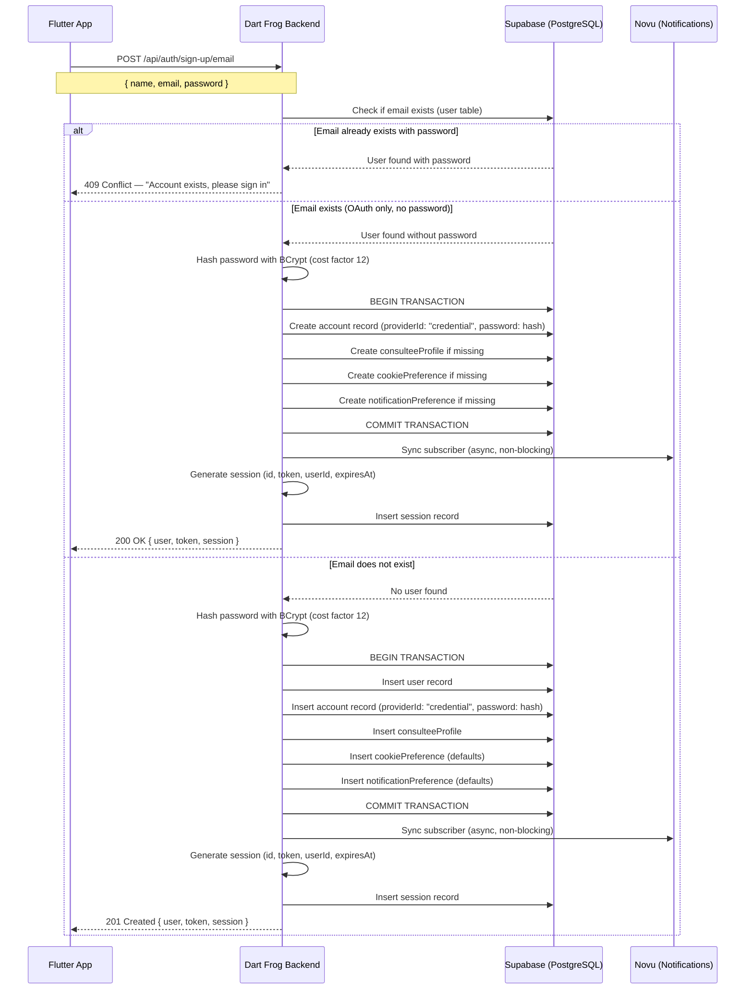

#### Endpoint Specification

```
POST /api/auth/sign-up/email

Request Body:
{
  "name": "string (required, 2-100 chars)",
  "email": "string (required, valid email)",
  "password": "string (required, min 8 chars, 1 uppercase, 1 number)"
}

Success Response (201 Created):
{
  "user": {
    "id": "cuid",
    "name": "John Doe",
    "email": "john@example.com",
    "emailVerified": null,
    "image": null,
    "role": "CONSULTEE",
    "onboardingCompleted": false
  },
  "token": "jwt-token-string",
  "session": {
    "id": "session-cuid",
    "expiresAt": "2026-03-04T00:00:00.000Z"
  }
}

Error Responses:
  400 Bad Request — Validation failed
  409 Conflict — Account already exists with password
  500 Internal Server Error
```

#### Password Hashing Compatibility

Both Dart Frog and BetterAuth **must** use the same hashing algorithm with the same parameters:

| Parameter | Dart Frog (Mobile) | BetterAuth (Web) |
|---|---|---|
| Algorithm | BCrypt | BCrypt (configured, not default) |
| Cost Factor | 12 | 12 |
| Dart Package | `bcrypt` (pub.dev) | `bcrypt` (npm) |
| Hash Format | `$2b$12$...` | `$2b$12$...` |

BetterAuth defaults to **scrypt**. The web configuration must explicitly set BCrypt:

```typescript
// BetterAuth config (Next.js side) — MUST match Dart Frog
import bcrypt from "bcrypt";

export const auth = betterAuth({
  emailAndPassword: {
    enabled: true,
    password: {
      hash: (password) => bcrypt.hash(password, 12),
      verify: ({ password, hash }) => bcrypt.compare(password, hash),
    },
  },
});
```

```dart
// Dart Frog side
import 'package:bcrypt/bcrypt.dart';

final hash = BCrypt.hashpw(password, BCrypt.gensalt(logRounds: 12));
final isValid = BCrypt.checkpw(password, storedHash);
```

### Email/Password Sign-In

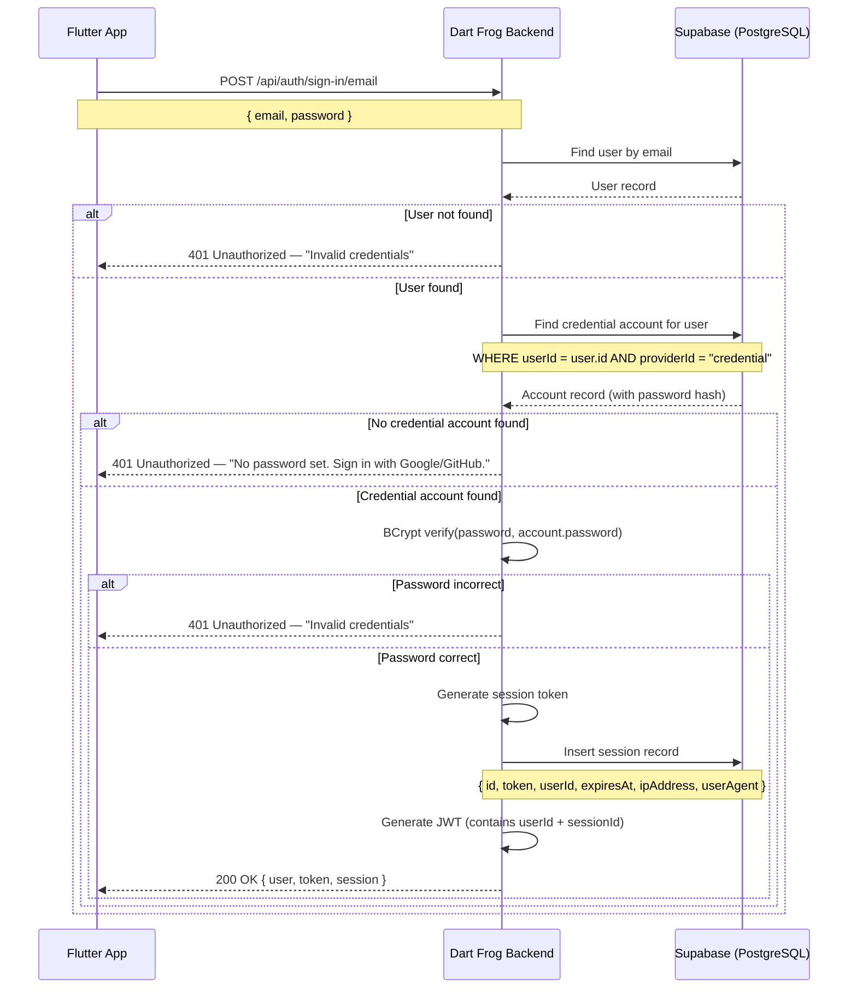

#### Endpoint Specification

```
POST /api/auth/sign-in/email

Request Body:
{
  "email": "string (required)",
  "password": "string (required)"
}

Success Response (200 OK):
{
  "user": {
    "id": "cuid",
    "name": "John Doe",
    "email": "john@example.com",
    "role": "CONSULTEE",
    "onboardingCompleted": true,
    "consulteeProfileId": "uuid-string",
    "consultantProfileId": null
  },
  "token": "jwt-token-string",
  "session": {
    "id": "session-cuid",
    "expiresAt": "2026-03-04T00:00:00.000Z"
  }
}
```

### Google OAuth

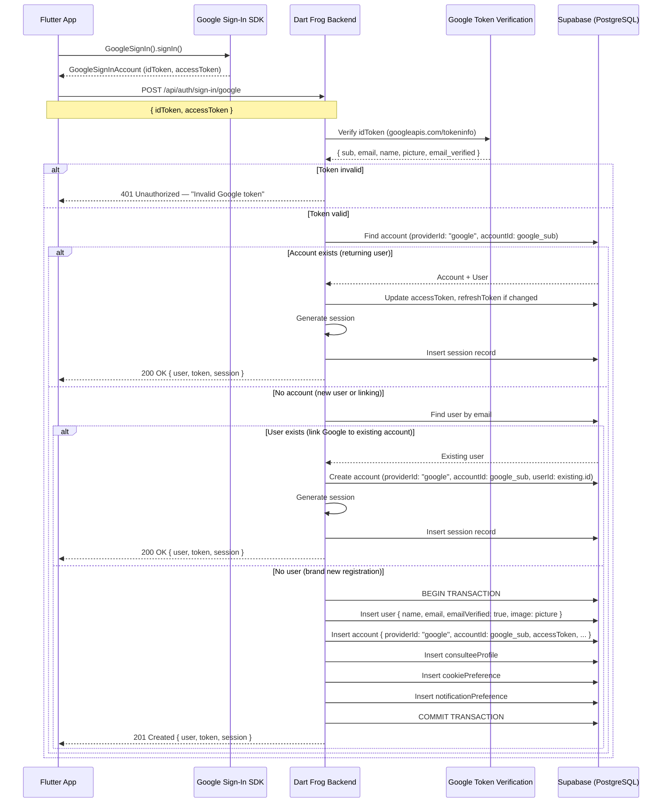

#### Endpoint Specification

```
POST /api/auth/sign-in/google

Request Body:
{
  "idToken": "string (required, Google ID token from GoogleSignIn SDK)",
  "accessToken": "string (optional, Google access token)"
}

The idToken is verified server-side using Google's tokeninfo endpoint
or by decoding the JWT and verifying against Google's public keys.
```

#### BetterAuth Compatibility Notes

BetterAuth creates Google OAuth accounts with:
- `providerId`: `"google"`
- `accountId`: Google's `sub` claim (unique user ID)

Dart Frog must write the same values so that a user who registers via Google on mobile can sign in on web (where BetterAuth reads these fields), and vice versa.

### GitHub OAuth

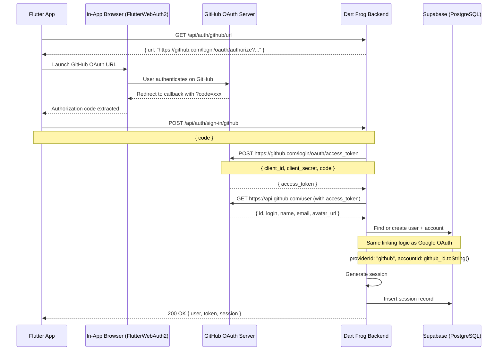

#### Endpoint Specifications

```
GET /api/auth/github/url

Response (200 OK):
{
  "url": "https://github.com/login/oauth/authorize?client_id=xxx&redirect_uri=xxx&scope=user:email"
}

---

POST /api/auth/sign-in/github

Request Body:
{
  "code": "string (required, GitHub authorization code)"
}

Response: Same structure as Google OAuth response.
```

### Apple Sign-In (iOS Only)

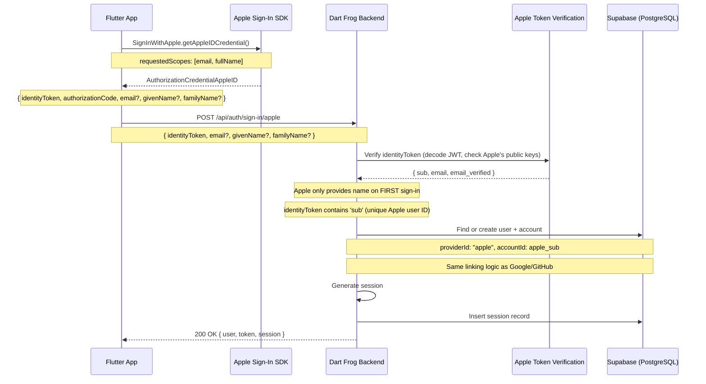

#### Endpoint Specification

```
POST /api/auth/sign-in/apple

Request Body:
{
  "identityToken": "string (required, Apple identity token JWT)",
  "email": "string (optional, only provided on first sign-in)",
  "givenName": "string (optional, only provided on first sign-in)",
  "familyName": "string (optional, only provided on first sign-in)"
}
```

#### Apple Sign-In Caveats

1. **Name is only provided once** — Apple sends the user's name only during the first authorization. If the app doesn't capture it, it's gone forever. Always save it immediately.
2. **Private relay email** — Apple may provide a relay email (`xxx@privaterelay.appleid.com`). Store this as the user's email and use it for communication.
3. **Cross-platform** — Apple Sign-In can also work on web (via BetterAuth's Apple provider), allowing account linking.

### Account Linking

When a user signs in with a new OAuth provider, the system auto-links by email:

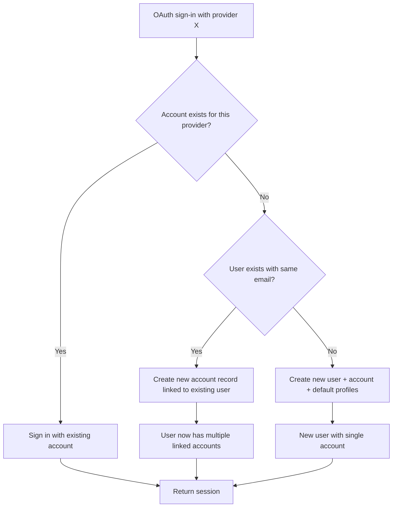

This matches BetterAuth's default account linking behavior (link by verified email). Both Dart Frog and BetterAuth follow the same logic, ensuring accounts linked on mobile are recognized on web and vice versa.

---

## Session Management

### Session Architecture

```
┌─────────────────────────────────────────────────────────────────┐
│                        SESSION TABLE (shared)                     │
│                                                                   │
│  id          │ token              │ userId │ expiresAt │ ...      │
│  ─────────── │ ────────────────── │ ────── │ ───────── │ ──────── │
│  clx1abc...  │ opaque-token-xyz   │ usr123 │ 2026-03-04│ ...      │
│  clx2def...  │ opaque-token-uvw   │ usr123 │ 2026-03-04│ ...      │
│              │                    │        │           │          │
│  ▲ Written by either Dart Frog or BetterAuth                     │
│  ▲ Read by either Dart Frog or BetterAuth                        │
└─────────────────────────────────────────────────────────────────┘

Mobile Flow:                           Web Flow:
┌──────────┐                           ┌──────────┐
│ Flutter  │                           │ Browser  │
│ App      │                           │          │
└────┬─────┘                           └────┬─────┘
     │ Authorization: Bearer <JWT>          │ Cookie: better-auth.session_token=<token>
     ▼                                      ▼
┌──────────┐                           ┌──────────┐
│ Dart Frog│                           │BetterAuth│
│          │                           │          │
│ 1. Decode│ JWT                       │ 1. Read  │ cookie
│ 2. Extract sessionId                 │ 2. Lookup│ session by token
│ 3. Lookup│ session by id             │ 3. Check │ expiresAt
│ 4. Check │ expiresAt                 │ 4. Return│ user
│ 5. Return│ user                      │          │
└──────────┘                           └──────────┘
```

### Session Token vs JWT

The mobile app uses a **dual-token approach**:

1. **Session Record** — Written to the `session` table (same table BetterAuth uses). Contains `token` (opaque string), `userId`, `expiresAt`, `ipAddress`, `userAgent`.
2. **JWT** — Sent to the Flutter client as the Bearer token. Contains the `sessionId` and `userId` for quick verification without a DB lookup on every request.

```
JWT Payload:
{
  "sub": "user-cuid",           // userId
  "sid": "session-cuid",         // sessionId
  "iat": 1706745600,             // issued at
  "exp": 1709337600              // expires at (30 days)
}
```

### Session Creation

When a user signs in (any method), Dart Frog creates:

1. A session record in the database:
   ```
   {
     id: generateCuid(),
     token: generateSecureRandomToken(32),  // BetterAuth-compatible opaque token
     userId: user.id,
     expiresAt: now + 30 days,
     ipAddress: request.headers['x-forwarded-for'] ?? request.connectionInfo.remoteAddress,
     userAgent: request.headers['user-agent']
   }
   ```

2. A JWT containing the session reference:
   ```
   JWT.sign({ sub: user.id, sid: session.id }, JWT_SECRET, { expiresIn: '30d' })
   ```

### Session Validation

On every authenticated request, the Dart Frog middleware:

1. Extracts the JWT from the `Authorization: Bearer <token>` header
2. Verifies the JWT signature using the shared secret
3. Extracts `userId` and `sessionId` from the JWT payload
4. Looks up the session in the database by `id`
5. Checks that `expiresAt` is in the future
6. Returns the user data (cached for the duration of the request)

### Session Expiry

| Parameter | Value | Notes |
|---|---|---|
| Session lifetime | 30 days | Configurable; BetterAuth defaults to 7 days |
| JWT expiry | 30 days | Must match session lifetime |
| Session extension | On each sign-in | Optional: extend expiresAt on activity |

**Important**: BetterAuth's default session expiry is 7 days. If the web keeps 7 days and mobile uses 30 days, sessions created on one platform may behave differently. Align these values:

```typescript
// BetterAuth config (web side)
export const auth = betterAuth({
  session: {
    expiresIn: 30 * 24 * 60 * 60, // 30 days in seconds
    updateAge: 24 * 60 * 60,       // Update session expiry every 24 hours
  },
});
```

### Cross-Platform Session Compatibility

| Aspect | Mobile (Dart Frog) | Web (BetterAuth) |
|---|---|---|
| Auth transport | `Authorization: Bearer <JWT>` | `Cookie: better-auth.session_token=<token>` |
| Session lookup | By `session.id` (from JWT) | By `session.token` (from cookie) |
| Same DB table | Yes (`sessions`) | Yes (`sessions`) |
| Session created on mobile, used on web? | Not directly (web uses cookie) | User would need to sign in again on web |
| Session created on web, used on mobile? | Not directly (mobile uses JWT) | User would need to sign in again on mobile |

Cross-platform session sharing (single sign-on across mobile and web) is **not** a goal. Each platform manages its own sessions against the same user records. The user may have simultaneous active sessions on both platforms.

### Multi-Device Session Management

A user can have multiple active sessions (phone, tablet, web browser). The API provides:

```
GET /api/auth/sessions
→ Returns all active sessions for the current user
→ Includes: id, ipAddress, userAgent, createdAt, expiresAt

DELETE /api/auth/sessions/:id
→ Revoke a specific session (sign out from that device)

DELETE /api/auth/sessions
→ Revoke all sessions except current (sign out everywhere else)
```

---

## Frontend (Flutter) Implementation

### Dependencies

```yaml
dependencies:
  # Authentication
  google_sign_in: ^6.2.1
  sign_in_with_apple: ^6.1.1
  flutter_web_auth_2: ^4.0.1    # For GitHub OAuth browser flow

  # Form handling
  flutter_hooks: ^0.20.5
  reactive_forms: ^17.0.1

  # Secure storage
  flutter_secure_storage: ^9.2.2

  # State management (from Phase 1)
  flutter_riverpod: ^2.5.1
  riverpod_annotation: ^2.3.5
```

### Auth State Architecture

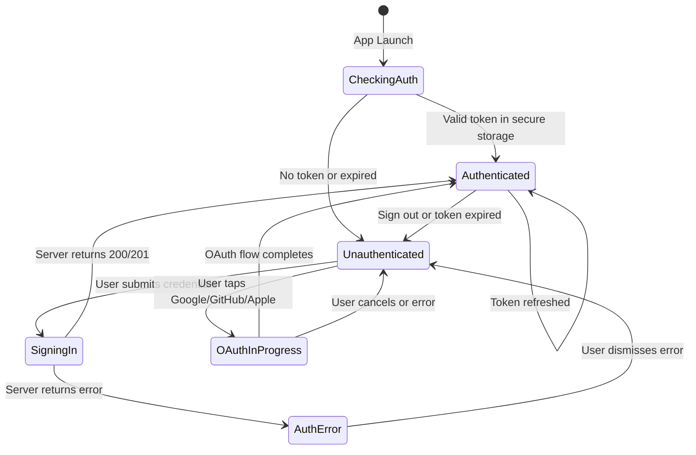

### Provider Structure (Riverpod)

```
┌─────────────────────────────────────────────────────┐
│                 Auth Providers                         │
│                                                       │
│  ┌─────────────────────────────────────────────────┐ │
│  │  authStateProvider (AsyncNotifier<AuthState>)   │ │
│  │  • Manages auth state machine                    │ │
│  │  • signInWithEmail(email, password)              │ │
│  │  • signUpWithEmail(name, email, password)        │ │
│  │  • signInWithGoogle()                            │ │
│  │  • signInWithGitHub(code)                        │ │
│  │  • signInWithApple()                             │ │
│  │  • signOut()                                     │ │
│  │  • checkAuthStatus() — called on app start       │ │
│  └──────────────┬──────────────────────────────────┘ │
│                 │ depends on                          │
│  ┌──────────────▼──────────────────────────────────┐ │
│  │  authRepositoryProvider                          │ │
│  │  • Abstracts remote + local data sources         │ │
│  │  • Handles token storage in secure storage       │ │
│  │  • Handles auto-retry and error mapping          │ │
│  └──────────────┬─────────────┬────────────────────┘ │
│                 │             │                       │
│  ┌──────────────▼───┐  ┌─────▼────────────────────┐ │
│  │ authRemoteSource  │  │ authLocalSource           │ │
│  │ • HTTP calls to   │  │ • FlutterSecureStorage   │ │
│  │   Dart Frog API   │  │ • Store/retrieve JWT     │ │
│  │ • Google Sign-In  │  │ • Store/retrieve user    │ │
│  │ • Apple Sign-In   │  │ • Clear on sign-out      │ │
│  └──────────────────┘  └──────────────────────────┘ │
└─────────────────────────────────────────────────────┘
```

### Auth State Model

```dart
// Illustrative structure — not implementation code
sealed class AuthState {}

class AuthInitial extends AuthState {}
class AuthLoading extends AuthState {}
class Authenticated extends AuthState {
  final UserModel user;
  final String token;
  final String sessionId;
}
class Unauthenticated extends AuthState {}
class AuthError extends AuthState {
  final String message;
}
```

### Secure Token Storage

The JWT and user data are stored in `flutter_secure_storage`:

| Key | Value | Notes |
|---|---|---|
| `auth_token` | JWT string | Used for Authorization header |
| `session_id` | Session ID | For session management |
| `user_data` | JSON-encoded user | Cached for instant display on app launch |

On app launch, the auth provider:
1. Reads the cached JWT from secure storage
2. Checks if it's expired (decode JWT, check `exp`)
3. If valid, sets state to `Authenticated` with cached user data
4. Makes a background call to `GET /api/auth/session` to validate the session still exists in DB
5. If the background check fails, transitions to `Unauthenticated`

### Auth Screens

| Screen | Route | Description |
|---|---|---|
| Sign In | `/auth/sign-in` | Email/password form + social login buttons |
| Sign Up | `/auth/sign-up` | Name, email, password form + social login buttons |
| Forgot Password | `/auth/forgot-password` | Email input → sends reset token |
| Reset Password | `/auth/reset-password` | New password form (deep link from email) |

### Social Login Button Flow

```
┌─────────────────────────────────────────────┐
│              Sign In Screen                   │
│                                               │
│  ┌─────────────────────────────────────────┐ │
│  │  Email: [________________________]       │ │
│  │  Password: [____________________]        │ │
│  │  [        Sign In        ]               │ │
│  └─────────────────────────────────────────┘ │
│                                               │
│  ──────────── OR ────────────                 │
│                                               │
│  ┌─────────────────────────────────────────┐ │
│  │  [G] Continue with Google                │ │ → GoogleSignIn SDK → idToken → API
│  │  [GH] Continue with GitHub               │ │ → FlutterWebAuth2 → code → API
│  │  [🍎] Continue with Apple (iOS only)     │ │ → SignInWithApple → identityToken → API
│  └─────────────────────────────────────────┘ │
│                                               │
│  Don't have an account? Sign Up               │
└─────────────────────────────────────────────┘
```

---

## Backend (Dart Frog) Implementation

### Route Structure

```
backend/routes/
└── api/
    └── auth/
        ├── sign-up/
        │   └── email.dart            POST  — Register with email/password
        ├── sign-in/
        │   ├── email.dart            POST  — Sign in with email/password
        │   ├── google.dart           POST  — Sign in with Google idToken
        │   ├── github.dart           POST  — Sign in with GitHub code
        │   └── apple.dart            POST  — Sign in with Apple identityToken
        ├── sign-out.dart             POST  — Sign out (invalidate session)
        ├── session.dart              GET   — Get current session + user
        ├── sessions.dart             GET   — List all user sessions
        │                             DELETE — Revoke all other sessions
        ├── change-password.dart      POST  — Change password (authenticated)
        ├── forget-password.dart      POST  — Request password reset email
        ├── reset-password.dart       POST  — Reset password with token
        ├── verify-email.dart         POST  — Verify email with token
        ├── list-accounts.dart        GET   — List linked OAuth accounts
        ├── link-social.dart          POST  — Link a new OAuth account
        ├── unlink-account.dart       POST  — Unlink an OAuth account
        └── delete-user.dart          POST  — Delete account and all data
```

### Service Layer

```
backend/lib/
├── services/
│   ├── auth_service.dart          — Core auth logic (sign-up, sign-in, validation)
│   ├── password_service.dart      — BCrypt hash/verify, reset token generation
│   ├── jwt_service.dart           — JWT creation, verification, decoding
│   ├── google_auth_service.dart   — Google idToken verification
│   ├── github_auth_service.dart   — GitHub code exchange + user fetch
│   ├── apple_auth_service.dart    — Apple identityToken verification
│   └── session_service.dart       — Session CRUD, expiry management
├── repositories/
│   ├── user_repository.dart       — User table CRUD
│   ├── account_repository.dart    — Account table CRUD
│   ├── session_repository.dart    — Session table CRUD
│   └── verification_repository.dart — Verification token CRUD
├── middleware/
│   └── auth_middleware.dart        — JWT extraction + session validation
└── models/
    ├── user_model.dart             — User data model
    ├── session_model.dart          — Session data model
    └── account_model.dart          — Account data model
```

### Auth Middleware

Every protected route uses the auth middleware:

```
Request → Auth Middleware → Route Handler
                │
                ├─ 1. Extract "Authorization: Bearer <jwt>" header
                ├─ 2. Verify JWT signature (HS256, shared secret)
                ├─ 3. Decode payload → { sub: userId, sid: sessionId }
                ├─ 4. Query session table by sessionId
                ├─ 5. Check session.expiresAt > now
                ├─ 6. Query user table by userId
                ├─ 7. Attach user to request context
                │
                ├─ If any step fails → 401 Unauthorized
                └─ If success → Continue to route handler
```

### JWT Configuration

| Parameter | Value | Notes |
|---|---|---|
| Algorithm | HS256 | HMAC-SHA256 |
| Secret | `JWT_SECRET` env var | **Must match `BETTER_AUTH_SECRET`** on web for interop |
| Expiry | 30 days | Matches session lifetime |
| Payload claims | `sub` (userId), `sid` (sessionId), `iat`, `exp` | Minimal payload |

### Database Repositories

Repositories are thin wrappers around Prisma-generated queries. They read/write the **same tables** that BetterAuth uses:

```
UserRepository:
  • findByEmail(email) → User?
  • findById(id) → User?
  • create({ name, email, emailVerified, image, role }) → User
  • update(id, { ...fields }) → User
  • delete(id) → void

AccountRepository:
  • findByProvider(providerId, accountId) → Account?
  • findByUserId(userId) → List<Account>
  • findCredentialAccount(userId) → Account?  // providerId = "credential"
  • create({ userId, providerId, accountId, password?, accessToken?, ... }) → Account
  • update(id, { ...fields }) → Account
  • delete(id) → void

SessionRepository:
  • findById(id) → Session?
  • findByToken(token) → Session?
  • findByUserId(userId) → List<Session>
  • create({ token, userId, expiresAt, ipAddress, userAgent }) → Session
  • delete(id) → void
  • deleteAllForUser(userId, { exceptId }) → void

VerificationRepository:
  • create({ identifier, value, expiresAt }) → Verification
  • findByIdentifierAndValue(identifier, value) → Verification?
  • delete(id) → void
  • deleteExpired() → void
```

---

## Profile & Account Management

These features were moved from Phase 10 (Profile & Settings) into Phase 2 because they are tightly coupled with the authentication system — they read/write the auth tables (account, session, verification, user).

### Change Password

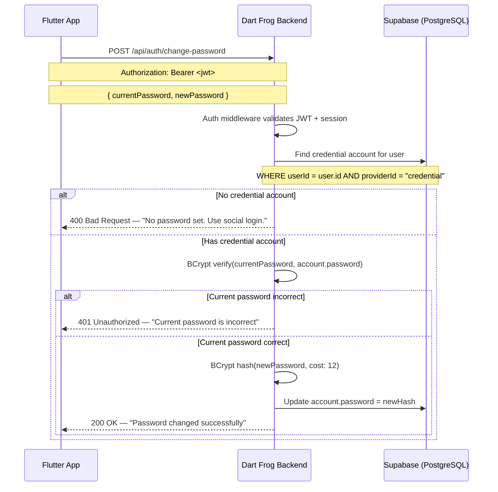

#### Endpoint Specification

```
POST /api/auth/change-password
Headers: Authorization: Bearer <jwt>

Request Body:
{
  "currentPassword": "string (required)",
  "newPassword": "string (required, min 8 chars, 1 uppercase, 1 number)"
}

Success Response (200 OK):
{ "message": "Password changed successfully" }
```

### Password Reset (Forgot Password)

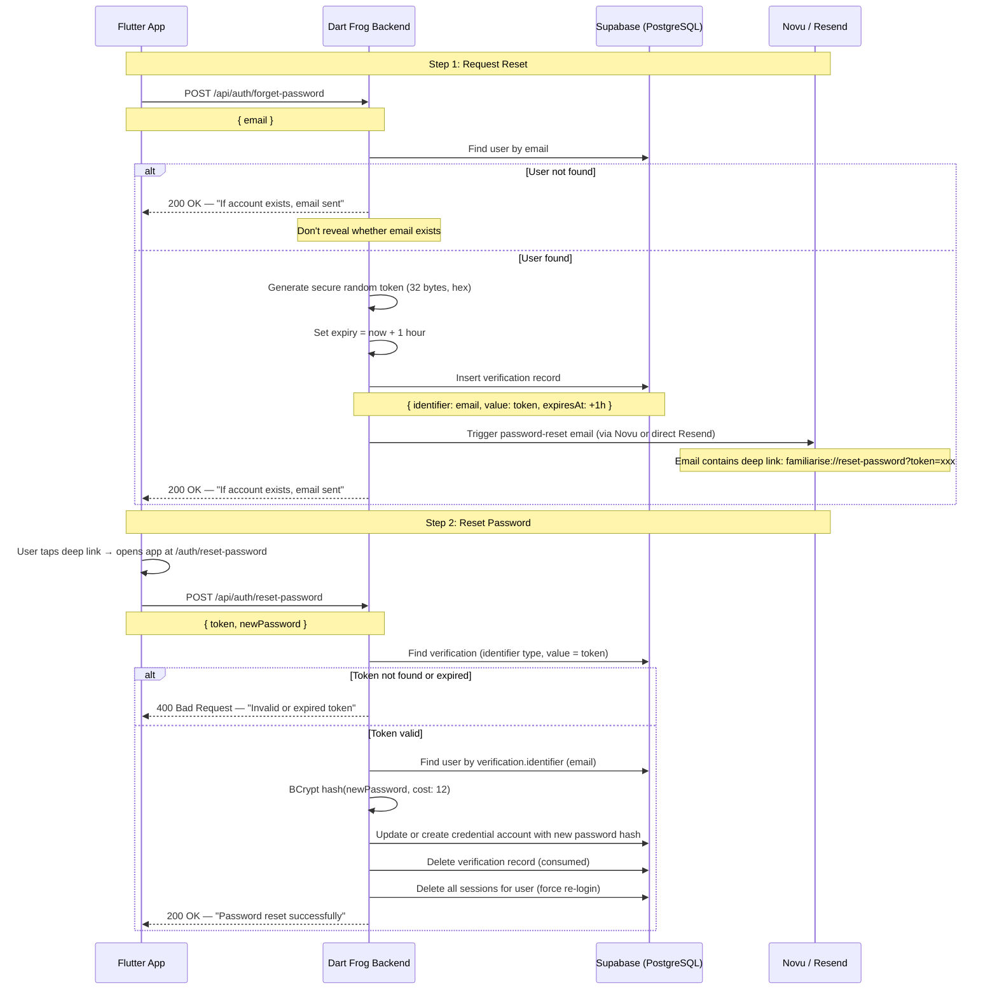

#### Endpoint Specifications

```
POST /api/auth/forget-password

Request Body:
{ "email": "string (required)" }

Response (200 OK — always, for security):
{ "message": "If an account with that email exists, a password reset link has been sent." }

---

POST /api/auth/reset-password

Request Body:
{
  "token": "string (required, from email deep link)",
  "newPassword": "string (required, min 8 chars)"
}

Success Response (200 OK):
{ "message": "Password reset successfully. Please sign in." }
```

### Email Verification

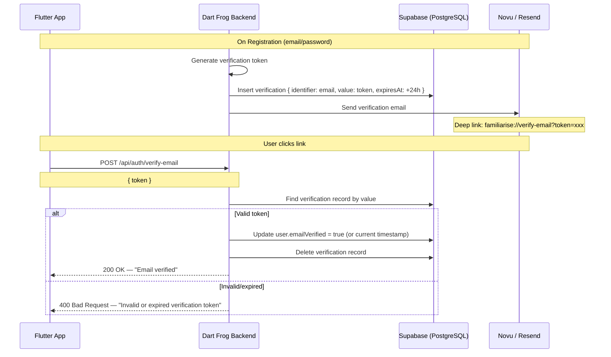

### Linked Accounts Management

Users can link multiple OAuth providers to a single account.

```
GET /api/auth/list-accounts
Headers: Authorization: Bearer <jwt>

Response (200 OK):
{
  "accounts": [
    { "providerId": "credential", "accountId": "john@example.com", "createdAt": "..." },
    { "providerId": "google", "accountId": "118234...", "createdAt": "..." }
  ]
}

---

POST /api/auth/link-social
Headers: Authorization: Bearer <jwt>

Request Body:
{
  "provider": "google" | "github" | "apple",
  "token": "string (idToken for google/apple, code for github)"
}

Response (200 OK):
{
  "message": "Account linked successfully",
  "account": { "providerId": "google", "accountId": "118234..." }
}

Error: 409 if provider already linked, 400 if token invalid.

---

POST /api/auth/unlink-account
Headers: Authorization: Bearer <jwt>

Request Body:
{
  "providerId": "google" | "github" | "apple" | "credential"
}

Response (200 OK):
{ "message": "Account unlinked successfully" }

Error: 400 if it's the user's only account (can't unlink last auth method).
```

### Delete Account

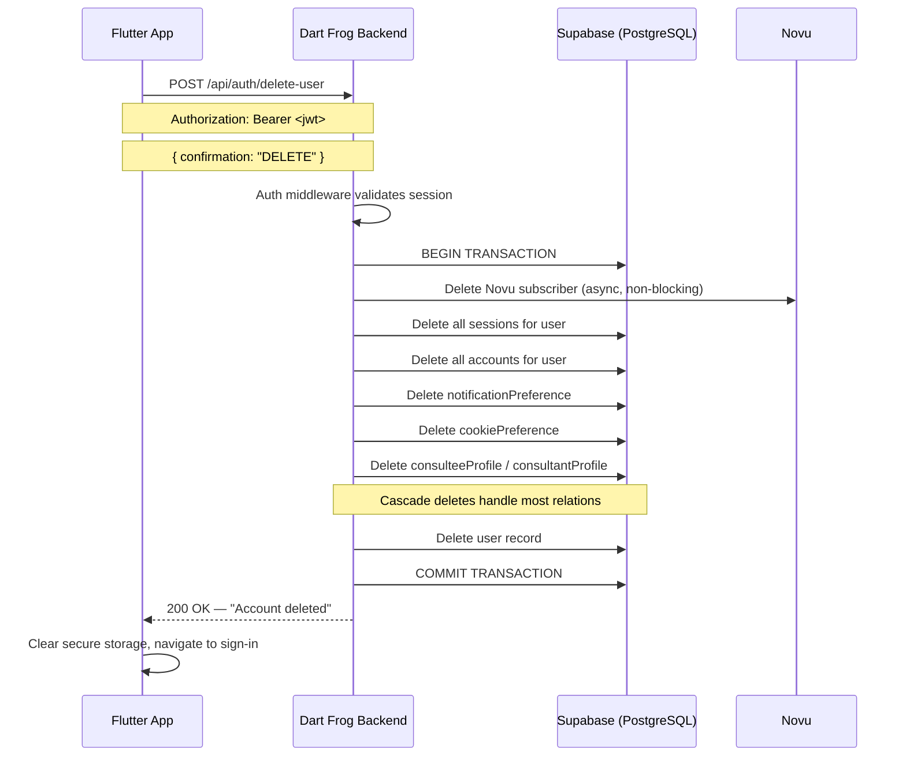

### Profile Image Management

```
DELETE /api/profile/image
Headers: Authorization: Bearer <jwt>

Removes the user's profile image from Supabase Storage
and sets user.image = null.

Response (200 OK):
{ "message": "Profile image removed" }
```

---

## Security Architecture

### Secret Management

| Secret | Where Used | Notes |
|---|---|---|
| `JWT_SECRET` | Dart Frog | Signs/verifies mobile JWTs. **Must equal `BETTER_AUTH_SECRET`** for session token compatibility |
| `BETTER_AUTH_SECRET` | Next.js (web) | BetterAuth's secret. 32+ character random string |
| `GOOGLE_CLIENT_ID` | Flutter + Dart Frog | Google OAuth client ID (same for both platforms) |
| `GOOGLE_CLIENT_SECRET` | Dart Frog only | Server-side only |
| `GITHUB_CLIENT_ID` | Dart Frog | GitHub OAuth app |
| `GITHUB_CLIENT_SECRET` | Dart Frog | Server-side only |
| `APPLE_SERVICE_ID` | Dart Frog | Apple Sign-In service |
| `APPLE_TEAM_ID` | Dart Frog | Apple Developer Team |
| `APPLE_KEY_ID` | Dart Frog | Apple Sign-In private key ID |
| `DATABASE_URL` | Dart Frog | Supabase PostgreSQL connection string |

### Password Security

| Control | Implementation |
|---|---|
| Hashing algorithm | BCrypt |
| Cost factor | 12 (4096 rounds) |
| Minimum length | 8 characters |
| Complexity | At least 1 uppercase, 1 number |
| Storage | In `account` table (not `user` table) |
| Timing attack prevention | BCrypt's constant-time comparison |

### JWT Security

| Control | Implementation |
|---|---|
| Algorithm | HS256 (HMAC-SHA256) |
| Secret length | 32+ characters |
| Token expiry | 30 days |
| Payload | Minimal (userId + sessionId only) |
| Sensitive data | Never stored in JWT |
| Revocation | Delete session from DB → JWT becomes invalid on next validation |

### Rate Limiting

| Endpoint | Limit | Window |
|---|---|---|
| `POST /api/auth/sign-in/*` | 10 requests | per minute per IP |
| `POST /api/auth/sign-up/*` | 5 requests | per minute per IP |
| `POST /api/auth/forget-password` | 3 requests | per minute per email |
| `POST /api/auth/reset-password` | 5 requests | per minute per IP |
| All other auth endpoints | 30 requests | per minute per user |

### CORS & Trusted Origins

Dart Frog must be configured to accept requests from the Flutter app. Since mobile apps don't send traditional `Origin` headers, CORS is primarily relevant for web-based OAuth callbacks:

```
Trusted origins:
  - https://familiarise.com (web)
  - familiarise://  (mobile app scheme, for deep links)
```

### Sentry Error Tracking

All auth failures are captured in Sentry with:
- Error type (invalid credentials, expired token, OAuth failure)
- User ID (if authenticated)
- Request metadata (IP, user agent) — no passwords or tokens
- Stack trace for unexpected errors

---

## Testing Strategy

### Unit Tests

| Component | Tests |
|---|---|
| PasswordService | Hash generation, verification, cost factor validation |
| JwtService | Token creation, verification, expiry, invalid token handling |
| AuthService | Sign-up logic, sign-in logic, account linking, validation |
| GoogleAuthService | ID token verification (mocked Google response) |
| GitHubAuthService | Code exchange, user fetch (mocked GitHub API) |
| SessionService | Creation, validation, expiry, revocation |

### Integration Tests

| Flow | What's Tested |
|---|---|
| Email sign-up → sign-in | Full registration + login cycle |
| Google OAuth | Mocked idToken → account creation → session |
| GitHub OAuth | Mocked code exchange → account creation → session |
| Account linking | Sign up with email → link Google → verify both methods work |
| Password reset | Request reset → verify token → reset → sign in with new password |
| Session management | Create → validate → revoke → confirm revoked |
| Cross-platform compatibility | Dart Frog creates session → verify BetterAuth can read it (schema test) |

### Widget Tests

| Screen | Tests |
|---|---|
| SignInScreen | Form validation, error display, social login button state |
| SignUpScreen | Form validation, password strength indicator, success navigation |
| ForgotPasswordScreen | Email validation, success message |
| ResetPasswordScreen | Token handling, password validation |

### Manual Test Matrix

| Scenario | iOS | Android |
|---|---|---|
| Email sign-up (new user) | ☐ | ☐ |
| Email sign-in (existing user) | ☐ | ☐ |
| Google OAuth sign-in | ☐ | ☐ |
| GitHub OAuth sign-in | ☐ | ☐ |
| Apple Sign-In | ☐ | N/A |
| Account linking (email → add Google) | ☐ | ☐ |
| Password change | ☐ | ☐ |
| Password reset via email | ☐ | ☐ |
| Sign out | ☐ | ☐ |
| Delete account | ☐ | ☐ |
| Session persists after app restart | ☐ | ☐ |
| Session expires after 30 days | ☐ | ☐ |
| Register on mobile, sign in on web | ☐ | ☐ |
| Register on web, sign in on mobile | ☐ | ☐ |
