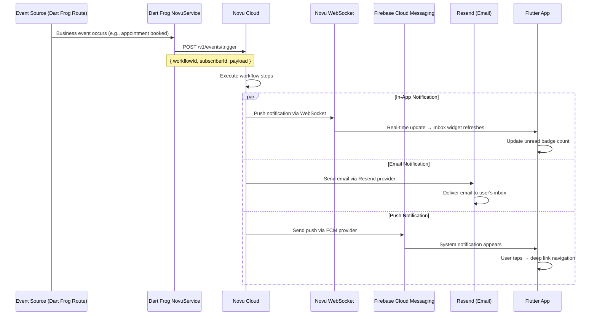
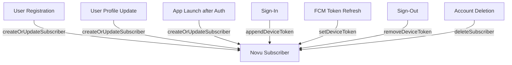
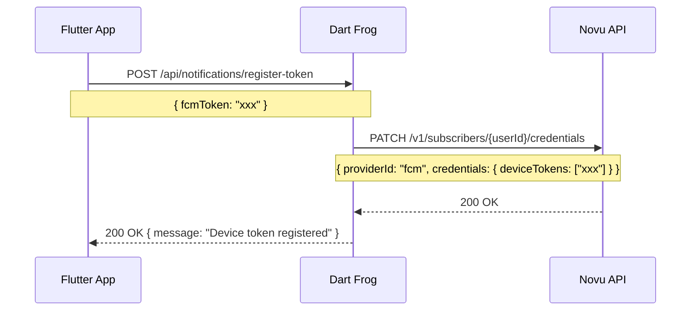
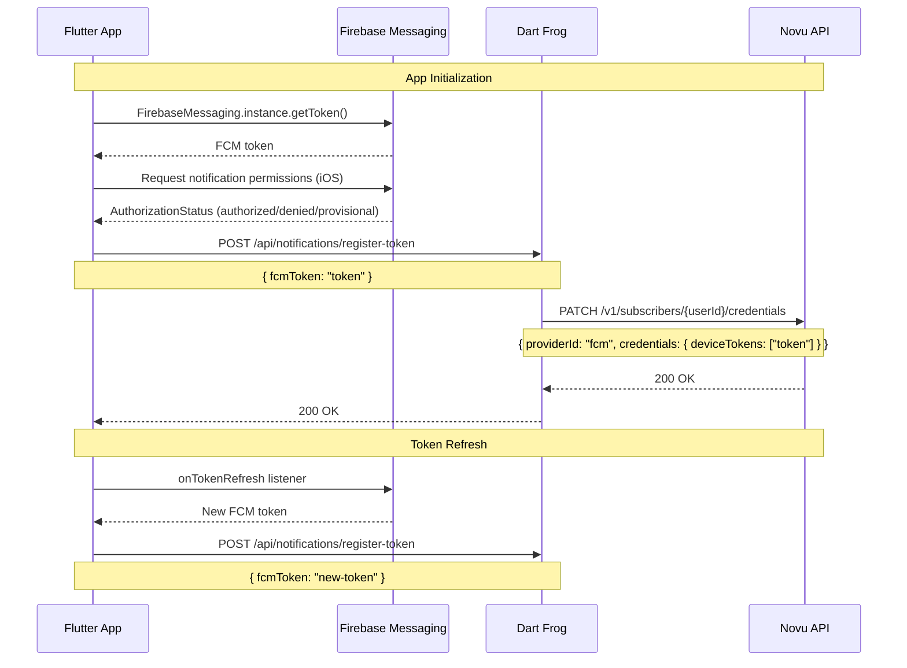
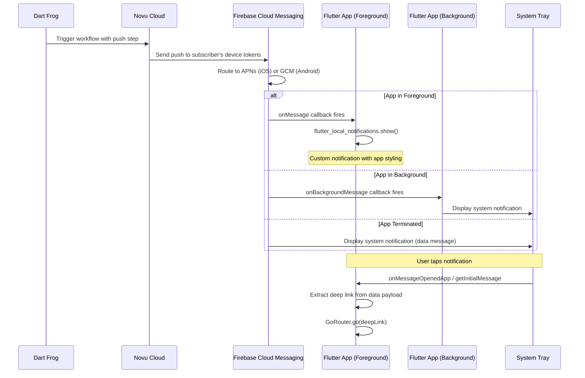
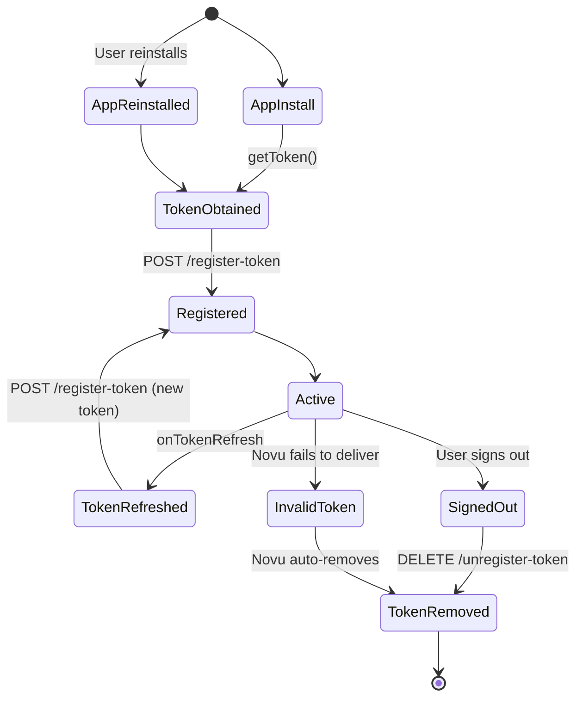
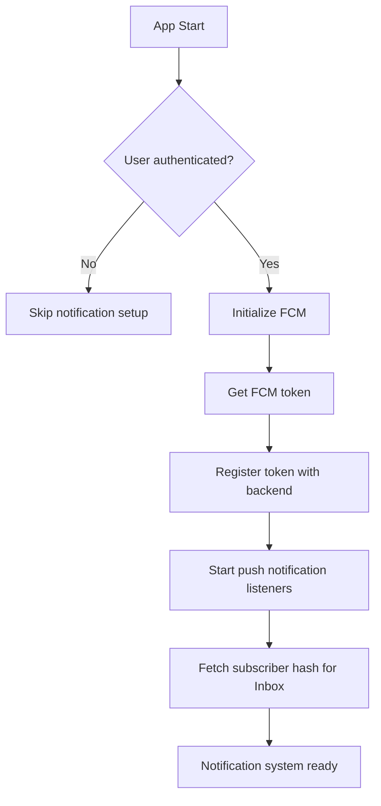
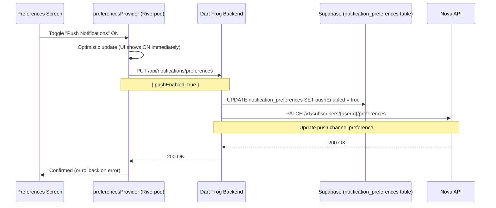

# Phase 10: Notification System (Novu)

## Overview

Phase 10 implements the complete notification system for Familiarise Mobile using **Novu** as the notification orchestrator. This includes in-app notifications (bell icon inbox), push notifications (FCM), notification preferences, and real-time delivery. The mobile notification system integrates with the **same Novu infrastructure** already used by the web application (23+ workflows).

**Prerequisites:** Phases 1-9 complete, Novu account configured, Firebase project configured
**Platforms:** iOS 14+, Android API 24+
**Related:** [Notification Strategy](../../../familiarise_web/docs/roadmap/notifications/notification-strategy.md), [Service Integration Architecture](../../../familiarise_web/docs/roadmap/notifications/service-integration-architecture.md)

---

## Table of Contents

- [Architecture Overview](#architecture-overview)
- [Novu Concepts Reference](#novu-concepts-reference)
- [Dependencies](#dependencies)
- [Backend: Novu Service Layer (Dart Frog)](#backend-novu-service-layer-dart-frog)
- [Backend: Subscriber Management](#backend-subscriber-management)
- [Backend: Workflow Trigger Points](#backend-workflow-trigger-points)
- [Frontend: In-App Notifications (Flutter)](#frontend-in-app-notifications-flutter)
- [Frontend: Push Notifications (FCM)](#frontend-push-notifications-fcm)
- [Frontend: Notification Providers (Riverpod)](#frontend-notification-providers-riverpod)
- [Frontend: Notification Preferences](#frontend-notification-preferences)
- [Cross-Platform Integration (Web References)](#cross-platform-integration-web-references)
- [Novu Dashboard Configuration](#novu-dashboard-configuration)
- [Database Schema](#database-schema)
- [Navigation & Router Updates](#navigation--router-updates)
- [Error Handling & Resilience](#error-handling--resilience)
- [Testing Strategy](#testing-strategy)

---

## Architecture Overview

### High-Level System Diagram

```
┌──────────────────────────────────────────────────────────────────────────────────┐
│                          NOTIFICATION SYSTEM ARCHITECTURE                          │
│                                                                                   │
│  ┌──────────────────┐    ┌──────────────────┐    ┌──────────────────────────────┐│
│  │   Flutter App     │    │   Dart Frog       │    │   Novu Cloud                 ││
│  │                   │◄──▶│   Backend         │───▶│                              ││
│  │ ┌──────────────┐ │    │                   │    │  ┌─────────────────────────┐ ││
│  │ │ Novu Inbox   │ │    │ ┌───────────────┐ │    │  │ Workflow Engine         │ ││
│  │ │ (WebSocket)  │◄┼────┼─┤ NovuService   │ │    │  │                        │ ││
│  │ └──────────────┘ │    │ │ • trigger()   │─┼────┼─▶│  Step 1: In-App        │ ││
│  │                   │    │ │ • bulk()      │ │    │  │  Step 2: Email (Resend)│ ││
│  │ ┌──────────────┐ │    │ │ • broadcast() │ │    │  │  Step 3: Push (FCM)    │ ││
│  │ │ FCM Handler  │ │    │ └───────────────┘ │    │  │  Step 4: Digest/Delay  │ ││
│  │ │ (Push)       │ │    │                   │    │  └─────────┬───────────────┘ ││
│  │ └──────┬───────┘ │    │ ┌───────────────┐ │    │            │                  ││
│  │        │          │    │ │ Subscriber    │ │    │  ┌─────────▼───────────────┐ ││
│  │ ┌──────▼───────┐ │    │ │ Service       │─┼────┼─▶│ Channel Routing         │ ││
│  │ │ Local Notif  │ │    │ │ • sync()      │ │    │  │                        │ ││
│  │ │ Display      │ │    │ │ • token()     │ │    │  │ In-App ──▶ Novu native │ ││
│  │ └──────────────┘ │    │ │ • prefs()     │ │    │  │ Email ───▶ Resend      │ ││
│  │                   │    │ └───────────────┘ │    │  │ Push ────▶ FCM/APNs   │ ││
│  │ ┌──────────────┐ │    │                   │    │  │ SMS ─────▶ Twilio      │ ││
│  │ │ Preferences  │ │    └──────────────────┘    │  └────────────────────────┘ ││
│  │ │ Screen       │ │                            │                              ││
│  │ └──────────────┘ │                            └──────────────────────────────┘│
│  └──────────────────┘                                                            │
│           │                                                                       │
│           │  ┌──────────────────────────────────────────────────┐                │
│           └─▶│   Firebase Cloud Messaging (FCM / APNs)          │                │
│              │   • Push delivery to iOS & Android devices        │                │
│              └──────────────────────────────────────────────────┘                │
│                                                                                   │
└──────────────────────────────────────────────────────────────────────────────────┘
```

### Component Responsibility Matrix

| Component | Responsibility |
|-----------|---------------|
| **Novu Cloud** | Workflow execution, channel routing, digest/batching, delay, subscriber preferences, in-app notification storage, WebSocket delivery |
| **Dart Frog Backend** | Trigger workflows via REST API, manage subscribers, register device tokens, sync preferences |
| **Flutter App** | Display in-app inbox (Novu widget), handle push notifications, manage preferences UI, deep link navigation |
| **Firebase (FCM)** | Push notification delivery to iOS (via APNs) and Android devices |
| **Resend (via Novu)** | Email delivery — configured as Novu's email provider in the Novu dashboard |

### Notification Flow (End-to-End)



---

## Novu Concepts Reference

### Subscribers

A Novu subscriber maps 1:1 to a Familiarise user. The `subscriberId` equals `user.id` (cuid).

| Subscriber Property | Source | Notes |
|---|---|---|
| `subscriberId` | `user.id` | Primary identifier |
| `email` | `user.email` | For email channel |
| `firstName` | `user.name.split(" ")[0]` | Display name |
| `lastName` | `user.name.split(" ").slice(1)` | Display name |
| `phone` | `user.phone` | For SMS channel (future) |
| `avatar` | `user.image` | Shown in Inbox |
| `locale` | `"en"` | Template localization |
| `data` | Custom JSON | Additional metadata |

### Workflows

A workflow is a blueprint for notification delivery. It defines:
- **Steps**: in-app, email, push, SMS, delay, digest
- **Templates**: Content for each channel (subject, body, etc.)
- **Conditions**: When to execute each step

Workflows are defined in the **Novu dashboard** (dashboard-first approach). The code only triggers them by ID.

### Topics

Topics group subscribers for fan-out delivery:

```
Topic: "org-{orgId}-members"
  → Subscribes all members of an organization
  → Trigger to topic = notify all members

Topic: "consultant-{consultantId}-clients"
  → Subscribes all consultees of a consultant
  → Useful for broadcast announcements
```

### Digest

Batches multiple triggers into a single notification:

```
Without digest: 8 booking requests → 8 emails
With digest:    8 booking requests → 1 summary email (after 1 hour)
```

Configured per workflow step in the Novu dashboard.

---

## Dependencies

### Flutter Packages

```yaml
dependencies:
  # Novu In-App Notifications
  novu: ^2.0.0                    # Official Novu Flutter SDK (Inbox widget)

  # Push Notifications
  firebase_core: ^3.8.1
  firebase_messaging: ^15.2.0
  flutter_local_notifications: ^18.0.1

  # Deep Linking (from Phase 1)
  go_router: ^14.6.2
```

### Dart Frog Backend

```yaml
# backend/pubspec.yaml
dependencies:
  http: ^1.2.2                    # For Novu REST API calls
  crypto: ^3.0.5                  # For HMAC subscriber hash
```

### Environment Variables

```env
# Server-side only (Dart Frog)
NOVU_SECRET_KEY=your-novu-secret-key     # From Novu dashboard → Settings → API Keys
NOVU_API_URL=https://api.novu.co/v1      # Or self-hosted URL

# Client-side (Flutter)
NOVU_APP_ID=your-novu-app-identifier     # From Novu dashboard → Settings → Application

# Firebase
# Android: google-services.json in android/app/
# iOS: GoogleService-Info.plist in ios/Runner/
```

---

## Backend: Novu Service Layer (Dart Frog)

There is **no official Novu Dart SDK**. The Dart Frog backend communicates with Novu via its REST API directly.

### NovuService

A singleton HTTP client for triggering Novu workflows:

```
NovuService
├── Configuration
│   ├── Base URL: https://api.novu.co/v1
│   ├── Auth: Authorization: ApiKey <NOVU_SECRET_KEY>
│   └── Content-Type: application/json
│
├── Core Methods
│   ├── triggerWorkflow(workflowId, subscriberId, payload, {overrides})
│   │   → POST /v1/events/trigger
│   │   → Body: { name: workflowId, to: { subscriberId }, payload }
│   │   → Returns: { acknowledged: true, transactionId: "..." }
│   │
│   ├── triggerBulk(events)
│   │   → POST /v1/events/trigger/bulk
│   │   → Body: { events: [{ name, to, payload }, ...] }
│   │   → For sending same event to multiple users efficiently
│   │
│   ├── triggerBroadcast(workflowId, payload)
│   │   → POST /v1/events/trigger/broadcast
│   │   → Sends to ALL subscribers (use sparingly)
│   │
│   └── cancelTrigger(transactionId)
│       → DELETE /v1/events/trigger/{transactionId}
│       → Cancel a pending/delayed notification
│
└── Error Handling
    ├── Non-throwing: logs errors, returns success/failure
    ├── Timeout: 10 seconds
    └── Retry: none (fire and forget for non-critical notifications)
```

### REST API Request Format

```
POST https://api.novu.co/v1/events/trigger
Headers:
  Authorization: ApiKey <NOVU_SECRET_KEY>
  Content-Type: application/json

Body:
{
  "name": "appointment-booked",
  "to": {
    "subscriberId": "user-cuid-123"
  },
  "payload": {
    "appointmentType": "One-on-One",
    "consultantName": "Dr. Smith",
    "consulteeName": "John Doe",
    "planTitle": "Career Guidance",
    "dateTime": "2026-02-15T10:00:00Z",
    "dashboardUrl": "https://familiarise.com/dashboard/consultee/appointments"
  }
}

Response (201):
{
  "data": {
    "acknowledged": true,
    "status": "processed",
    "transactionId": "txn_abc123"
  }
}
```

### Trigger Helper for Multiple Recipients

When both parties (consultant + consultee) need to be notified:

```
triggerForBoth(workflowId, consultantId, consulteeId, payload)
  → Calls triggerBulk with two events
  → Each event has the same workflowId and payload
  → Different subscriberId for each recipient
```

---

## Backend: Subscriber Management

### SubscriberService

```
SubscriberService
├── createOrUpdateSubscriber(userId, {email, firstName, lastName, phone, avatar})
│   → PUT /v1/subscribers/{subscriberId}
│   → Called on: registration, profile update, app launch (after auth)
│
├── deleteSubscriber(subscriberId)
│   → DELETE /v1/subscribers/{subscriberId}
│   → Called on: account deletion
│
├── setDeviceToken(subscriberId, fcmToken, providerId)
│   → PUT /v1/subscribers/{subscriberId}/credentials
│   → Body: { providerId: "fcm", credentials: { deviceTokens: [fcmToken] } }
│   → Called on: app install, sign-in, token refresh
│
├── appendDeviceToken(subscriberId, fcmToken)
│   → PATCH /v1/subscribers/{subscriberId}/credentials
│   → Body: { providerId: "fcm", credentials: { deviceTokens: [fcmToken] } }
│   → PATCH appends to existing tokens (for multi-device)
│
├── removeDeviceToken(subscriberId, fcmToken)
│   → Custom: GET current tokens, filter out this one, PUT updated list
│   → Called on: sign-out
│
├── getPreferences(subscriberId)
│   → GET /v1/subscribers/{subscriberId}/preferences
│   → Returns per-workflow channel preferences
│
└── updatePreferences(subscriberId, preferences)
    → PATCH /v1/subscribers/{subscriberId}/preferences
    → Updates per-channel and per-workflow preferences
```

### Subscriber Sync Points



### Backend Routes for Notification Management

| Method | Route | Purpose |
|--------|-------|---------|
| POST | `/api/notifications/register-token` | Register FCM device token with Novu |
| DELETE | `/api/notifications/unregister-token` | Remove FCM device token (on sign-out) |
| GET | `/api/notifications/preferences` | Get user notification preferences |
| PUT | `/api/notifications/preferences` | Update notification preferences |
| POST | `/api/notifications/subscriber/sync` | Force sync user data to Novu subscriber |

#### Register Token Endpoint

```
POST /api/notifications/register-token
Headers: Authorization: Bearer <jwt>

Body:
{ "fcmToken": "firebase-device-token-string" }

Response (200):
{ "message": "Device token registered" }
```



---

## Backend: Workflow Trigger Points

The following table maps every business event in the Dart Frog backend to its Novu workflow trigger. These workflow IDs **must match** the workflows defined in the Novu dashboard and already used by the web application.

### Workflow ID Constants

These are the same 30 workflow IDs defined in the web repo at `/lib/novu/workflows.ts`:

| Category | Workflow ID | Description |
|----------|------------|-------------|
| **Appointment** | `appointment-booked` | Booking confirmed |
| | `appointment-cancelled` | Booking cancelled |
| | `appointment-rescheduled` | Booking time changed |
| | `appointment-reminder` | Reminder before session |
| | `appointment-completed` | Session ended |
| **Payment** | `payment-success` | Payment received |
| | `payment-failed` | Payment failed |
| | `refund-processed` | Refund completed |
| | `refund-requested` | Refund request submitted |
| **Support** | `support-ticket-created` | New support ticket |
| | `support-ticket-update` | Ticket status changed |
| | `support-ticket-response` | Staff replied to ticket |
| **Feedback** | `feedback-received` | New feedback submitted |
| | `new-review-received` | New review for consultant |
| **Trials** | `trial-session-requested` | Trial requested |
| | `trial-session-scheduled` | Trial scheduled |
| | `trial-session-completed` | Trial completed |
| | `trial-session-cancelled` | Trial cancelled |
| **Subscriptions** | `subscription-started` | New subscription |
| | `subscription-cancelled` | Subscription cancelled |
| | `subscription-renewed` | Subscription renewed |
| **Consultant** | `new-booking-request` | New booking request |
| | `verification-status-changed` | Verification approved/rejected |
| | `payout-processed` | Payout sent |
| **Admin** | `general-announcement` | System announcement |
| | `new-consultant-application` | New consultant application |
| **Waitlist** | `waitlist-spot-available` | Spot opened up |
| **Disputes** | `dispute-created` | New dispute |
| | `dispute-resolved` | Dispute resolved |
| **Recordings** | `recording-available` | Recording ready |

### Trigger Point Details

| Dart Frog Route | Event | Workflow ID | Recipients | Payload |
|---|---|---|---|---|
| `POST /api/appointments` | Appointment created | `appointment-booked` | consultant + consultee | appointmentType, consultantName, consulteeName, planTitle, dateTime, dashboardUrl |
| `PATCH /api/appointments/{id}` (cancel) | Appointment cancelled | `appointment-cancelled` | both parties | + reason, cancelledBy |
| `PATCH /api/appointments/{id}` (reschedule) | Appointment rescheduled | `appointment-rescheduled` | both parties | + oldDateTime, newDateTime |
| Scheduled job (cron) | Reminder before appointment | `appointment-reminder` | both parties | appointmentType, dateTime, dashboardUrl |
| `POST /api/appointments/{id}/complete` | Session completed | `appointment-completed` | both parties | appointmentType, consultantName |
| `POST /api/payments/webhook` (success) | Payment received | `payment-success` | consultee + consultant | amount, currency, consultantName, planTitle |
| `POST /api/payments/webhook` (failure) | Payment failed | `payment-failed` | consultee | amount, currency, failureReason, retryUrl |
| `POST /api/refunds` | Refund processed | `refund-processed` | consultee | amount, currency, reason |
| `POST /api/reviews` | New review | `new-review-received` | consultant | reviewerName, rating, comment, planTitle |
| `POST /api/support` | Ticket created | `support-ticket-created` | staff | ticketId, ticketTitle, dashboardUrl |
| `POST /api/support/{id}/respond` | Staff response | `support-ticket-response` | ticket creator | ticketId, message, respondedBy |
| `POST /api/subscriptions` | Subscription started | `subscription-started` | consultee | planTitle, consultantName |
| `DELETE /api/subscriptions/{id}` | Subscription cancelled | `subscription-cancelled` | consultee + consultant | planTitle, consultantName |
| `POST /api/waitlist/{id}/notify` | Spot available | `waitlist-spot-available` | waitlisted user | consultantName, planTitle |
| `POST /api/recordings/{id}/ready` | Recording ready | `recording-available` | consultee + consultant | recordingUrl, appointmentType |

### Payload Type Definitions

Each workflow has a typed payload (matching the web repo's TypeScript types in `/lib/novu/workflows.ts`):

```
AppointmentPayload:
  appointmentId?: String
  appointmentType: String         "One-on-One" | "Group" | "Trial"
  consultantName: String
  consulteeName: String
  planTitle: String
  dateTime?: String               ISO 8601
  dashboardUrl: String

PaymentSuccessPayload:
  amount: num
  currency: String                "INR" | "USD"
  consultantName: String
  appointmentType: String
  planTitle: String
  receiptUrl?: String
  dashboardUrl: String

ReviewPayload:
  reviewerName: String
  rating: int                     1-5
  comment?: String
  planTitle?: String
  dashboardUrl: String

SupportTicketPayload:
  ticketId: String
  ticketTitle: String
  status?: String
  message?: String
  respondedBy?: String
  dashboardUrl: String
```

Full payload definitions for all 30 workflows can be found in the web repo at `familiarise_web/lib/novu/workflows.ts`.

---

## Frontend: In-App Notifications (Flutter)

### Novu Flutter SDK (Inbox Widget)

The official `novu` Flutter package provides an Inbox widget with WebSocket-based real-time updates:

```
┌─────────────────────────────────────────────────┐
│                 Notification Inbox                 │
│                                                   │
│  ┌─────────────────────────────────────────────┐ │
│  │ 🔔 Notifications                    Mark All│ │
│  ├─────────────────────────────────────────────┤ │
│  │                                             │ │
│  │  ● Dr. Smith booked an appointment          │ │
│  │    One-on-One · Career Guidance             │ │
│  │    2 minutes ago                            │ │
│  │    [View Details]     [Reschedule]          │ │
│  │                                             │ │
│  │  ○ Payment received — ₹2,500               │ │
│  │    Career Guidance Plan                     │ │
│  │    1 hour ago                               │ │
│  │                                             │ │
│  │  ○ New review from Priya K. ★★★★★          │ │
│  │    "Excellent session!"                     │ │
│  │    3 hours ago                              │ │
│  │                                             │ │
│  └─────────────────────────────────────────────┘ │
│                                                   │
│  ● = unread   ○ = read                           │
└─────────────────────────────────────────────────┘
```

### Novu SDK Configuration

```
NovuInboxWidget Configuration:
  applicationIdentifier: NOVU_APP_ID (from environment)
  subscriberId: user.id (from auth state)
  subscriberHash: HMAC-SHA256(user.id, NOVU_SECRET_KEY) — for production security
  backendUrl: "https://api.novu.co" (or self-hosted)
  socketUrl: "https://ws.novu.co" (or self-hosted)
```

### HMAC Subscriber Hash

In production, the Novu Inbox requires HMAC authentication to prevent spoofing:

```
Server (Dart Frog):
  hash = HMAC-SHA256(subscriberId, NOVU_SECRET_KEY)

Client (Flutter):
  NovuInboxWidget(subscriberHash: hash)
```

The hash is generated server-side and passed to the Flutter client during session initialization.

#### Endpoint for Subscriber Hash

```
GET /api/notifications/subscriber-hash
Headers: Authorization: Bearer <jwt>

Response (200):
{ "subscriberHash": "a1b2c3d4e5f6..." }
```

### Inbox Screen Structure

```
NotificationInboxScreen
├── AppBar
│   ├── Title: "Notifications"
│   └── Action: Mark All as Read
├── Body
│   ├── NovuInboxWidget (official SDK)
│   │   ├── WebSocket connection for real-time updates
│   │   ├── Notification list (subject, body, avatar, timestamp)
│   │   ├── Read/unread state management
│   │   ├── Action buttons (primaryAction, secondaryAction)
│   │   ├── Pull-to-refresh
│   │   └── Pagination (infinite scroll)
│   └── Empty state: "No notifications yet"
└── Navigation
    └── Tap notification → Deep link via redirect.url
```

### Notification Deep Linking

Each notification can include a `redirect.url` that maps to an in-app route:

| Notification Type | redirect.url | GoRouter Route |
|---|---|---|
| Appointment booked | `/dashboard/consultee/appointments/{id}` | `/appointments/:id` |
| Payment success | `/dashboard/consultee/payments/{id}` | `/payments/:id` |
| New review | `/dashboard/consultant/reviews` | `/reviews` |
| Support response | `/dashboard/support/{ticketId}` | `/support/:id` |
| Recording available | `/dashboard/recordings/{id}` | `/recordings/:id` |

```mermaid
flowchart TD
    A[User taps notification] --> B{Source?}
    B -->|In-App Inbox| C[Extract redirect.url from notification]
    B -->|Push Notification| D[Extract data.deepLink from FCM payload]
    C --> E[GoRouter.go(url)]
    D --> E
```

### Notification Bell Widget

A badge widget placed in the AppBar or bottom navigation bar:

```
NotificationBellWidget
├── Icon: bell icon (Icons.notifications_outlined)
├── Badge: unread count (from Novu SDK)
│   ├── Shows count if > 0
│   ├── Shows dot if count > 99
│   └── Hidden if count = 0
└── onTap: Navigate to NotificationInboxScreen
```

---

## Frontend: Push Notifications (FCM)

### Firebase Messaging Setup



### Push Notification Delivery Flow



### Token Lifecycle



### Platform-Specific Configuration

#### Android

```
android/app/src/main/AndroidManifest.xml:
  • <meta-data android:name="com.google.firebase.messaging.default_notification_channel_id"
               android:value="familiarise_notifications" />
  • Notification channel configuration:
    - ID: familiarise_notifications
    - Name: Familiarise Notifications
    - Importance: HIGH
    - Sound: default
    - Vibration: enabled

android/app/build.gradle:
  • apply plugin: 'com.google.gms.google-services'

android/app/google-services.json:
  • Downloaded from Firebase Console
```

#### iOS

```
ios/Runner/Info.plist:
  • UIBackgroundModes: remote-notification

ios/Runner.xcodeproj → Signing & Capabilities:
  • Push Notifications capability enabled
  • Background Modes → Remote notifications enabled

ios/Runner/AppDelegate.swift:
  • UNUserNotificationCenter.current().delegate = self

ios/Runner/GoogleService-Info.plist:
  • Downloaded from Firebase Console

APNs:
  • Upload APNs authentication key (.p8) to Firebase Console
  • Or: Upload APNs certificate (.p12)
```

### Notification Display (Foreground)

When the app is in the foreground, FCM does not display notifications automatically. Use `flutter_local_notifications`:

```
Foreground notification flow:
  1. FirebaseMessaging.onMessage fires
  2. Extract: title, body, data from RemoteMessage
  3. flutter_local_notifications.show(
       id: hashCode of message,
       title: message.notification?.title,
       body: message.notification?.body,
       notificationDetails: platformSpecificDetails,
       payload: jsonEncode(message.data)  // For tap handling
     )
  4. On tap → onDidReceiveNotificationResponse
  5. Extract deep link from payload
  6. GoRouter.go(deepLink)
```

---

## Frontend: Notification Providers (Riverpod)

### State Architecture

```
┌─────────────────────────────────────────────────────────────────┐
│                    Notification Providers                         │
│                                                                  │
│  ┌────────────────────────────────────────────────────────────┐ │
│  │  fcmTokenProvider (FutureProvider, keepAlive)               │ │
│  │  • Obtains FCM token on app start                          │ │
│  │  • Listens for token refresh                               │ │
│  │  • Registers token with backend                            │ │
│  └─────────────────────────────┬──────────────────────────────┘ │
│                                │                                 │
│  ┌────────────────────────────────────────────────────────────┐ │
│  │  pushNotificationProvider (Provider, keepAlive)             │ │
│  │  • Listens for onMessage (foreground)                      │ │
│  │  • Listens for onMessageOpenedApp (background tap)         │ │
│  │  • Handles getInitialMessage (terminated tap)              │ │
│  │  • Shows flutter_local_notifications for foreground        │ │
│  │  • Routes deep links via GoRouter                          │ │
│  └────────────────────────────────────────────────────────────┘ │
│                                                                  │
│  ┌────────────────────────────────────────────────────────────┐ │
│  │  notificationPreferencesProvider (AsyncNotifier)            │ │
│  │  • Loads preferences from backend (GET /api/notifications/preferences) │ │
│  │  • Saves changes to backend + syncs to Novu                │ │
│  │  • Optimistic UI updates                                   │ │
│  └────────────────────────────────────────────────────────────┘ │
│                                                                  │
│  ┌────────────────────────────────────────────────────────────┐ │
│  │  subscriberHashProvider (FutureProvider)                    │ │
│  │  • Fetches HMAC hash from backend for Novu Inbox auth      │ │
│  │  • Cached until session changes                            │ │
│  └────────────────────────────────────────────────────────────┘ │
│                                                                  │
└─────────────────────────────────────────────────────────────────┘
```

### Initialization Flow



---

## Frontend: Notification Preferences

### Preferences Screen

```
┌──────────────────────────────────────────────┐
│  ← Notification Preferences                   │
│                                                │
│  ─── Channels ───                              │
│  In-App Notifications          [████ ON ]      │
│  Email Notifications           [████ ON ]      │
│  Push Notifications            [████ ON ]      │
│                                                │
│  ─── Categories ───                            │
│  Appointment Reminders         [████ ON ]      │
│  Payment Notifications         [████ ON ]      │
│  Support Updates               [████ ON ]      │
│  Feedback Alerts               [████ ON ]      │
│  Trial Notifications           [████ ON ]      │
│  Subscription Alerts           [████ ON ]      │
│  Marketing Emails              [     OFF]      │
│                                                │
│  ─── Quiet Hours ───                           │
│  Enable Quiet Hours            [     OFF]      │
│  Start Time                    22:00           │
│  End Time                      08:00           │
│  Timezone                      Asia/Kolkata    │
│                                                │
└──────────────────────────────────────────────┘
```

### Preferences Data Flow



### Mapping: Database Preferences → Novu Preferences

| Database Field (NotificationPreference) | Novu Mapping |
|---|---|
| `inAppEnabled` | Channel preference: in_app = enabled/disabled |
| `emailEnabled` | Channel preference: email = enabled/disabled |
| `pushEnabled` | Channel preference: push = enabled/disabled |
| `appointmentReminders` | Workflow preference: appointment-* workflows |
| `paymentNotifications` | Workflow preference: payment-* workflows |
| `supportUpdates` | Workflow preference: support-* workflows |
| `feedbackAlerts` | Workflow preference: feedback-*, new-review-* workflows |
| `trialNotifications` | Workflow preference: trial-* workflows |
| `subscriptionAlerts` | Workflow preference: subscription-* workflows |
| `marketingEmails` | Workflow preference: general-announcement |
| `quietHoursEnabled/Start/End/Timezone` | Custom implementation (check before trigger or use Novu delay) |

The database (`notification_preferences` table) is the **source of truth**. Changes are synced to Novu so that Novu's workflow engine respects user preferences when deciding which channels to deliver through.

---

## Cross-Platform Integration (Web References)

### Shared Novu Infrastructure

The web and mobile applications share the **same Novu organization, environment, and workflow definitions**:

```
Novu Organization: Familiarise
  └── Environment: Production
       ├── Workflows: 30 (shared between web + mobile)
       ├── Subscribers: All users (one subscriber per user, regardless of platform)
       ├── Integrations:
       │   ├── Email → Resend
       │   ├── Push → Firebase (FCM)
       │   └── In-App → Novu native
       └── API Keys: Same key used by both web + mobile backends
```

### Same Subscriber, Multiple Device Tokens

A single Novu subscriber can have multiple device tokens (one per device/platform):

```
Subscriber: user-cuid-123
  ├── Device Tokens:
  │   ├── FCM: "android-token-abc"       (registered by mobile app)
  │   ├── FCM: "ios-token-def"            (registered by mobile app)
  │   └── Web Push: "web-push-token-ghi"  (registered by web app)
  └── When push notification is triggered:
      → Novu sends to ALL registered device tokens
      → User receives push on all devices
```

### Web Novu Code Reference

The web repository contains the complete Novu integration that the mobile app integrates with:

| Web File | Purpose | Mobile Equivalent |
|---|---|---|
| `lib/novu/client.ts` | Singleton Novu SDK client | `NovuService` class in Dart Frog |
| `lib/novu/workflows.ts` | 30 workflow ID constants + typed payloads | Workflow ID constants in Dart Frog |
| `lib/novu/service.ts` | 29 trigger functions (505 lines) | Trigger methods in Dart Frog routes |
| `lib/novu/subscriber.ts` | Subscriber sync, preferences, delete | `SubscriberService` class in Dart Frog |
| `providers/NovuProvider.tsx` | React Inbox component (`@novu/nextjs`) | `NovuInboxWidget` (Flutter `novu` package) |
| `hooks/useNovuSubscriberSync.ts` | Auto-sync subscriber on dashboard mount | Sync in `pushNotificationProvider` on auth |
| `app/api/novu/preferences/route.ts` | GET/PUT preferences API | `/api/notifications/preferences` routes |
| `app/api/novu/subscriber/route.ts` | POST subscriber sync API | `/api/notifications/subscriber/sync` route |

### Workflow Consistency Rules

1. **Workflow IDs must match exactly** between web and mobile trigger code
2. **Payload schemas are shared** — same notification data regardless of trigger source
3. Web triggers from Next.js API routes; mobile triggers from Dart Frog routes
4. Both trigger the same Novu workflows → Novu handles delivery to all channels
5. A notification triggered from the web app shows in the mobile Inbox (and vice versa) because they share the same Novu subscriber

### Subscriber Sync Timing

| Platform | Sync Trigger | What Gets Synced |
|---|---|---|
| Web | Registration | email, firstName, lastName |
| Web | Dashboard mount | email, firstName, lastName, avatar |
| Web | Profile update | Changed fields |
| Mobile | Registration | email, firstName, lastName |
| Mobile | App launch (after auth) | email, firstName, lastName, avatar, FCM token |
| Mobile | Profile update | Changed fields |
| Mobile | FCM token refresh | Device token only |
| Mobile | Sign-out | Remove device token |

Both platforms write to the **same Novu subscriber record**. The latest sync wins for subscriber properties (email, name, avatar). Device tokens accumulate across platforms.

---

## Novu Dashboard Configuration

### Integrations to Configure

| Channel | Provider | Configuration Required |
|---------|----------|----------------------|
| **In-App** | Novu (built-in) | No external provider needed. Enabled by default. |
| **Email** | Resend | Add Resend integration → paste `RESEND_API_KEY` → set "From" email |
| **Push** | Firebase (FCM) | Add FCM integration → upload Firebase service account JSON file |
| **SMS** | Twilio (future) | Not configured for MVP |

### Workflow Setup

Each of the 30 workflows must be created in the Novu dashboard with:

1. **Workflow name** — Human-readable name (e.g., "Appointment Booked")
2. **Workflow ID** — Machine identifier matching the code constants (e.g., `appointment-booked`)
3. **Channel steps** — Which channels to use:

| Workflow ID | In-App | Email | Push | Digest? |
|---|:---:|:---:|:---:|:---:|
| `appointment-booked` | ✓ | ✓ | ✓ | — |
| `appointment-cancelled` | ✓ | ✓ | ✓ | — |
| `appointment-rescheduled` | ✓ | ✓ | ✓ | — |
| `appointment-reminder` | ✓ | ✓ | ✓ | — |
| `appointment-completed` | ✓ | ✓ | — | — |
| `payment-success` | ✓ | ✓ | ✓ | — |
| `payment-failed` | ✓ | ✓ | ✓ | — |
| `refund-processed` | ✓ | ✓ | — | — |
| `refund-requested` | ✓ | ✓ | — | — |
| `support-ticket-created` | ✓ | ✓ | — | — |
| `support-ticket-update` | ✓ | — | — | — |
| `support-ticket-response` | ✓ | ✓ | ✓ | — |
| `feedback-received` | ✓ | — | — | — |
| `new-review-received` | ✓ | ✓ | ✓ | — |
| `trial-session-requested` | ✓ | ✓ | — | — |
| `trial-session-scheduled` | ✓ | ✓ | ✓ | — |
| `trial-session-completed` | ✓ | ✓ | — | — |
| `trial-session-cancelled` | ✓ | ✓ | — | — |
| `subscription-started` | ✓ | ✓ | — | — |
| `subscription-cancelled` | ✓ | ✓ | — | — |
| `subscription-renewed` | ✓ | ✓ | — | — |
| `new-booking-request` | ✓ | ✓ | ✓ | ✓ (1h) |
| `verification-status-changed` | ✓ | ✓ | ✓ | — |
| `payout-processed` | ✓ | ✓ | — | — |
| `general-announcement` | ✓ | ✓ | ✓ | — |
| `new-consultant-application` | ✓ | ✓ | — | — |
| `waitlist-spot-available` | ✓ | ✓ | ✓ | — |
| `dispute-created` | ✓ | ✓ | — | — |
| `dispute-resolved` | ✓ | ✓ | — | — |
| `recording-available` | ✓ | ✓ | ✓ | — |

### Digest Configuration

The `new-booking-request` workflow uses a digest step:
- **Digest window**: 1 hour
- **Effect**: If a consultant receives 8 booking requests within 1 hour, they get 1 notification summarizing all 8 instead of 8 separate notifications
- **Channels affected**: Email only (in-app and push still deliver individually for urgency)

### HMAC Security (Production)

Enable HMAC authentication in the Novu dashboard:
1. Go to Settings → Security
2. Enable "HMAC Encryption"
3. The HMAC key is your `NOVU_SECRET_KEY`
4. All Inbox connections must include `subscriberHash`

---

## Database Schema

### NotificationPreference Table (Existing)

This table already exists in the Prisma schema:

```prisma
model NotificationPreference {
  id               String  @id @default(cuid())
  user             User    @relation(fields: [userId], references: [id], onUpdate: Cascade, onDelete: Cascade)
  userId           String  @unique
  allNotifications Boolean @default(true)

  // Channel preferences
  inAppEnabled Boolean @default(true)
  emailEnabled Boolean @default(true)
  pushEnabled  Boolean @default(false)

  // Legacy category preferences
  mentions       Boolean @default(false)
  directMessages Boolean @default(false)
  updates        Boolean @default(false)

  // Category preferences
  appointmentReminders Boolean @default(true)
  paymentNotifications Boolean @default(true)
  supportUpdates       Boolean @default(true)
  feedbackAlerts       Boolean @default(true)
  trialNotifications   Boolean @default(true)
  subscriptionAlerts   Boolean @default(true)
  marketingEmails      Boolean @default(false)

  // Quiet hours
  quietHoursEnabled  Boolean @default(false)
  quietHoursStart    String? // "22:00" format
  quietHoursEnd      String? // "08:00" format
  quietHoursTimezone String? // "Asia/Kolkata"

  @@map("notification_preferences")
}
```

No schema changes are needed — this table is already designed for the notification system.

---

## Navigation & Router Updates

### New Routes

| Route | Screen | Description |
|-------|--------|-------------|
| `/notifications` | `NotificationInboxScreen` | Full notification inbox (Novu widget) |
| `/notifications/preferences` | `NotificationPreferencesScreen` | Notification preference toggles |

### Dashboard Updates

Add notification bell to the dashboard AppBar:

```
AppBar:
  leading: BackButton (if applicable)
  title: "Dashboard"
  actions:
    ├── NotificationBellWidget (badge with unread count)
    └── ProfileAvatar
```

### GoRouter Configuration Addition

```
GoRoute(
  path: '/notifications',
  builder: (context, state) => const NotificationInboxScreen(),
  routes: [
    GoRoute(
      path: 'preferences',
      builder: (context, state) => const NotificationPreferencesScreen(),
    ),
  ],
),
```

---

## Error Handling & Resilience

### Principle: Notifications Must Never Block User Actions

If the Novu API is down or a push token registration fails, the primary user action (booking an appointment, making a payment) must still succeed. Notifications are **fire-and-forget** with logging.

### Error Scenarios

| Scenario | Handling |
|---|---|
| Novu API unreachable | Log error via Sentry, continue with user action. Notification is lost (acceptable). |
| FCM token registration fails | Retry with exponential backoff (3 attempts). If all fail, log and skip. Push won't work until next app launch. |
| WebSocket disconnects (Inbox) | Novu SDK handles auto-reconnect. If persistent failure, show "Notifications may be delayed" banner. |
| Invalid FCM token | Novu auto-removes invalid tokens on delivery failure (MESSAGE_FAILED webhook). No action needed. |
| Rate limiting (Novu API) | Respect `Retry-After` header. Queue retries. Novu's free tier allows 30,000 events/month. |
| Subscriber hash mismatch | Inbox will fail to connect. Log error, attempt re-fetch of hash from backend. |
| Push permission denied (iOS) | Show in-app prompt explaining benefits. Respect user's choice. Don't repeatedly ask. |

### Sentry Integration

Capture notification failures in Sentry:

```
Category: notification
Tags:
  - workflow: "appointment-booked"
  - channel: "push" | "in_app" | "email"
  - subscriberId: "user-xxx"
Extra:
  - novuResponse: { ... }
  - errorMessage: "..."
```

---

## Testing Strategy

### Unit Tests

| Component | Tests |
|---|---|
| NovuService | triggerWorkflow (mock HTTP), error handling, timeout |
| SubscriberService | createOrUpdate, delete, setDeviceToken, preferences |
| HMAC generation | Correct hash for known inputs |

### Widget Tests

| Screen | Tests |
|---|---|
| NotificationInboxScreen | Loading state, empty state, notification list rendering |
| NotificationPreferencesScreen | Toggle state, save button, optimistic updates |
| NotificationBellWidget | Badge rendering (0, 5, 99+), tap navigation |

### Integration Tests

| Flow | What's Tested |
|---|---|
| Full notification delivery | Trigger workflow from Dart Frog → appears in Flutter Inbox |
| Push notification tap | Receive push → tap → deep link opens correct screen |
| Preference sync | Toggle preference in Flutter → verify in Novu dashboard |
| Token registration | App install → token registered → push deliverable |
| Sign-out cleanup | Sign out → token removed → no more push to this device |

### Manual Test Matrix

| Scenario | iOS | Android |
|---|---|---|
| In-app notification appears in Inbox | ☐ | ☐ |
| Unread badge count updates in real-time | ☐ | ☐ |
| Push notification received (foreground) | ☐ | ☐ |
| Push notification received (background) | ☐ | ☐ |
| Push notification received (terminated) | ☐ | ☐ |
| Tap push → deep link opens correct screen | ☐ | ☐ |
| Tap Inbox notification → navigates correctly | ☐ | ☐ |
| Mark as read (single) | ☐ | ☐ |
| Mark all as read | ☐ | ☐ |
| Notification preferences save | ☐ | ☐ |
| Push toggle ON → receives push | ☐ | ☐ |
| Push toggle OFF → no push received | ☐ | ☐ |
| Quiet hours respected | ☐ | ☐ |
| Sign out → no more push | ☐ | ☐ |
| Multiple devices → push on all | ☐ | ☐ |
| Web trigger → shows in mobile Inbox | ☐ | ☐ |
| Mobile trigger → shows in web Inbox | ☐ | ☐ |

### Monitoring & Observability

| Metric | Source | Dashboard |
|---|---|---|
| Notification delivery rate | Novu dashboard → Activity Feed | Per workflow, per channel |
| Push delivery failures | Novu dashboard → Activity Feed | Filter by status: failed |
| Email delivery rate | Resend dashboard | Sent, delivered, bounced |
| Inbox WebSocket connections | Novu dashboard → Subscribers | Active connections |
| Trigger failures (Dart Frog) | Sentry | Category: notification |
| FCM token registration errors | Sentry | Category: push_registration |
