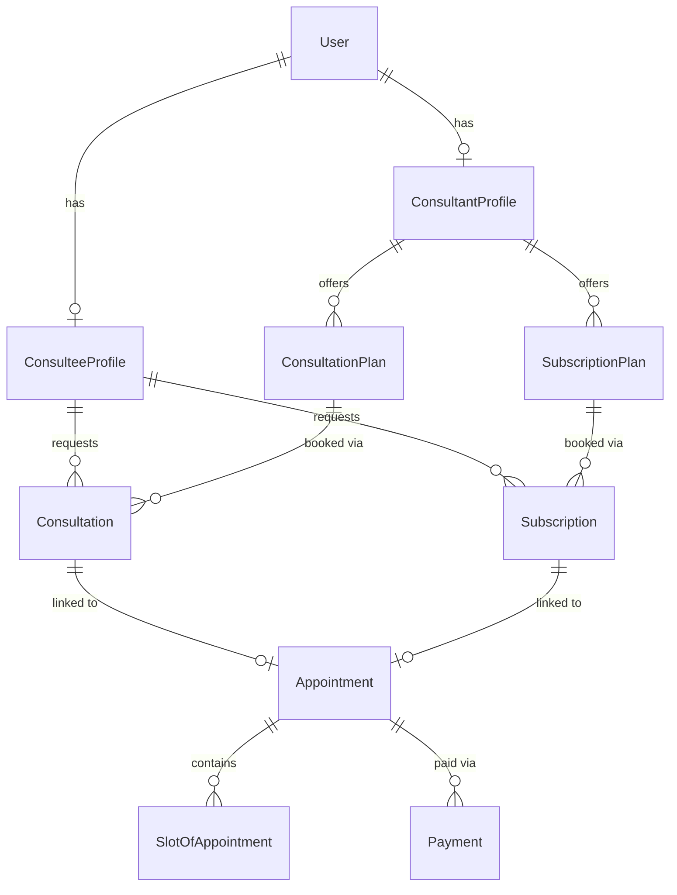
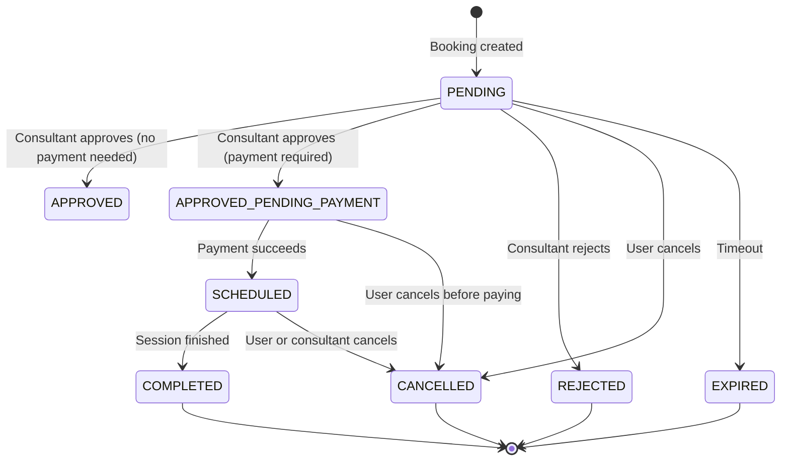
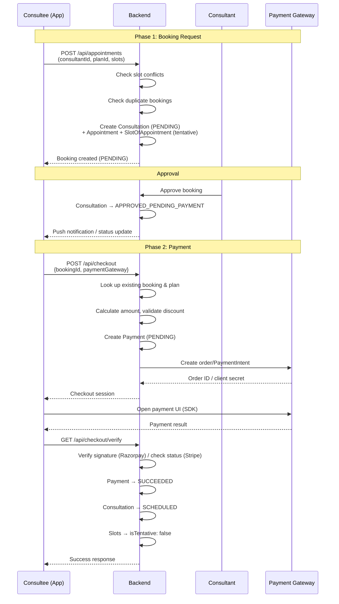
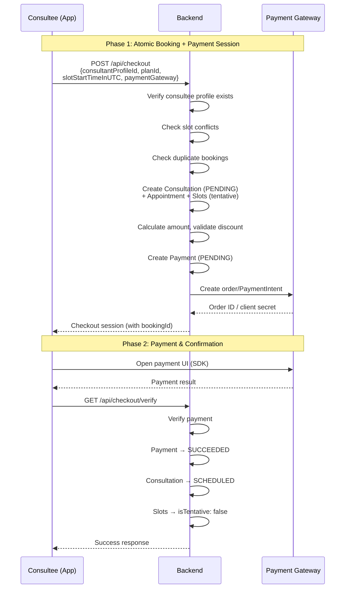

# Booking Lifecycle

> This document describes how bookings work end-to-end in the Familiarise mobile app — from a user selecting a consultant's plan, through approval and payment, to a confirmed scheduled session.

## Table of Contents

- [Overview](#overview)
- [Supported Booking Types](#supported-booking-types)
- [Entity Relationships](#entity-relationships)
- [Booking Status Transitions](#booking-status-transitions)
- [Checkout Flows](#checkout-flows)
  - [Request-then-Pay Flow](#request-then-pay-flow)
  - [Direct Checkout Flow](#direct-checkout-flow)
- [Approval Flow](#approval-flow)
- [Slot Management](#slot-management)
- [Booking Sources](#booking-sources)
- [Key Differences from Web App](#key-differences-from-web-app)
- [Related Documentation](#related-documentation)

---

## Overview

A "booking" in Familiarise is a request from a consultee (user) to schedule time with a consultant. The system uses a **two-phase commit pattern**:

1. **Phase 1 (Tentative)**: Create the booking and slots as tentative — they exist in the database but aren't confirmed yet.
2. **Phase 2 (Confirm)**: After successful payment, mark the booking as `SCHEDULED` and slots as confirmed (`isTentative: false`).

This prevents double-booking while allowing the payment gateway time to process.

---

## Supported Booking Types

The mobile app supports two booking types:

| Type | Description | Key Entity | Plan Entity |
|------|-------------|-----------|-------------|
| **Consultation** | One-time 1:1 session with a consultant | `Consultation` | `ConsultationPlan` |
| **Subscription** | Recurring sessions over a scheduling period | `Subscription` | `SubscriptionPlan` |

### Consultation

A single session booked for a specific time slot. The consultee picks a date, selects an available slot, and books it. Duration is defined by the `ConsultationPlan` (e.g., 30 min, 1 hour).

### Subscription

A recurring engagement over a defined period (e.g., 1 month). The subscription defines `callsPerWeek`, `sessionDurationInHours`, and `totalSessions`. Individual session slots are scheduled within the `schedulingPeriodStartsAt` → `schedulingPeriodEndsAt` window.

---

## Entity Relationships



### Key Fields

| Entity | Key Fields |
|--------|-----------|
| `Consultation` | `id`, `consultationPlanId`, `requestStatus`, `requestedById`, `bookingSource`, `requestNotes` |
| `Subscription` | `id`, `subscriptionPlanId`, `schedulingPeriodStartsAt`, `schedulingPeriodEndsAt`, `requestStatus`, `requestedById`, `bookingSource` |
| `Appointment` | `id`, `appointmentType` (CONSULTATION/SUBSCRIPTION), `consultationId?`, `subscriptionId?` |
| `SlotOfAppointment` | `id`, `startsAt`, `endsAt`, `isTentative`, `appointmentId` |
| `Payment` | `id`, `amount`, `currency`, `paymentIntent`, `paymentGateway`, `paymentStatus`, `userId`, `appointmentId` |

---

## Booking Status Transitions

The `RequestStatus` enum (`lib/domain/entities/booking/booking.dart:29-37`) defines all possible states:



### Status Definitions

| Status | Meaning |
|--------|---------|
| `PENDING` | Booking request submitted, awaiting consultant response |
| `APPROVED` | Approved but no payment needed (free plans, if applicable) |
| `APPROVED_PENDING_PAYMENT` | Approved, waiting for user to pay |
| `SCHEDULED` | Payment confirmed, session is scheduled |
| `COMPLETED` | Session has taken place |
| `REJECTED` | Consultant declined the request |
| `CANCELLED` | Cancelled by user or consultant |
| `EXPIRED` | Request timed out without action |

---

## Checkout Flows

### Request-then-Pay Flow

The traditional flow where the consultant must approve before the user pays.



### Direct Checkout Flow

Used when the user books and pays in a single step (e.g., open calendar slots).



**Key difference**: In direct checkout, the booking creation and payment session creation happen in the same `POST /api/checkout` call. The backend creates the consultation, appointment, and slots before creating the payment record and gateway order.

---

## Approval Flow

### How Consultant Approval Works

1. User submits a booking request → `Consultation` created with status `PENDING`
2. Consultant sees the request in their dashboard
3. Consultant either **approves** or **rejects**:
   - **Approve**: Status changes to `APPROVED_PENDING_PAYMENT`. The user is notified and can proceed to checkout.
   - **Reject**: Status changes to `REJECTED`. Tentative slots are released.
4. If no action is taken within the timeout window, the booking moves to `EXPIRED`

### Direct Checkout Skips Approval

When using direct checkout (`bookingSource: DIRECT_CHECKOUT`), the booking is created with `PENDING` status but immediately proceeds to payment. After payment succeeds, it jumps directly to `SCHEDULED`, effectively auto-approving.

---

## Slot Management

### Tentative Slots

When a booking is created, its `SlotOfAppointment` records are created with `isTentative: true`. Tentative slots:

- **Block the time** in the consultant's calendar (other users see them as unavailable)
- **Are not yet confirmed** — they can be released if payment fails or the booking is cancelled

### Slot Confirmation After Payment

After payment verification succeeds, the backend calls `CheckoutRepository.confirmSlots()`:

```
SlotOfAppointment (appointmentId = X) → isTentative: false
```

This happens in both:
- `verify.dart` (synchronous verification path for Razorpay)
- `webhook_handlers.dart` → `_confirmBooking()` (asynchronous webhook path)

### Slot Conflict Detection

When creating a consultation booking, `AppointmentRepository.createConsultationBooking()` checks for conflicts:

- Queries existing non-tentative slots that overlap with the requested time range
- If conflicts found, throws `SlotConflictException` with the conflicting slot times
- The checkout route returns HTTP 409 with error code `SLOT_CONFLICT`

### Duplicate Booking Prevention

The system prevents a user from having multiple active bookings with the same consultant for the same plan type:

- Checks for existing bookings with status `PENDING`, `APPROVED`, `APPROVED_PENDING_PAYMENT`, or `SCHEDULED`
- If found, throws `DuplicateBookingException`
- The checkout route returns HTTP 409 with error code `DUPLICATE_BOOKING`

---

## Booking Sources

| Source | Enum Value | When Used |
|--------|-----------|-----------|
| Request Submitted | `REQUEST_SUBMITTED` | User submits a booking request, awaits consultant approval |
| Direct Checkout | `DIRECT_CHECKOUT` | User books and pays in one step via `POST /api/checkout` |

Defined in `lib/core/constants/enums.dart:58-61`.

---

## Key Differences from Web App

| Feature | Web App | Mobile App |
|---------|---------|------------|
| Booking types | 5 (Consultation, Subscription, Webinar, Class, Trial) | 2 (Consultation, Subscription) |
| Distributed locking | Redis-based locks during checkout | No locking (direct DB queries) |
| Waitlist integration | Waitlist for full webinars/classes | Not implemented |
| Auto-completion cron | Marks sessions as COMPLETED automatically | Not implemented |
| Approval flow | Complex with per-type handlers | Simplified (same for both types) |
| Two-phase commit | Same pattern | Same pattern |
| Payment gateways | Razorpay + Stripe | Razorpay + Stripe |

---

## Related Documentation

- [Checkout Flow Architecture](../payments/01-checkout-flow-architecture.md) — Frontend state machine, gateway capabilities, component architecture
- [Payment Processing](../payments/02-payment-processing.md) — Backend payment flow, webhooks, verification
- [Payment Gateway Configuration](../payments/03-gateway-configuration.md) — Gateway setup and environment variables
- [Payment Testing Guide](../payments/04-testing-guide.md) — Test cards and testing strategies
- [Cancellation Flow](../payments/cancellations/flow.md) — How cancellations work after booking
- [Refund Flow](../payments/refunds/flow.md) — How refunds are processed
- Phase 5 Implementation Guide: `docs/implementation-guides/phase-05-booking-scheduling.md`
- Phase 6 Implementation Guide: `docs/implementation-guides/phase-06-checkout-payments.md`
