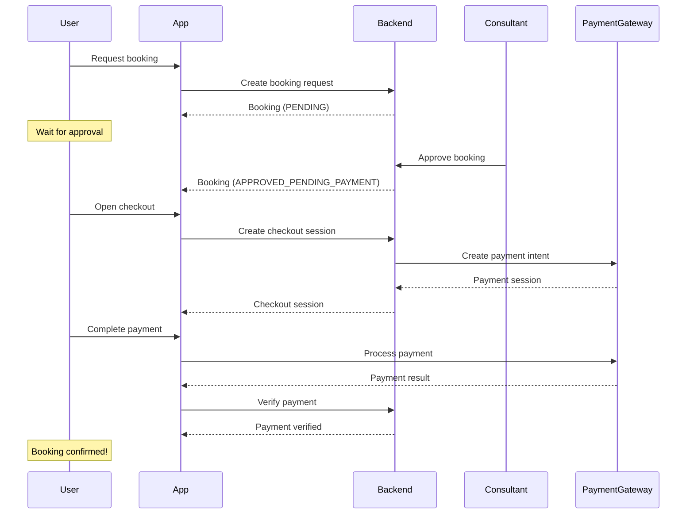
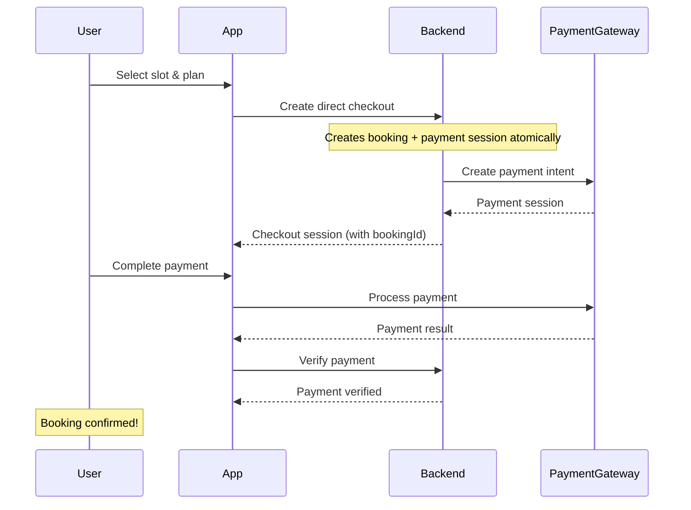
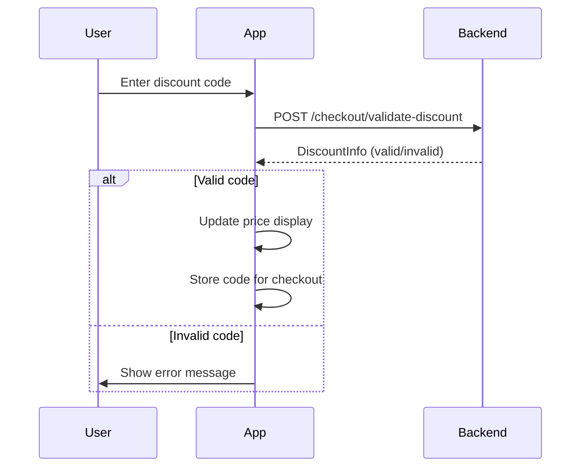

# Checkout Flow Architecture

This document describes the architecture of the checkout and payment system.

## Overview

The checkout system handles payment processing for booking consultations and subscriptions. It supports multiple payment gateways and two distinct checkout flows.

## Checkout Flows

### 1. Request-then-Pay Flow

Used when bookings require consultant approval before payment.



### 2. Direct Checkout Flow

Used for instant booking with auto-approval (e.g., open calendar slots).



## State Machine

The checkout flow is managed by a finite state machine:

```
┌─────────┐
│ initial │
└────┬────┘
     │ initializeCheckout()
     ▼
┌─────────┐
│ loading │
└────┬────┘
     │ session created
     ▼
┌───────────────┐
│ sessionCreated│
└───────┬───────┘
        │ processPayment()
        ▼
┌────────────┐
│ processing │
└─────┬──────┘
      │ payment complete
      ▼
┌───────────┐
│ verifying │
└─────┬─────┘
      │
      ├─────────────────────┐
      │                     │
      ▼                     ▼
┌─────────┐           ┌─────────┐
│ success │           │ failure │
└─────────┘           └─────────┘
```

### State Definitions

| State | Description |
|-------|-------------|
| `initial` | Starting state, ready to begin checkout |
| `loading` | Creating checkout session with backend |
| `sessionCreated` | Session ready, waiting for user to pay |
| `processing` | Payment being processed by gateway |
| `verifying` | Payment complete, verifying with backend |
| `success` | Payment verified, booking confirmed |
| `failure` | Payment or verification failed |
| `cancelled` | User cancelled payment |

## Component Architecture

```
┌────────────────────────────────────────────────────────────────┐
│                     Presentation Layer                          │
├────────────────────────────────────────────────────────────────┤
│  CheckoutScreen                                                 │
│  ├── BookingSummaryCard                                        │
│  ├── DiscountCodeInput                                         │
│  ├── PaymentMethodSelector                                      │
│  └── PriceSummaryCard                                          │
├────────────────────────────────────────────────────────────────┤
│  Providers (Riverpod)                                          │
│  ├── CheckoutFlowProvider (state machine)                      │
│  ├── StripeServiceProvider                                     │
│  ├── RazorpayServiceProvider                                   │
│  └── DiscountCodeValidatorProvider                             │
└────────────────────────────────────────────────────────────────┘
                              │
                              ▼
┌────────────────────────────────────────────────────────────────┐
│                      Domain Layer                               │
├────────────────────────────────────────────────────────────────┤
│  Entities                                                       │
│  ├── CheckoutSession                                           │
│  ├── PaymentVerification                                       │
│  ├── DiscountInfo                                              │
│  └── PaymentGatewayType                                        │
├────────────────────────────────────────────────────────────────┤
│  Repository Interface                                          │
│  └── CheckoutRepository                                        │
└────────────────────────────────────────────────────────────────┘
                              │
                              ▼
┌────────────────────────────────────────────────────────────────┐
│                       Data Layer                                │
├────────────────────────────────────────────────────────────────┤
│  Repository Implementation                                      │
│  └── CheckoutRepositoryImpl                                    │
├────────────────────────────────────────────────────────────────┤
│  Remote Data Source                                            │
│  └── CheckoutRemoteSource                                      │
├────────────────────────────────────────────────────────────────┤
│  Models                                                        │
│  ├── CheckoutResponseModel                                     │
│  ├── PaymentVerificationModel                                  │
│  └── DiscountValidationModel                                   │
└────────────────────────────────────────────────────────────────┘
```

## Payment Gateway Selection

The system automatically selects the appropriate gateway based on currency:

```dart
// Default selection logic
if (currency.toUpperCase() == 'INR') {
  _selectedGateway = PaymentGatewayType.razorpay;
} else {
  _selectedGateway = PaymentGatewayType.stripe;
}
```

### Gateway Capabilities

| Feature | Razorpay | Stripe |
|---------|----------|--------|
| UPI | ✅ | ❌ |
| Indian Cards | ✅ | ✅ |
| International Cards | Limited | ✅ |
| Apple Pay | ❌ | ✅ |
| Google Pay | ✅ | ✅ |
| Net Banking | ✅ | ❌ |
| Indian Wallets | ✅ | ❌ |

## Stripe Integration Details

### Payment Sheet Configuration

```dart
await Stripe.instance.initPaymentSheet(
  paymentSheetParameters: SetupPaymentSheetParameters(
    paymentIntentClientSecret: session.stripeClientSecret,
    merchantDisplayName: 'Familiarise',
    style: ThemeMode.system,
    applePay: PaymentSheetApplePay(
      merchantCountryCode: _getMerchantCountry(session.currency),
    ),
    googlePay: PaymentSheetGooglePay(
      merchantCountryCode: _getMerchantCountry(session.currency),
      testEnv: kDebugMode, // Test in debug, production in release
    ),
  ),
);
```

### Merchant Country Mapping

```dart
String _getMerchantCountry(String currency) {
  switch (currency.toUpperCase()) {
    case 'INR': return 'IN';
    case 'USD': return 'US';
    case 'EUR': return 'DE';
    case 'GBP': return 'GB';
    case 'AUD': return 'AU';
    case 'CAD': return 'CA';
    case 'JPY': return 'JP';
    case 'SGD': return 'SG';
    default: return 'US';
  }
}
```

## Razorpay Integration Details

### Payment Options

```dart
final options = {
  'key': EnvConfig.razorpayKeyId,
  'amount': amountInPaise, // Amount in smallest unit
  'currency': 'INR',
  'order_id': razorpayOrderId,
  'name': 'Familiarise',
  'description': planTitle,
  'prefill': {
    'email': userEmail,
    'contact': userPhone,
  },
};
```

## Discount Code Validation

Discount codes are validated before payment:



### Discount Types

1. **Percentage**: `10% off` - Calculated as `originalAmount * (percentage / 100)`
2. **Fixed Amount**: `₹500 off` - Fixed deduction from total

### Discount Caps

- `maximumDiscountAmount`: Caps percentage discounts
- Cannot exceed `originalAmount` (no negative totals)

## Error Handling

### Payment Failures

| Error Type | User Message | Recovery Action |
|------------|--------------|-----------------|
| Network | "Connection failed" | Retry payment |
| Card Declined | "Card declined" | Try different card |
| Insufficient Funds | "Insufficient funds" | Try different payment |
| 3DS Failed | "Verification failed" | Retry with OTP |
| Server Error | "Something went wrong" | Contact support |

### Session Invalidation

Checkout sessions are invalidated when:
- Payment gateway changes
- Discount code changes
- User navigates away

This prevents stale session data from causing payment issues.

## Security Considerations

1. **Server-side session creation**: Payment amounts calculated on server, not client
2. **Signature verification**: Razorpay payments verified using signature
3. **Payment verification**: All payments verified with backend before confirming booking
4. **No client-side secrets**: Stripe client secret received from backend per-session
5. **kDebugMode for test**: Google Pay test mode only in debug builds
