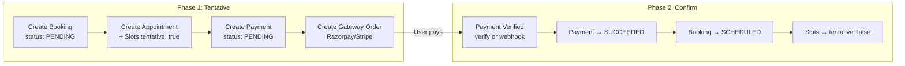
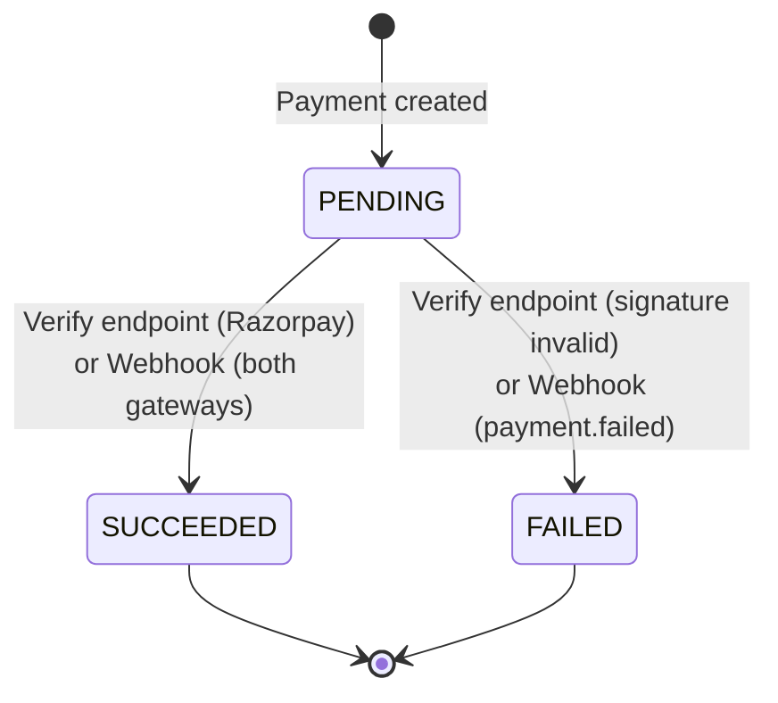
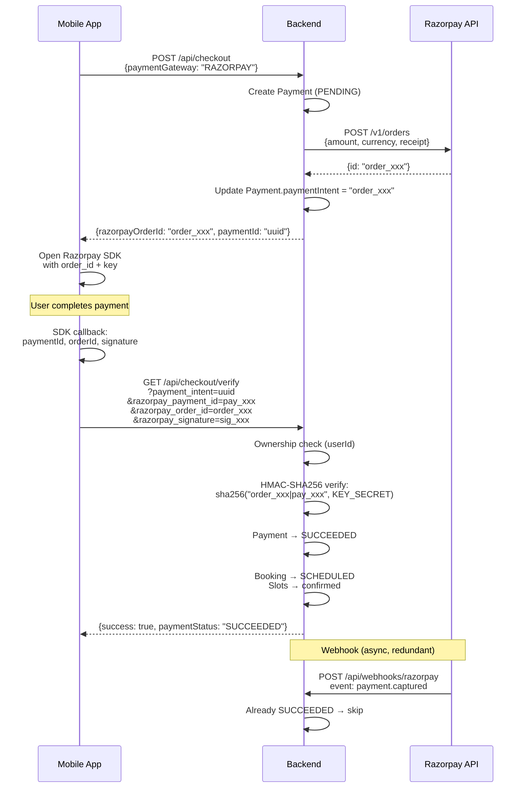
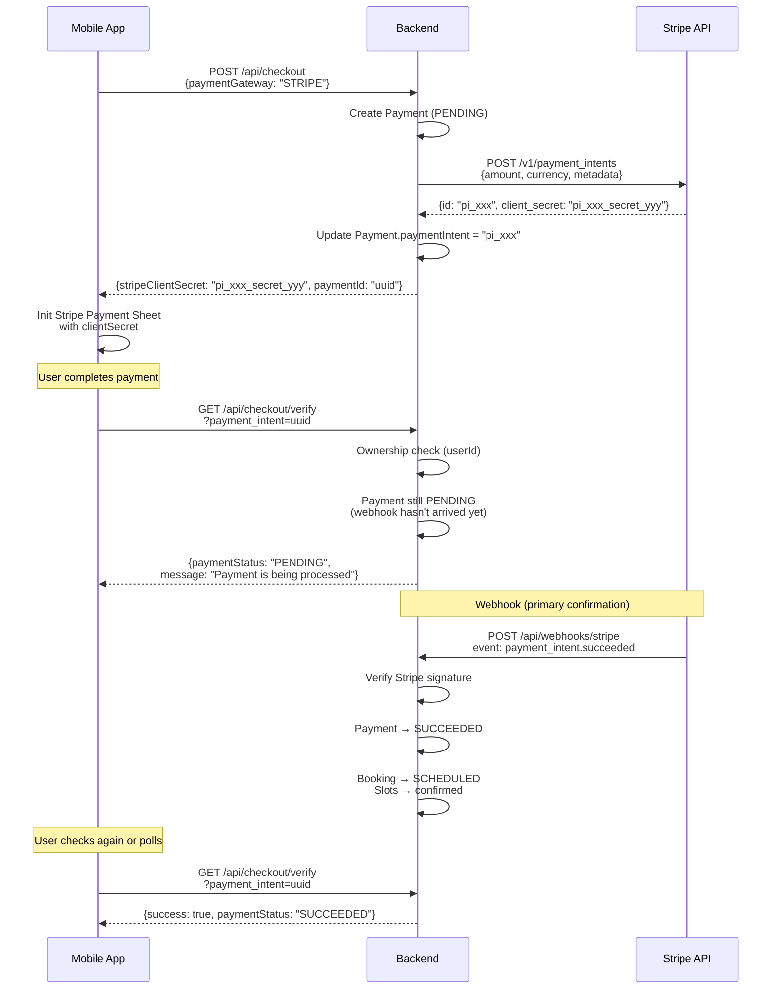

# Payment Processing

> This document describes how payment processing works end-to-end — from the checkout API, through gateway integration, to webhook confirmation. For the frontend state machine and component architecture, see [01-checkout-flow-architecture.md](./01-checkout-flow-architecture.md).

## Table of Contents

- [Overview](#overview)
- [Checkout API](#checkout-api)
  - [POST /api/checkout — Create Session](#post-apicheckout--create-session)
  - [GET /api/checkout/verify — Verify Payment](#get-apicheckoutverify--verify-payment)
- [Two-Phase Commit Pattern](#two-phase-commit-pattern)
- [Payment State Transitions](#payment-state-transitions)
- [Gateway Integration](#gateway-integration)
  - [Gateway Selection Logic](#gateway-selection-logic)
  - [Razorpay Flow](#razorpay-flow)
  - [Stripe Flow](#stripe-flow)
- [Webhook Handlers](#webhook-handlers)
  - [Razorpay Webhooks](#razorpay-webhooks)
  - [Stripe Webhooks](#stripe-webhooks)
  - [Shared Handler Logic](#shared-handler-logic)
  - [Idempotency](#idempotency)
- [Discount Code Handling](#discount-code-handling)
- [Error Handling](#error-handling)
- [Security](#security)
- [Related Documentation](#related-documentation)

---

## Overview

The payment system supports two gateways — **Razorpay** (India/INR) and **Stripe** (international). Payments flow through three stages:

1. **Session creation** (`POST /api/checkout`) — Backend creates a Payment record and a gateway-specific order/intent
2. **Client-side payment** — Frontend opens the gateway's native SDK (Razorpay Payment Sheet or Stripe Payment Sheet)
3. **Verification** — Two paths confirm the payment:
   - **Synchronous**: Frontend calls `GET /api/checkout/verify` (primary for Razorpay)
   - **Asynchronous**: Gateway sends a webhook event (primary for Stripe)

Both paths ultimately do the same thing: update `Payment.paymentStatus` to `SUCCEEDED` and confirm the booking.

---

## Checkout API

### POST /api/checkout — Create Session

**File**: `backend/routes/api/checkout/index.dart`

Creates a payment session. Supports two flows:

#### Request-then-Pay (existing booking)

```json
{
  "bookingId": "uuid",
  "appointmentType": "CONSULTATION" | "SUBSCRIPTION",
  "paymentGateway": "RAZORPAY" | "STRIPE",
  "discountCode": "WELCOME10"
}
```

#### Direct Checkout (creates booking + payment atomically)

```json
{
  "consultantProfileId": "uuid",
  "planId": "uuid",
  "appointmentType": "CONSULTATION" | "SUBSCRIPTION",
  "paymentGateway": "RAZORPAY" | "STRIPE",
  "slotStartTimeInUTC": "2024-01-15T09:00:00Z",
  "slotEndTimeInUTC": "2024-01-15T10:00:00Z",
  "schedulingPeriodStartsAt": "2024-01-15T00:00:00Z",
  "schedulingPeriodEndsAt": "2024-02-15T00:00:00Z",
  "discountCode": "WELCOME10",
  "notes": "optional message"
}
```

> For consultations, `slotStartTimeInUTC` is required. For subscriptions, `schedulingPeriodStartsAt` is required.

#### Success Response (HTTP 201)

```json
{
  "paymentId": "uuid",
  "gateway": "RAZORPAY",
  "amount": 50.00,
  "currency": "INR",
  "razorpayOrderId": "order_xxx",
  "stripeClientSecret": "pi_xxx_secret_yyy",
  "stripePaymentIntentId": "pi_xxx",
  "discountAmount": 5.00,
  "discountCode": "WELCOME10",
  "bookingId": "uuid",
  "bookingType": "CONSULTATION"
}
```

> Gateway-specific fields are conditionally included: `razorpayOrderId` for Razorpay, `stripeClientSecret` + `stripePaymentIntentId` for Stripe.

#### Error Codes

| Code | HTTP | Cause |
|------|------|-------|
| `MISSING_REQUIRED_FIELDS` | 400 | `appointmentType` or `paymentGateway` not provided |
| `INVALID_CHECKOUT_REQUEST` | 400 | Neither `bookingId` nor `consultantProfileId + planId` provided |
| `MISSING_CONSULTEE_PROFILE` | 400 | User hasn't completed onboarding |
| `MISSING_SLOT_TIME` | 400 | Consultation checkout without `slotStartTimeInUTC` |
| `MISSING_SCHEDULING_PERIOD` | 400 | Subscription checkout without `schedulingPeriodStartsAt` |
| `BOOKING_NOT_FOUND` | 404 | Invalid `bookingId` |
| `PLAN_NOT_FOUND` | 404 | Invalid `planId` |
| `SLOT_CONFLICT` | 409 | Requested slot overlaps with an existing confirmed slot |
| `DUPLICATE_BOOKING` | 409 | User already has an active booking with this consultant |
| `RAZORPAY_NOT_CONFIGURED` | 500 | Missing `RAZORPAY_KEY_ID` / `RAZORPAY_KEY_SECRET` in env |
| `STRIPE_NOT_CONFIGURED` | 500 | Missing `STRIPE_SECRET_KEY` in env |
| `RAZORPAY_ORDER_FAILED` | 502 | Razorpay API returned an error |
| `STRIPE_PAYMENT_FAILED` | 502 | Stripe API returned an error |

---

### GET /api/checkout/verify — Verify Payment

**File**: `backend/routes/api/checkout/verify.dart`

Verifies payment after the gateway callback and confirms the booking.

#### Query Parameters

| Parameter | Required | Description |
|-----------|----------|-------------|
| `payment_intent` | Yes | The payment UUID (not the gateway intent ID) |
| `razorpay_payment_id` | Razorpay only | Payment ID from Razorpay callback |
| `razorpay_order_id` | Razorpay only | Order ID from Razorpay callback |
| `razorpay_signature` | Razorpay only | HMAC-SHA256 signature from Razorpay callback |

#### Response

```json
{
  "success": true,
  "paymentStatus": "SUCCEEDED",
  "appointmentId": "uuid",
  "bookingType": "CONSULTATION",
  "message": "Payment successful",
  "consultantName": "John Doe",
  "planTitle": "1-Hour Consultation",
  "scheduledAt": "2024-01-15T09:00:00Z"
}
```

#### Three-Way Payment Status

The response `paymentStatus` field reflects the actual state:

| `success` | `pendingMessage` | `paymentStatus` | Meaning |
|-----------|-----------------|-----------------|---------|
| `true` | — | `SUCCEEDED` | Payment confirmed |
| `false` | set | `PENDING` | Stripe payment still processing (webhook hasn't arrived) |
| `false` | `null` | `FAILED` | Payment failed or verification failed |

> This three-way status was a bug fix — previously, PENDING Stripe payments were incorrectly returned as `FAILED`.

---

## Two-Phase Commit Pattern



Phase 2 can be triggered by either:
- **Verify endpoint** (`GET /api/checkout/verify`) — called by the frontend after Razorpay callback
- **Webhook** (`POST /api/webhooks/stripe` or `/razorpay`) — called by the gateway asynchronously

Both paths call the same confirmation logic (`updatePaymentStatus` → `updateBookingStatus` → `confirmSlots`).

---

## Payment State Transitions



The `Payment.paymentStatus` field has three values: `PENDING`, `SUCCEEDED`, `FAILED`.

**Idempotency**: Both the verify endpoint and webhook handlers check `currentStatus` before updating. If already `SUCCEEDED` or `FAILED`, they skip the update and return the current state.

---

## Gateway Integration

### Gateway Selection Logic

The frontend auto-selects the gateway based on the plan's currency:

```dart
if (currency.toUpperCase() == 'INR') {
  selectedGateway = PaymentGatewayType.razorpay;
} else {
  selectedGateway = PaymentGatewayType.stripe;
}
```

The user can manually override this in the checkout UI.

> For the full gateway capabilities comparison table, see [01-checkout-flow-architecture.md](./01-checkout-flow-architecture.md#gateway-capabilities).

---

### Razorpay Flow



**Signature verification**: The Razorpay signature is an HMAC-SHA256 hash of `orderId|paymentId` using the `RAZORPAY_KEY_SECRET`. The backend computes this independently and compares it to the signature provided by the SDK callback.

---

### Stripe Flow



**Key difference from Razorpay**: Stripe payments are confirmed via **webhooks**, not the verify endpoint. When the frontend calls verify immediately after payment, the webhook may not have arrived yet — so the response returns `paymentStatus: "PENDING"` instead of `FAILED`.

---

## Webhook Handlers

### Razorpay Webhooks

**File**: `backend/routes/api/webhooks/razorpay.dart`

**Endpoint**: `POST /api/webhooks/razorpay`

**Signature verification**: HMAC-SHA256 of the raw request body using `RAZORPAY_WEBHOOK_SECRET`, compared against the `X-Razorpay-Signature` header.

| Event | Handler | Action |
|-------|---------|--------|
| `payment.captured` | `handlePaymentSuccess()` | Mark payment SUCCEEDED, confirm booking |
| `order.paid` | `handlePaymentSuccess()` | Same as above |
| `payment.failed` | `handlePaymentFailure()` | Mark payment FAILED |
| `refund.processed` | `handleRefundProcessed()` | Create refund record |
| `refund.created` | `handleRefundProcessed()` | Create refund record |
| `payment.dispute.created` | `handleDisputeCreated()` | Create dispute record |

### Stripe Webhooks

**File**: `backend/routes/api/webhooks/stripe.dart`

**Endpoint**: `POST /api/webhooks/stripe`

**Signature verification**: Uses `StripeService.verifyWebhookSignature()` which validates the `Stripe-Signature` header (v1 scheme with 5-minute timestamp tolerance).

| Event | Handler | Action |
|-------|---------|--------|
| `payment_intent.succeeded` | `handlePaymentSuccess()` | Mark payment SUCCEEDED, confirm booking |
| `payment_intent.payment_failed` | `handlePaymentFailure()` | Mark payment FAILED |
| `charge.refunded` | `handleRefundProcessed()` | Create refund record |
| `charge.dispute.created` | `handleDisputeCreated()` | Create dispute record |

### Shared Handler Logic

**File**: `backend/lib/services/webhook_handlers.dart`

Both webhook endpoints delegate to `WebhookHandlers`, which contains the shared business logic:

```
handlePaymentSuccess(paymentIntentOrOrderId, gateway)
  └─ Find Payment by paymentIntent field
  └─ Skip if already SUCCEEDED (idempotent)
  └─ Payment.paymentStatus → SUCCEEDED
  └─ _confirmBooking(appointmentId)
       ├─ If Consultation → status: SCHEDULED + confirmSlots()
       ├─ If Subscription → status: SCHEDULED
       ├─ If Webinar → status: SCHEDULED + create group channel
       └─ If Class → status: SCHEDULED + create group channel
```

> The `_confirmBooking()` method looks up the appointment by ID, determines the booking type, and updates the appropriate entity. For consultations, it also calls `confirmSlots()` to mark slots as non-tentative.

### Idempotency

Both webhook endpoints check for duplicate processing:

1. **Payment-level**: `handlePaymentSuccess()` checks `if (currentStatus == 'SUCCEEDED') return` — skips if already processed
2. **Event-level**: Webhook events are tracked in the `WebhookEvent` table. Before processing, the handler checks if an event with the same ID has already been recorded. The event ID format:
   - Razorpay: `{accountId}_{eventType}_{paymentId}`
   - Stripe: Uses Stripe's native event ID

---

## Discount Code Handling

Discount codes are validated during checkout via `CheckoutRepository.validateDiscountCode()`:

1. Looks up the code in the `DiscountCode` table
2. Checks: `isActive == true`, not expired, usage limit not exceeded
3. Calculates discount amount:
   - **PERCENTAGE**: `amount * discountValue / 100`, capped by `maxDiscount`
   - **FIXED**: `discountValue` as a flat deduction
4. The discounted amount is deducted from `amountInSmallestUnit` (clamped to 0 minimum)
5. `discountCodeId` is stored on the Payment record for tracking

---

## Error Handling

### Error Response Format

All checkout endpoints use a consistent error format:

```json
{
  "error": {
    "code": "ERROR_CODE",
    "message": "Human-readable description",
    "details": { "field": "value" },
    "hint": "Suggestion for resolution"
  }
}
```

`details` and `hint` are optional. In production, internal error details are suppressed.

### Gateway-Specific Errors

| Gateway | Error | HTTP | What Happened |
|---------|-------|------|--------------|
| Razorpay | `RAZORPAY_ORDER_FAILED` | 502 | Razorpay API rejected the order creation |
| Stripe | `STRIPE_PAYMENT_FAILED` | 502 | Stripe API rejected the PaymentIntent creation |
| Razorpay | Signature mismatch | 400 | HMAC verification failed in verify endpoint |

---

## Security

### IDOR Ownership Verification

**File**: `backend/routes/api/checkout/verify.dart`

The verify endpoint checks that the payment belongs to the authenticated user before returning any data:

```dart
final paymentUserId = payment['userId'] as String?;
if (paymentUserId != userId) {
  return Response.json(
    statusCode: io.HttpStatus.notFound,  // 404, not 403
    body: {
      'success': false,
      'paymentStatus': 'FAILED',
      'message': 'Payment not found',
    },
  );
}
```

> Returns 404 (not 403) to avoid leaking that the payment ID exists. Without this check, any authenticated user could view any other user's payment details by guessing UUIDs.

### Signature Verification

Both gateways use cryptographic signature verification:

| Gateway | Algorithm | Message | Secret |
|---------|----------|---------|--------|
| Razorpay (verify) | HMAC-SHA256 | `orderId\|paymentId` | `RAZORPAY_KEY_SECRET` |
| Razorpay (webhook) | HMAC-SHA256 | Raw request body | `RAZORPAY_WEBHOOK_SECRET` |
| Stripe (webhook) | HMAC-SHA256 | `timestamp.payload` | `STRIPE_WEBHOOK_SECRET` |

### Server-Side Amount Calculation

Payment amounts are always calculated on the server from the plan's `price` field. The client never sends an amount — it only sends identifiers (`bookingId`, `planId`). This prevents price manipulation.

---

## Related Documentation

- [Checkout Flow Architecture](./01-checkout-flow-architecture.md) — Frontend state machine, gateway capabilities, component architecture
- [Booking Lifecycle](../booking/01-booking-lifecycle.md) — Booking status transitions, slot management, approval flow
- [Payment Gateway Configuration](./03-gateway-configuration.md) — Environment variables and gateway setup
- [Payment Testing Guide](./04-testing-guide.md) — Test cards and testing strategies
- [Refund Flow](./refunds/flow.md) — How refunds are processed after cancellation
- [Dispute Handling](./disputes/flow.md) — How payment disputes are tracked
- [Cancellation Flow](./cancellations/flow.md) — How bookings are cancelled
