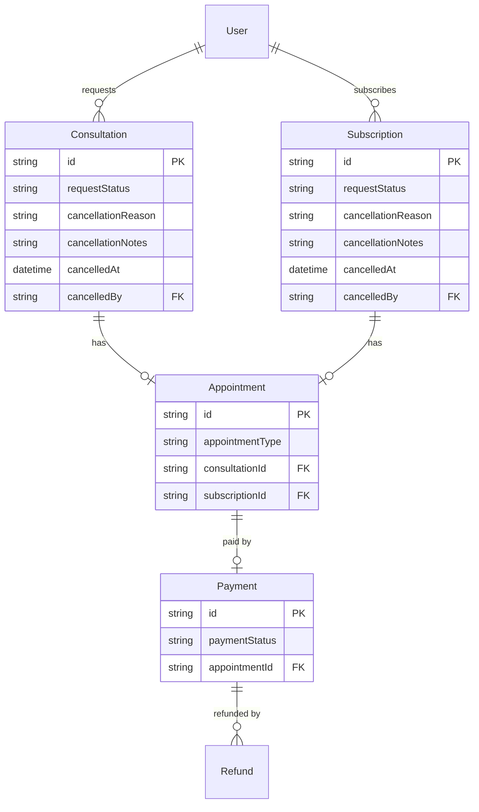
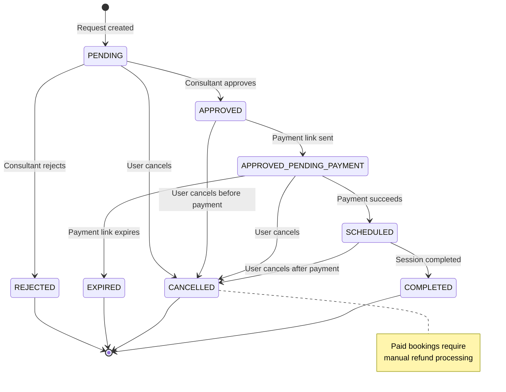
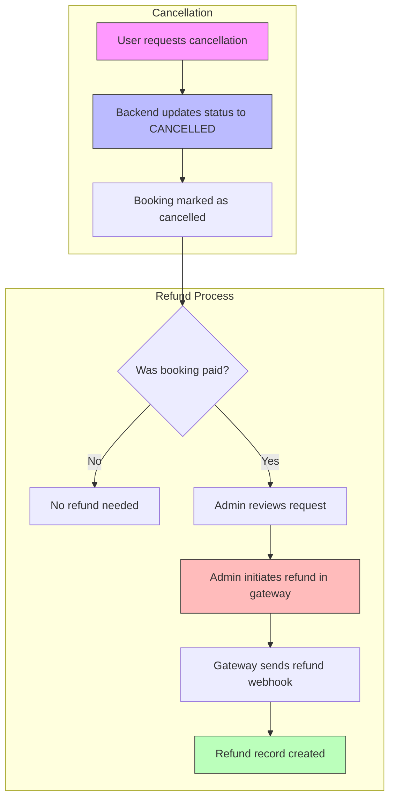
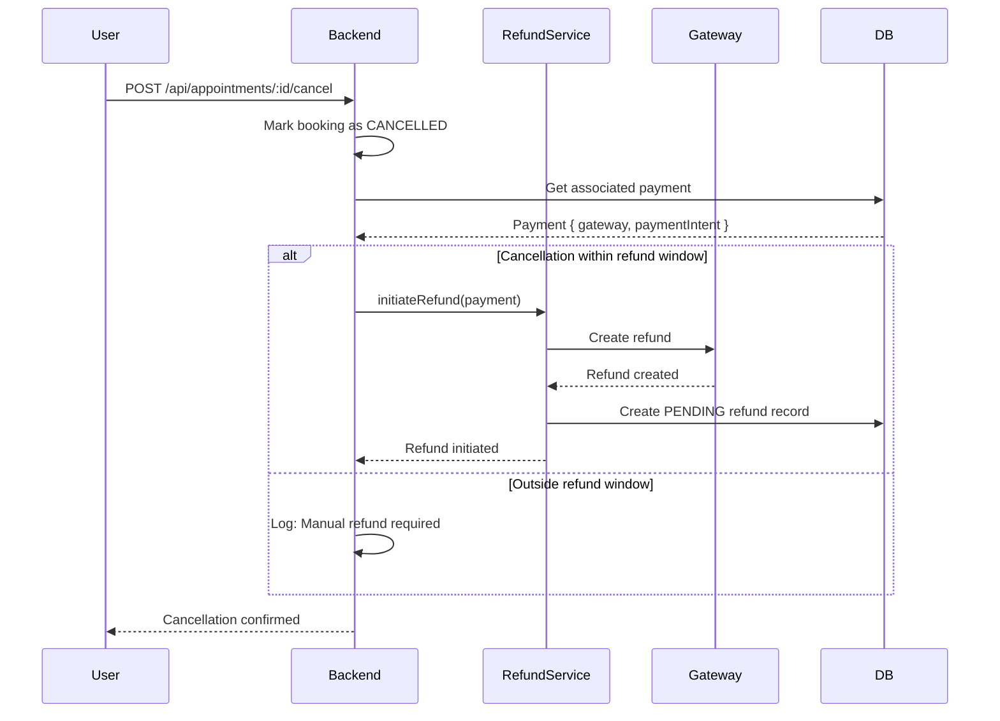

# Cancellations Architecture

## Overview

The cancellation system allows users to cancel booked appointments. Currently, cancellations update the booking status but **do not automatically trigger refunds**. Refunds must be initiated manually through payment gateway dashboards.

---

## Data Model

### Entities Involved



### Cancellation Fields

| Field | Type | Description |
|-------|------|-------------|
| `requestStatus` | RequestStatus | Updated to CANCELLED |
| `cancellationReason` | CancellationReason? | Enum value (TODO: not persisted) |
| `cancellationNotes` | String? | Free-text notes (TODO: not persisted) |
| `cancelledAt` | DateTime? | Timestamp of cancellation (TODO: not set) |
| `cancelledBy` | String? | User ID who cancelled (TODO: not set) |

---

## RequestStatus State Machine

### Status Transitions



### Cancellable Statuses

| Status | Can Cancel | Refund Required |
|--------|------------|-----------------|
| `PENDING` | Yes | No |
| `APPROVED` | Yes | No |
| `APPROVED_PENDING_PAYMENT` | Yes | No |
| `SCHEDULED` | Yes | Yes (manual) |
| `REJECTED` | No | N/A |
| `EXPIRED` | No | N/A |
| `CANCELLED` | No | N/A |
| `COMPLETED` | No | N/A |

---

## CancellationReason Enum

### User-Initiated Reasons

| Value | Description |
|-------|-------------|
| `SCHEDULE_CONFLICT` | User has scheduling conflict |
| `FOUND_ALTERNATIVE` | User found alternative solution |
| `FINANCIAL_REASONS` | Cost concerns |
| `PERSONAL_EMERGENCY` | Personal emergency |
| `NO_LONGER_NEEDED` | Service no longer required |

### Consultant-Initiated Reasons

| Value | Description |
|-------|-------------|
| `CONSULTANT_UNAVAILABLE` | Consultant can't make it |
| `CONSULTANT_EMERGENCY` | Consultant emergency |

### System-Initiated Reasons

| Value | Description |
|-------|-------------|
| `PAYMENT_FAILED` | Payment failed or expired |
| `EXPIRED` | Booking expired |

### Issue-Related Reasons

| Value | Description |
|-------|-------------|
| `CONSULTANT_ISSUE` | Issue with consultant |
| `TECHNICAL_ISSUE` | Technical problems |
| `OTHER` | Other reason (requires notes) |

---

## Cancellation vs Refund Relationship



### Key Point: No Automatic Refunds

Cancellation and refunds are **decoupled**:

1. **Cancellation**: Immediate, changes booking status
2. **Refund**: Manual, requires admin action in gateway dashboard
3. **Tracking**: Refund webhooks create Refund records

---

## Cancellation Policies

### Current Implementation

| Policy | Value | Enforced |
|--------|-------|----------|
| Minimum notice | 24 hours | Frontend only |
| Refund window | "5-7 business days" | Displayed to user |
| Full refund | N/A | Manual decision |
| Partial refund | N/A | Manual decision |

### Frontend Policy Check

```dart
// lib/domain/entities/booking/booking.dart

bool get canCancelNow {
  if (!canCancel) return false;

  // 24-hour cancellation window
  final scheduledTime = slots.first.startsAt;
  final hoursUntilSession = scheduledTime.difference(DateTime.now()).inHours;

  return hoursUntilSession >= 24;
}
```

### Policy Display (Mobile App)

```dart
// lib/features/booking/widgets/cancel_dialog.dart

if (booking.isPaid) {
  Text('Refund will be processed within 5-7 business days');
}
```

---

## Current Limitations

| Limitation | Description | Status |
|------------|-------------|--------|
| Reason not persisted | `cancellationReason` not saved to DB | TODO |
| Notes not persisted | `cancellationNotes` not saved to DB | TODO |
| No auto-refund | Must manually refund in gateway | TODO |
| No cancelledAt timestamp | Timestamp not recorded | TODO |
| No cancelledBy tracking | Who cancelled not recorded | TODO |
| Backend doesn't enforce 24hr | Only frontend checks time | TODO |

---

## Planned Improvements

### Auto-Refund on Cancellation (TODO)



### Cancellation Reason Persistence (TODO)

```dart
// Planned: Update cancel endpoint to save reason

Future<void> cancelBooking({
  required String bookingId,
  required String bookingType,
  required String userId,
  CancellationReason? reason,
  String? notes,
}) async {
  await db.update(
    table: bookingType == 'CONSULTATION' ? 'Consultation' : 'Subscription',
    where: {'id': bookingId},
    data: {
      'requestStatus': 'CANCELLED',
      'cancellationReason': reason?.name,
      'cancellationNotes': notes,
      'cancelledAt': DateTime.now().toIso8601String(),
      'cancelledBy': userId,
    },
  );
}
```

---

## Key Files

| File | Purpose |
|------|---------|
| `backend/routes/api/appointments/[id]/cancel.dart` | Cancel endpoint |
| `backend/lib/database/repositories/appointment_repository.dart` | Cancellation logic |
| `lib/features/booking/widgets/cancel_dialog.dart` | Mobile cancellation UI |
| `lib/features/booking/providers/booking_actions_provider.dart` | Cancellation state |
| `lib/domain/entities/booking/booking.dart` | Booking entity with cancellation helpers |
