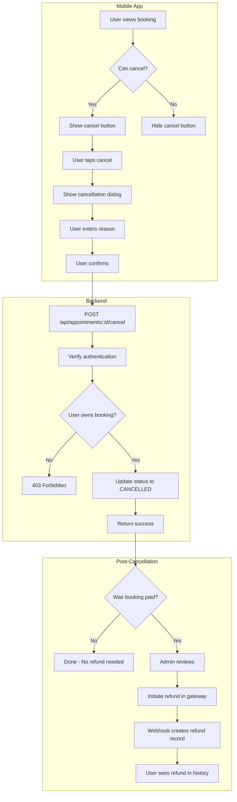
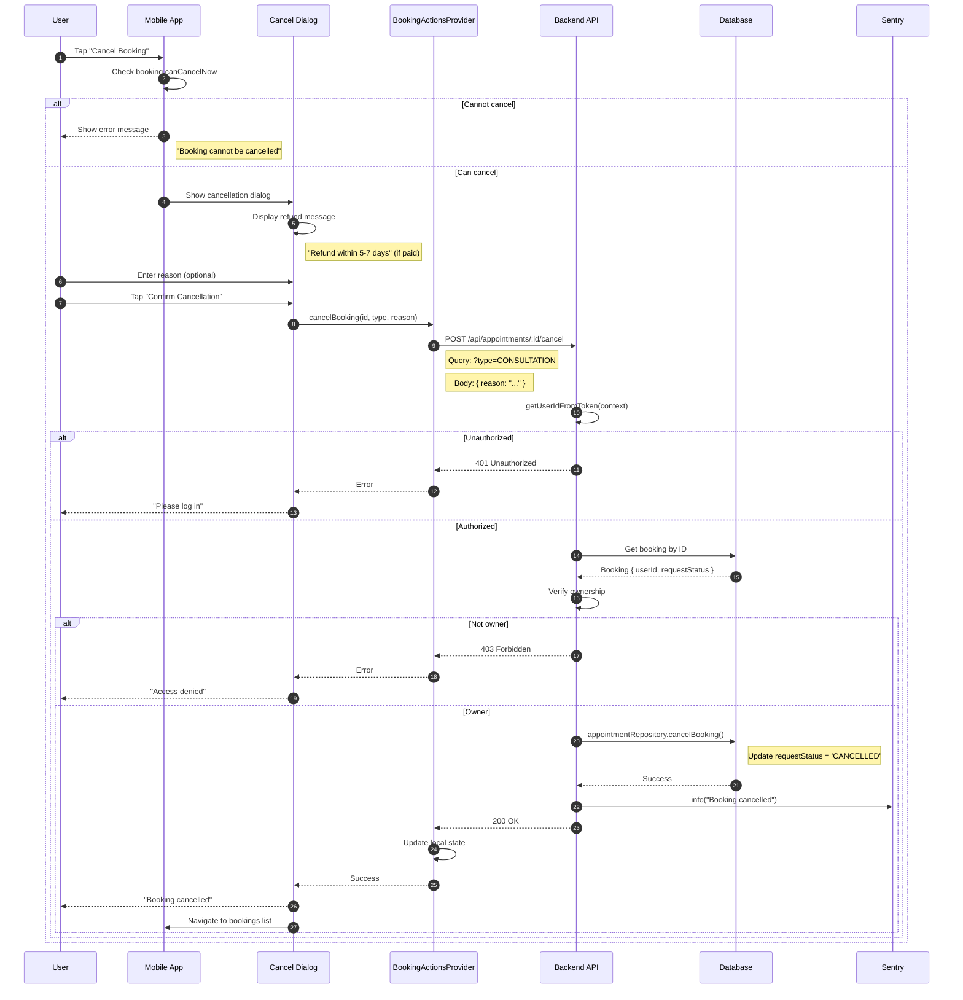
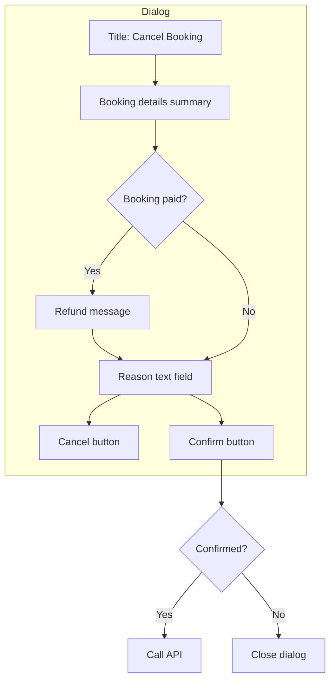
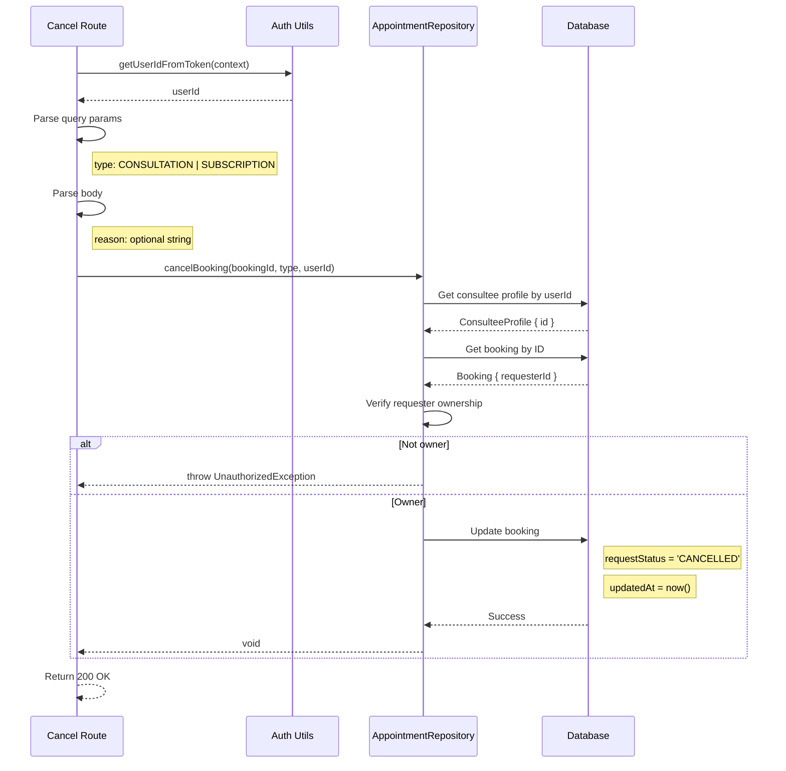
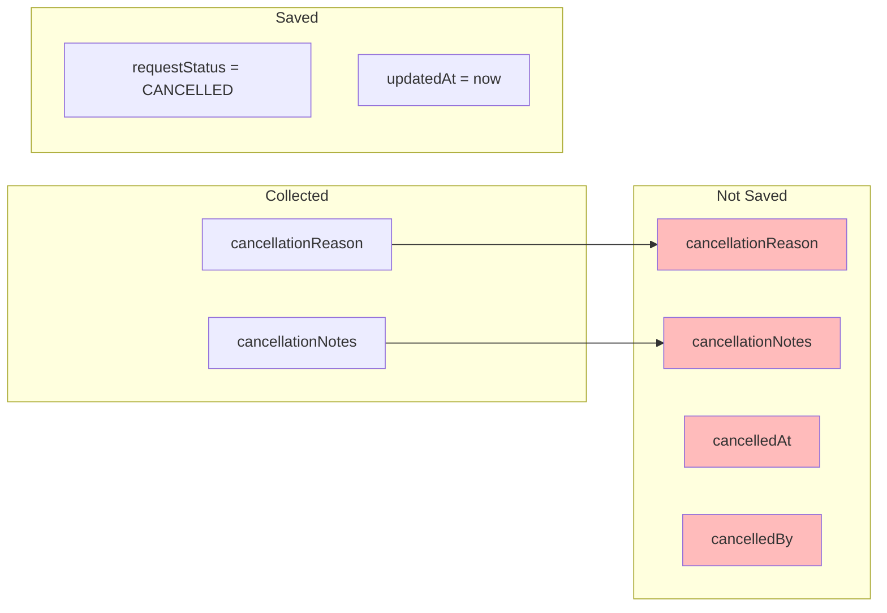
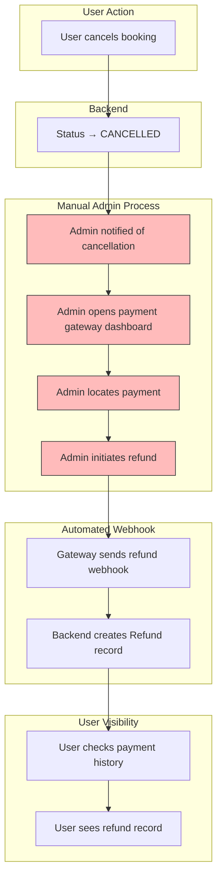
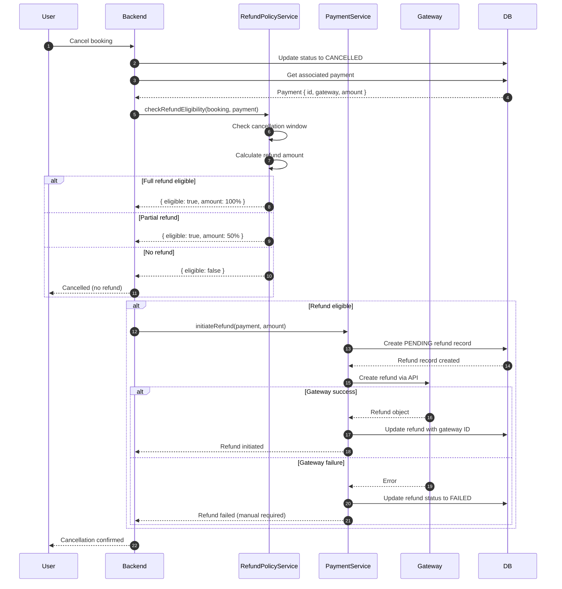
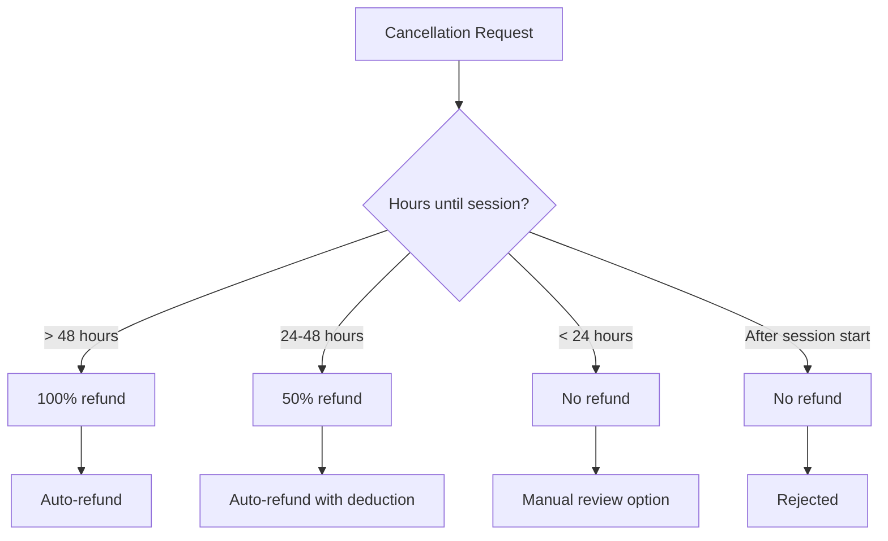
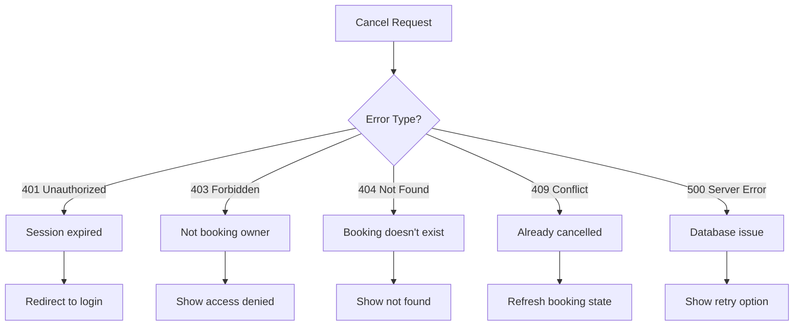

# Cancellation Flows

## Overview

This document details the cancellation flows for both unpaid and paid bookings, including the current manual refund process and planned automatic refund implementation.

---

## End-to-End Cancellation Flow



---

## User Cancellation Flow (Current Implementation)

### Sequence Diagram



---

## Mobile App Cancellation Dialog

### Dialog Flow



### Dialog UI (Pseudo-code)

```dart
CancelDialog(booking):
  Column(
    Header("Cancel Booking"),

    // Booking summary
    Text("Consultant: ${booking.consultantName}"),
    Text("Date: ${booking.scheduledAt}"),

    // Refund notice (if paid)
    if (booking.isPaid):
      InfoCard(
        icon: Icons.info,
        text: "Refund will be processed within 5-7 business days"
      ),

    // Reason input
    TextField(
      label: "Reason for cancellation (optional)",
      maxLines: 3,
      onChanged: (value) => reason = value
    ),

    // Actions
    Row(
      TextButton("Cancel", onPressed: close),
      ElevatedButton(
        "Confirm Cancellation",
        style: dangerStyle,
        onPressed: () => confirmCancellation(reason)
      )
    )
  )
```

---

## Backend Cancellation Logic

### Current Implementation



### What's NOT Saved (Current Limitation)



---

## Full Cancellation with Refund Flow

### Current Manual Process



### Planned Automatic Process (TODO)



---

## Cancellation Policy Rules (Planned)

### Policy Decision Matrix



### Policy Configuration (Planned)

```dart
class RefundPolicy {
  // Full refund window
  static const fullRefundHours = 48;

  // Partial refund window
  static const partialRefundHours = 24;
  static const partialRefundPercent = 50;

  // No refund after session starts
  static const noRefundAfterStart = true;

  RefundDecision evaluate(Booking booking) {
    final hoursUntil = booking.scheduledAt.difference(DateTime.now()).inHours;

    if (hoursUntil > fullRefundHours) {
      return RefundDecision.full();
    } else if (hoursUntil > partialRefundHours) {
      return RefundDecision.partial(partialRefundPercent);
    } else {
      return RefundDecision.none();
    }
  }
}
```

---

## Error Handling

### Common Error Scenarios



### Mobile App Error Handling

```dart
Future<void> cancelBooking() async {
  try {
    await repository.cancelBooking(booking.id, booking.type);
    // Success
  } on UnauthorizedException {
    // Navigate to login
  } on ForbiddenException {
    showError("You don't have permission to cancel this booking");
  } on NotFoundException {
    showError("Booking not found");
  } on ConflictException {
    showError("Booking is already cancelled");
    refreshBooking();
  } catch (e) {
    showError("Failed to cancel booking. Please try again.");
  }
}
```

---

## Business Rules Summary

| Rule | Current | Enforced By |
|------|---------|-------------|
| 24-hour minimum notice | Yes | Frontend only |
| Only owner can cancel | Yes | Backend |
| Refund for paid bookings | Manual | Admin dashboard |
| Cancellation reason required | No | Optional field |
| Session-in-progress protection | No | Not implemented |

---

## Key Files

| File | Purpose |
|------|---------|
| `backend/routes/api/appointments/[id]/cancel.dart` | Cancel endpoint |
| `backend/lib/database/repositories/appointment_repository.dart` | `cancelBooking()` method |
| `lib/features/booking/widgets/cancel_dialog.dart` | Cancellation UI |
| `lib/features/booking/providers/booking_actions_provider.dart` | Cancellation state management |
| `lib/data/datasources/remote/booking_remote_source.dart` | API client |
| `lib/domain/entities/booking/booking.dart` | `canCancel` and `canCancelNow` properties |
