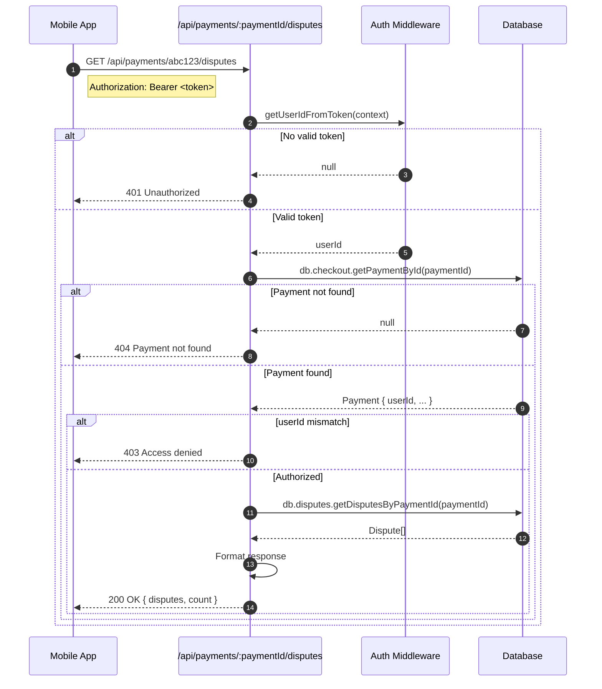

# Disputes API Reference

## Overview

This document covers the current dispute API endpoints and planned future endpoints.

---

## Current Endpoints

### GET /api/payments/:paymentId/disputes

Retrieve all disputes associated with a payment.

#### Authentication

Requires valid JWT token in `Authorization` header.

#### Authorization

User must own the payment (payment.userId === authenticated user).

#### Request

```
GET /api/payments/abc123-def456/disputes
Authorization: Bearer <jwt_token>
```

#### Response (Success - 200)

```json
{
  "paymentId": "abc123-def456",
  "disputes": [
    {
      "id": "uuid-dispute-1",
      "disputeId": "dp_1OdP1x2eZvKYlo2C0ABC123",
      "amount": 10000,
      "currency": "USD",
      "reason": "fraudulent",
      "status": "NEEDS_RESPONSE",
      "paymentGateway": "STRIPE",
      "dueBy": "2024-01-22T00:00:00Z",
      "isChargeRefundable": true,
      "createdAt": "2024-01-15T10:30:00Z"
    }
  ],
  "count": 1
}
```

#### Response (Unauthorized - 401)

```json
{
  "error": {
    "message": "Unauthorized"
  }
}
```

#### Response (Payment Not Found - 404)

```json
{
  "error": {
    "message": "Payment not found"
  }
}
```

#### Response (Access Denied - 403)

```json
{
  "error": {
    "message": "Access denied"
  }
}
```

#### Response (Server Error - 500)

```json
{
  "error": {
    "message": "Failed to fetch disputes",
    "details": "Error description..."
  }
}
```

---

### Sequence Diagram: GET Disputes



---

## Response Field Reference

### Dispute Object

| Field | Type | Description |
|-------|------|-------------|
| `id` | string | Internal UUID for the dispute record |
| `disputeId` | string | Gateway-specific dispute ID (e.g., `dp_xxx`) |
| `amount` | integer | Disputed amount in smallest currency unit |
| `currency` | string | ISO 4217 currency code |
| `reason` | string | Dispute reason code (gateway-specific) |
| `status` | DisputeStatus | Current dispute status |
| `paymentGateway` | string | Gateway: "STRIPE" or "RAZORPAY" |
| `dueBy` | ISO8601? | Evidence submission deadline (may be null) |
| `isChargeRefundable` | boolean | Whether proactive refund is possible |
| `createdAt` | ISO8601 | When dispute was created |

### DisputeStatus Enum

| Value | Description | Urgency |
|-------|-------------|---------|
| `WARNING_NEEDS_RESPONSE` | Early fraud warning | Low |
| `WARNING_UNDER_REVIEW` | Warning being reviewed | Low |
| `WARNING_CLOSED` | Warning resolved | None |
| `NEEDS_RESPONSE` | Evidence required | High |
| `UNDER_REVIEW` | Evidence submitted, awaiting decision | Medium |
| `CHARGE_REFUNDED` | Merchant proactively refunded | None |
| `WON` | Merchant won dispute | None |
| `LOST` | Customer won dispute | None |

### Dispute Reason Codes

#### Stripe Reasons

| Code | Description |
|------|-------------|
| `duplicate` | Duplicate charge |
| `fraudulent` | Fraud claim |
| `subscription_canceled` | Subscription issue |
| `product_unacceptable` | Product/service issue |
| `product_not_received` | Non-delivery |
| `unrecognized` | Unrecognized charge |
| `credit_not_processed` | Refund not received |
| `general` | Other |

#### Razorpay Reasons

| Code | Description |
|------|-------------|
| `chargeback` | General chargeback |
| `fraud` | Fraud claim |
| `authorization` | Authorization issue |
| `processing_error` | Processing error |
| `consumer_dispute` | Consumer dispute |

---

## Future Endpoints (TODO)

### POST /api/disputes/:disputeId/evidence

> **Status**: Not Implemented
> **Gateway Support**: Stripe only (Razorpay requires dashboard)

Submit evidence to respond to a dispute.

#### Planned Request

```
POST /api/disputes/dp_xxx/evidence
Authorization: Bearer <jwt_token>
Content-Type: application/json

{
  "customerName": "John Doe",
  "customerEmail": "john@example.com",
  "serviceDate": "2024-01-10",
  "receiptUrl": "https://storage.example.com/receipts/abc123.pdf",
  "serviceDocumentation": "https://storage.example.com/docs/session-notes.pdf",
  "additionalInfo": "Customer attended 30-minute consultation session"
}
```

#### Planned Evidence Fields

| Field | Required | Description |
|-------|----------|-------------|
| `customerName` | Yes | Customer's full name |
| `customerEmail` | Yes | Customer's email |
| `serviceDate` | Recommended | Date of service |
| `receiptUrl` | Recommended | URL to receipt/invoice |
| `serviceDocumentation` | Recommended | URL to proof of service |
| `additionalInfo` | Optional | Additional context |

#### Planned Response (Success - 200)

```json
{
  "disputeId": "dp_xxx",
  "status": "UNDER_REVIEW",
  "evidenceSubmittedAt": "2024-01-16T09:00:00Z",
  "message": "Evidence submitted successfully"
}
```

#### Planned Error Responses

| Code | Condition |
|------|-----------|
| 400 | Missing required fields |
| 400 | Gateway is Razorpay (not supported) |
| 403 | User doesn't own associated payment |
| 404 | Dispute not found |
| 409 | Dispute not in NEEDS_RESPONSE status |
| 410 | Evidence deadline has passed |
| 502 | Stripe API error |

---

### GET /api/disputes

> **Status**: Not Implemented

List all disputes for the authenticated user.

#### Planned Request

```
GET /api/disputes?status=NEEDS_RESPONSE&page=1&limit=20
Authorization: Bearer <jwt_token>
```

#### Planned Query Parameters

| Parameter | Type | Description |
|-----------|------|-------------|
| `status` | string | Filter by status |
| `gateway` | string | Filter by gateway |
| `page` | integer | Page number |
| `limit` | integer | Items per page |

#### Planned Response

```json
{
  "disputes": [ ... ],
  "pagination": {
    "page": 1,
    "limit": 20,
    "total": 5,
    "pages": 1
  }
}
```

---

### GET /api/admin/disputes

> **Status**: Not Implemented

Admin endpoint to view all disputes across users.

#### Planned Features

- Filter by urgency (approaching deadline)
- Filter by status
- Export to CSV
- Bulk operations

---

## Mobile App Usage

### Fetching Disputes (Dart)

```dart
// lib/data/datasources/remote/payment_remote_source.dart

Future<List<DisputeModel>> getDisputesByPaymentId(String paymentId) async {
  final response = await dio.get(
    '/api/payments/$paymentId/disputes',
    options: Options(headers: {'Authorization': 'Bearer $token'}),
  );

  if (response.statusCode == 200) {
    final data = response.data;
    return (data['disputes'] as List)
        .map((d) => DisputeModel.fromJson(d))
        .toList();
  }

  throw PaymentException('Failed to fetch disputes');
}
```

### DisputeModel (Dart)

```dart
@freezed
class Dispute with _$Dispute {
  const factory Dispute({
    required String id,
    required String disputeId,
    required int amount,
    required String currency,
    required String reason,
    required DisputeStatus status,
    required String paymentGateway,
    DateTime? dueBy,
    required bool isChargeRefundable,
    required DateTime createdAt,
  }) = _Dispute;
}

enum DisputeStatus {
  warningNeedsResponse,
  warningUnderReview,
  warningClosed,
  needsResponse,
  underReview,
  chargeRefunded,
  won,
  lost,
}
```

### Displaying Dispute Urgency

```dart
extension DisputeUrgency on Dispute {
  bool get isUrgent {
    if (status != DisputeStatus.needsResponse) return false;
    if (dueBy == null) return true; // Unknown deadline = urgent

    final hoursRemaining = dueBy!.difference(DateTime.now()).inHours;
    return hoursRemaining < 48;
  }

  String get urgencyLabel {
    if (status == DisputeStatus.needsResponse) {
      if (dueBy == null) return 'Response Required';
      final days = dueBy!.difference(DateTime.now()).inDays;
      if (days < 1) return 'Due Today!';
      if (days < 3) return 'Due in $days days';
      return 'Due by ${DateFormat.yMMMd().format(dueBy!)}';
    }
    return status.label;
  }
}
```

---

## Gateway Dashboard Links

Since evidence submission currently requires gateway dashboards:

| Gateway | Dashboard URL |
|---------|---------------|
| Stripe | https://dashboard.stripe.com/disputes |
| Razorpay | https://dashboard.razorpay.com/app/disputes |

---

## Error Codes

| HTTP Code | Error | Cause |
|-----------|-------|-------|
| 401 | Unauthorized | Missing or invalid JWT token |
| 403 | Access denied | User doesn't own the payment |
| 404 | Payment not found | Invalid paymentId |
| 500 | Internal server error | Database or server issue |

---

## Key Files

| File | Purpose |
|------|---------|
| `backend/routes/api/payments/[paymentId]/disputes.dart` | Current GET endpoint |
| `lib/data/datasources/remote/payment_remote_source.dart` | Mobile API client (TODO) |
| `lib/domain/entities/dispute.dart` | Dispute entity (TODO) |
