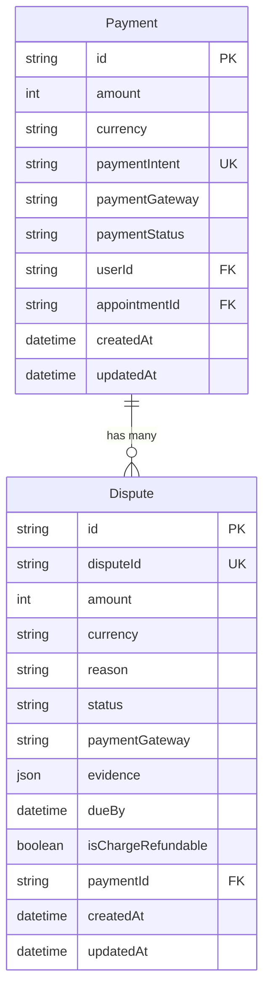
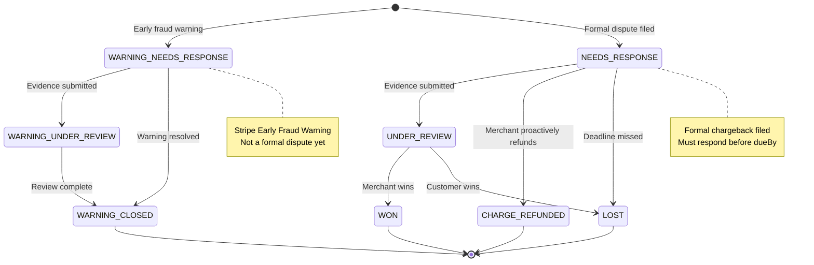
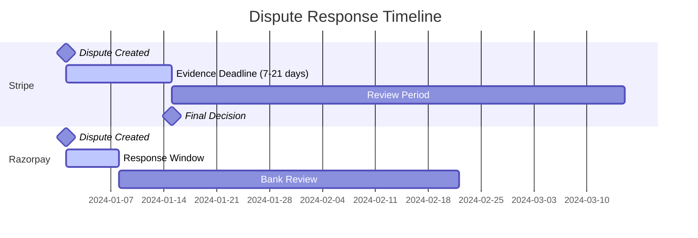
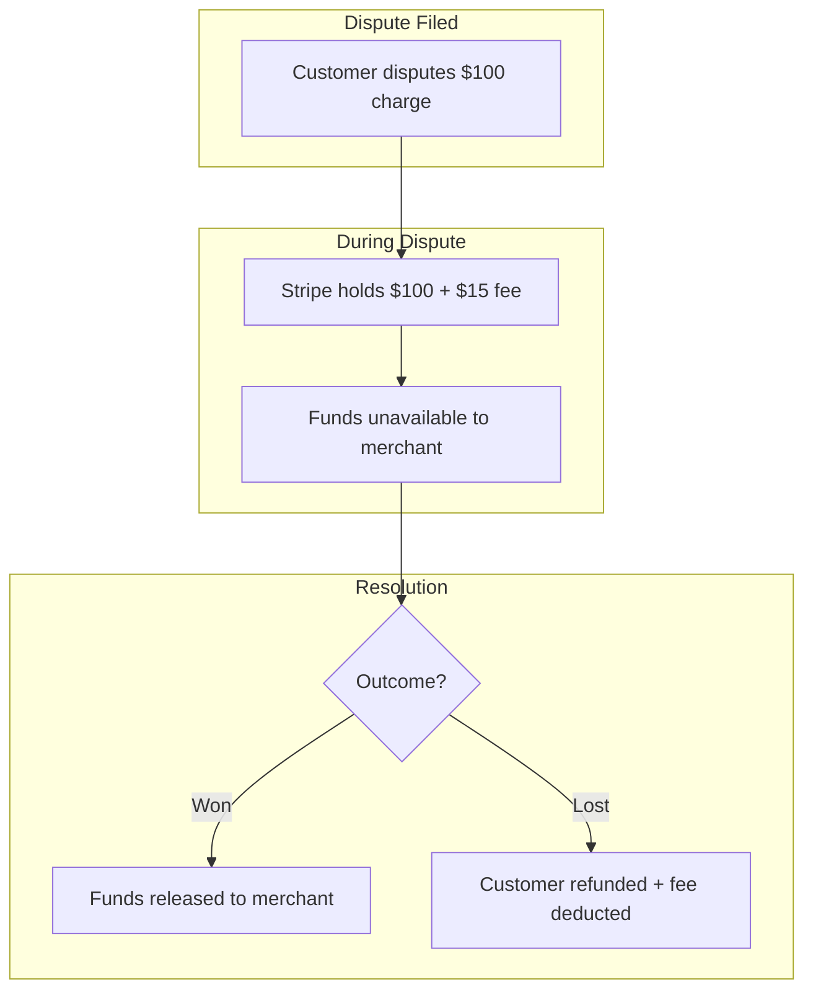

# Disputes Architecture

## Overview

The dispute system tracks chargebacks and payment disputes filed by customers through their banks or card issuers. Disputes are received via webhooks from payment gateways and tracked in the database for monitoring and resolution.

---

## Data Model

### Entity Relationship Diagram



### Dispute Model Schema

```
Dispute {
  id                 String         @id @default(uuid())
  disputeId          String         @unique    // Gateway-specific ID
  amount             Int                       // Disputed amount (smallest unit)
  currency           String                    // ISO currency code
  reason             String                    // Dispute reason code
  status             DisputeStatus             // See state machine below
  paymentGateway     PaymentGateway            // STRIPE | RAZORPAY
  evidence           Json?                     // Submitted evidence
  dueBy              DateTime?                 // Response deadline
  isChargeRefundable Boolean        @default(true)
  paymentId          String         @relation  // Links to Payment
  createdAt          DateTime       @default(now())
  updatedAt          DateTime       @updatedAt
}
```

---

## DisputeStatus State Machine

### Full State Diagram



### Status Definitions

| Status | Description | Action Required |
|--------|-------------|-----------------|
| `WARNING_NEEDS_RESPONSE` | Early fraud warning (Stripe only) | Review and monitor |
| `WARNING_UNDER_REVIEW` | Warning evidence under review | Wait for outcome |
| `WARNING_CLOSED` | Warning resolved without dispute | None |
| `NEEDS_RESPONSE` | Formal dispute requires evidence | Submit before deadline |
| `UNDER_REVIEW` | Evidence submitted, awaiting decision | Wait for outcome |
| `CHARGE_REFUNDED` | Merchant proactively refunded | None |
| `WON` | Merchant won the dispute | Funds returned |
| `LOST` | Customer won the dispute | Funds deducted |

---

## Gateway Differences

### Feature Comparison

| Feature | Stripe | Razorpay |
|---------|--------|----------|
| API for listing disputes | Yes | No (dashboard only) |
| API for submitting evidence | Yes | No |
| Webhook support | Yes | Yes |
| Early fraud warnings | Yes | No |
| Evidence deadline tracking | Yes | Yes |
| Automated response deadline | Yes | Manual |

### Dispute ID Patterns

| Gateway | ID Pattern | Example |
|---------|------------|---------|
| Stripe | `dp_*` | `dp_1OdP1x2eZvKYlo2C0ABC123` |
| Razorpay | `disp_*` | `disp_H2xWz3abc123def` |

---

## Dispute Reason Codes

### Stripe Reason Codes

| Code | Description |
|------|-------------|
| `duplicate` | Customer claims duplicate charge |
| `fraudulent` | Customer claims fraud |
| `subscription_canceled` | Subscription cancellation issue |
| `product_unacceptable` | Product/service not as described |
| `product_not_received` | Customer didn't receive product |
| `unrecognized` | Customer doesn't recognize charge |
| `credit_not_processed` | Expected refund not received |
| `general` | General/other reason |

### Razorpay Reason Codes

| Code | Description |
|------|-------------|
| `chargeback` | General chargeback |
| `fraud` | Fraud claim |
| `authorization` | Authorization issue |
| `processing_error` | Processing error claim |
| `consumer_dispute` | Consumer dispute |

---

## Response Deadlines

### Timeline



### Key Deadlines

| Gateway | Response Window | Typical Review Period |
|---------|-----------------|----------------------|
| Stripe | 7-21 days | 60-90 days |
| Razorpay | 7 days | 45-60 days |

---

## Evidence Submission (Stripe Only)

### Required Evidence Fields

| Field | Type | Description |
|-------|------|-------------|
| `customer_name` | string | Customer's name |
| `customer_email_address` | string | Customer's email |
| `customer_purchase_ip` | string | IP address during purchase |
| `receipt` | file_id | Receipt or invoice |
| `service_date` | string | Date service was provided |
| `service_documentation` | file_id | Proof of service delivery |

### Evidence Submission (Pseudo-code)

```
submitEvidence(disputeId, evidence):
  // Only works for Stripe
  if gateway != 'STRIPE':
    throw NotSupportedException("Evidence submission only available for Stripe")

  stripe.disputes.update(disputeId, {
    evidence: {
      customer_name: evidence.customerName,
      customer_email_address: evidence.customerEmail,
      receipt: evidence.receiptFileId,
      service_date: evidence.serviceDate,
      // ... other fields
    },
    submit: true  // Submit for review
  })

  // Update local record
  db.disputes.update(disputeId, {
    status: 'UNDER_REVIEW',
    evidence: evidence
  })
```

---

## Dispute Impact

### Financial Impact



### Fee Structure

| Gateway | Dispute Fee | Refunded if Won? |
|---------|-------------|------------------|
| Stripe | $15 USD | Yes |
| Razorpay | Varies | Sometimes |

---

## Current Limitations

| Limitation | Description | Status |
|------------|-------------|--------|
| No evidence submission API | Can only submit via Stripe Dashboard | TODO |
| No dispute listing API | Can only view via gateway dashboards | TODO |
| No reconciliation job | Stuck disputes not auto-recovered | TODO |
| No admin notifications | Team not alerted on new disputes | TODO |
| Razorpay evidence | Must use Razorpay Dashboard | Gateway limitation |

---

## Key Files

| File | Purpose |
|------|---------|
| `backend/lib/services/webhook_handlers.dart` | Dispute webhook processing |
| `backend/routes/api/payments/[paymentId]/disputes.dart` | Dispute visibility API |
| `backend/lib/generated/models/dispute.dart` | Dispute model |
| `backend/lib/generated/models/dispute_status.dart` | DisputeStatus enum |
