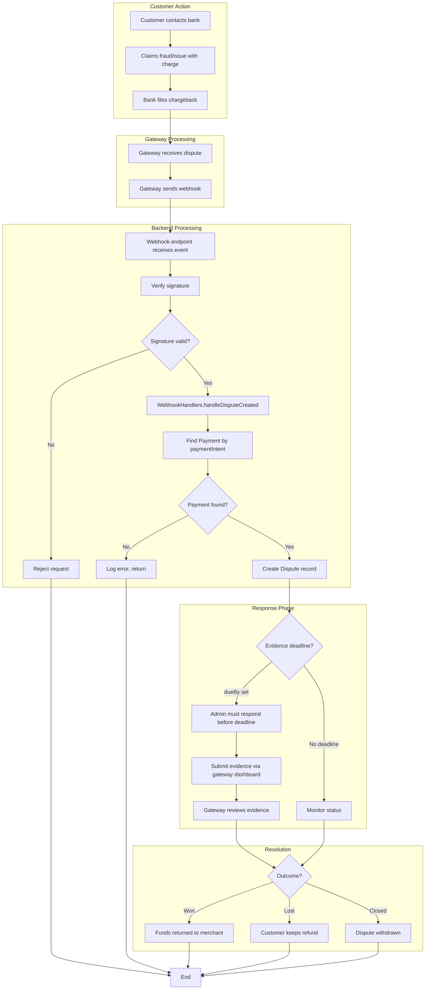
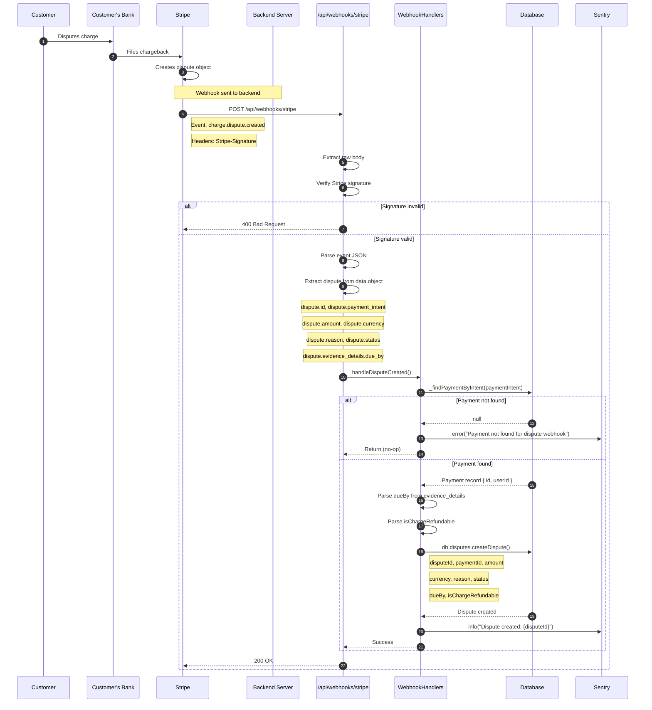
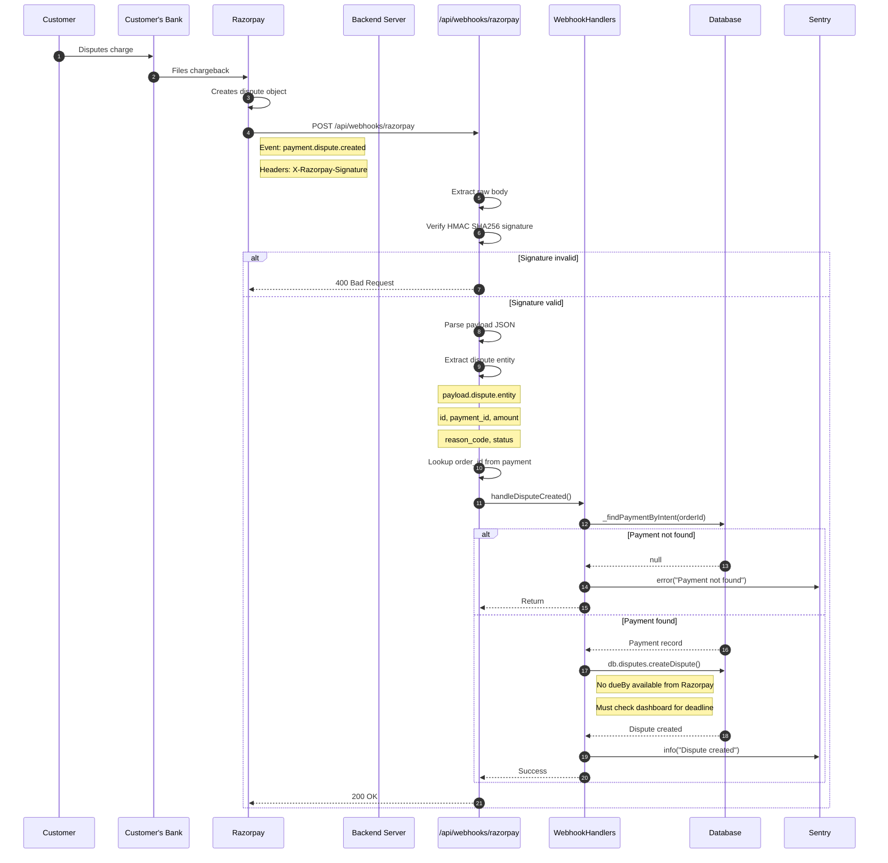
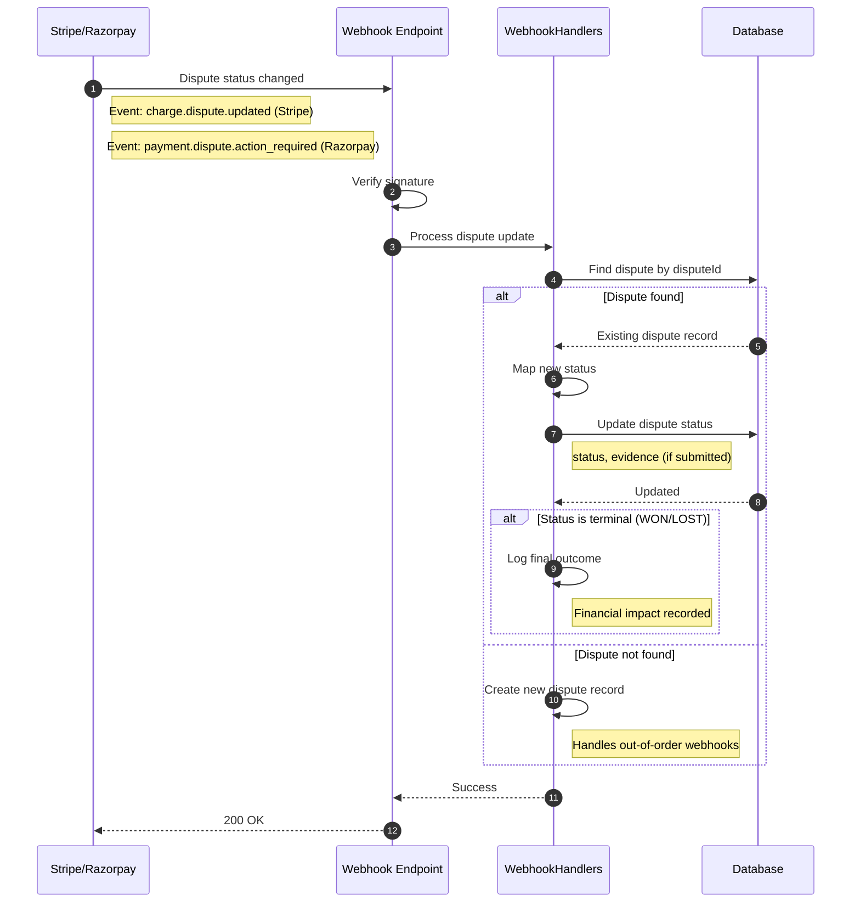
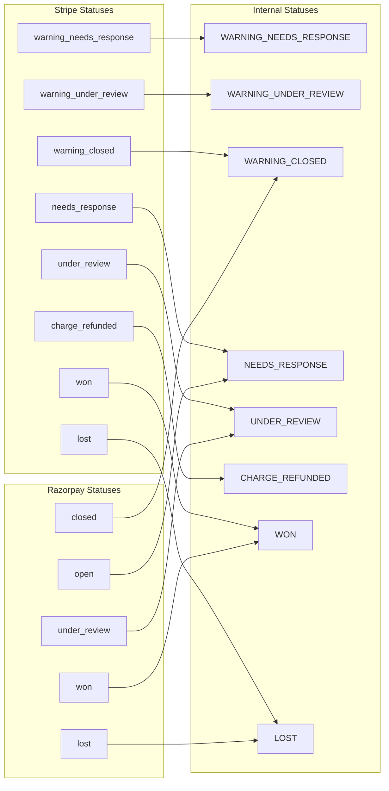
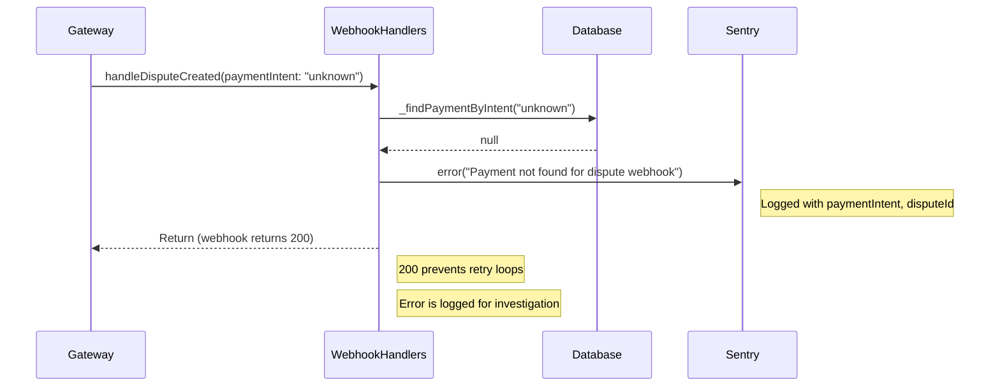
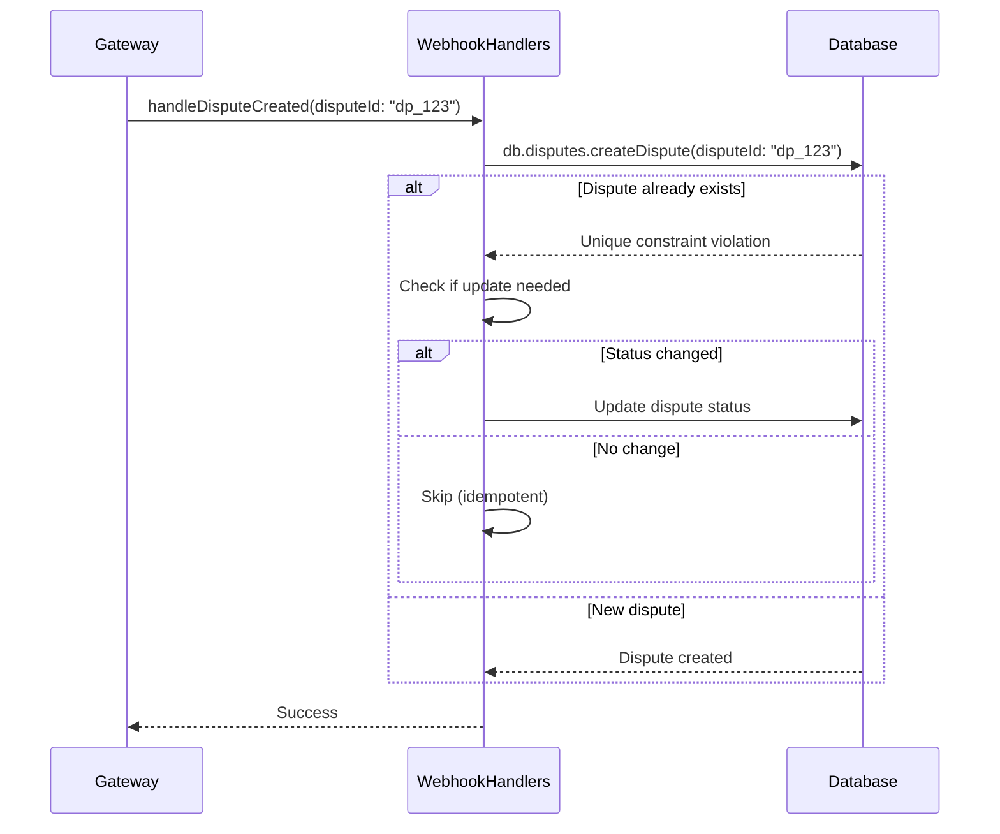
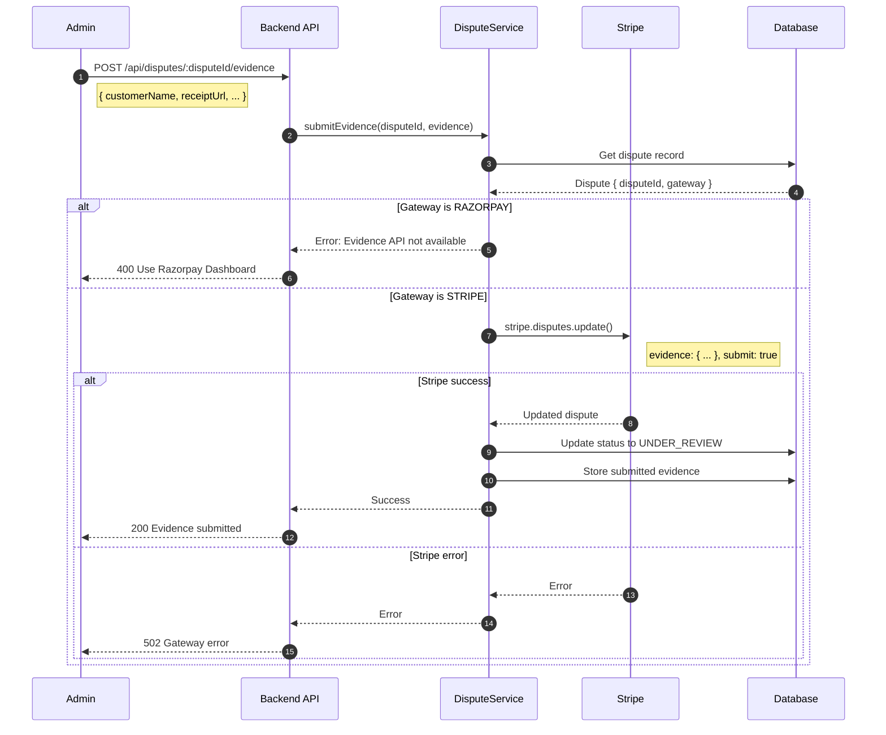
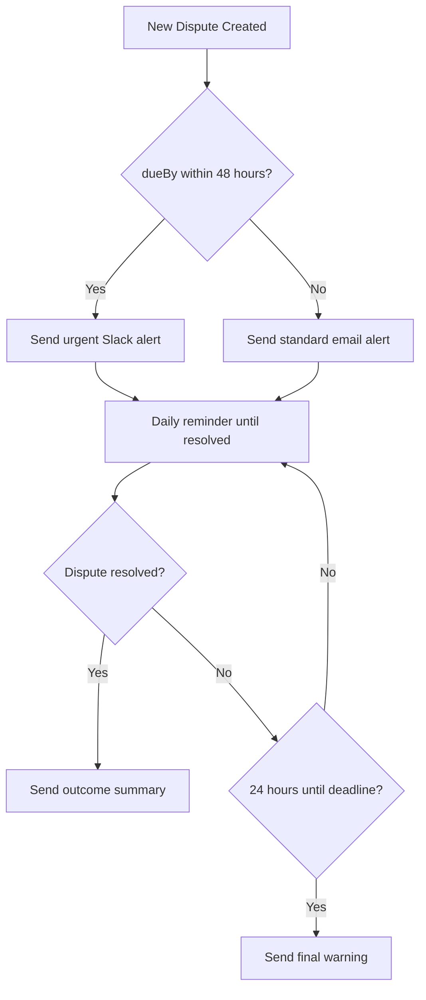

# Dispute Flows

## Overview

This document details the dispute processing flows for both Stripe and Razorpay gateways. Disputes are received via webhooks and tracked in the database for monitoring and resolution.

---

## End-to-End Dispute Lifecycle



---

## Stripe Dispute Webhook Flow

### Sequence Diagram: charge.dispute.created



### Stripe Dispute Event Payload

```
{
  "type": "charge.dispute.created",
  "data": {
    "object": {
      "id": "dp_xxx",
      "object": "dispute",
      "amount": 10000,
      "currency": "usd",
      "payment_intent": "pi_xxx",
      "reason": "fraudulent",
      "status": "needs_response",
      "evidence": { ... },
      "evidence_details": {
        "due_by": 1705363200,
        "has_evidence": false,
        "past_due": false,
        "submission_count": 0
      },
      "is_charge_refundable": true,
      "created": 1704758400
    }
  }
}
```

---

## Razorpay Dispute Webhook Flow

### Sequence Diagram: payment.dispute.created



### Razorpay Dispute Event Payload

```
{
  "event": "payment.dispute.created",
  "payload": {
    "dispute": {
      "entity": {
        "id": "disp_xxx",
        "payment_id": "pay_xxx",
        "amount": 100000,
        "currency": "INR",
        "amount_deducted": 100000,
        "reason_code": "chargeback",
        "status": "open",
        "phase": "chargeback",
        "created_at": 1704758400
      }
    },
    "payment": {
      "entity": {
        "id": "pay_xxx",
        "order_id": "order_xxx"
      }
    }
  }
}
```

---

## Dispute Status Updates

### Sequence Diagram: Dispute Updated



---

## Status Mapping



---

## Error Handling

### Payment Not Found



### Duplicate Dispute Webhook



---

## Evidence Submission Flow (TODO)

### Planned Implementation



### Evidence Fields

| Field | Type | Required | Description |
|-------|------|----------|-------------|
| `customer_name` | string | Yes | Customer's full name |
| `customer_email` | string | Yes | Customer's email address |
| `service_date` | string | Recommended | When service was provided |
| `receipt` | file | Recommended | Receipt or invoice |
| `service_documentation` | file | Recommended | Proof of delivery/completion |
| `customer_communication` | file | Optional | Relevant correspondence |

---

## Dispute Monitoring

### Dashboard Checklist

Since disputes require manual intervention via gateway dashboards, the team should:

1. **Daily Check**: Review open disputes in Stripe/Razorpay dashboards
2. **Deadline Tracking**: Note evidence deadlines (dueBy)
3. **Evidence Preparation**: Gather service documentation
4. **Response Submission**: Submit evidence before deadline
5. **Outcome Monitoring**: Track final resolution

### Future: Automated Alerts (TODO)



---

## Key Files

| File | Purpose |
|------|---------|
| `backend/routes/api/webhooks/stripe.dart` | Stripe webhook endpoint |
| `backend/routes/api/webhooks/razorpay.dart` | Razorpay webhook endpoint |
| `backend/lib/services/webhook_handlers.dart` | Dispute handling logic |
| `backend/lib/database/repositories/dispute_repository.dart` | Dispute database operations |
