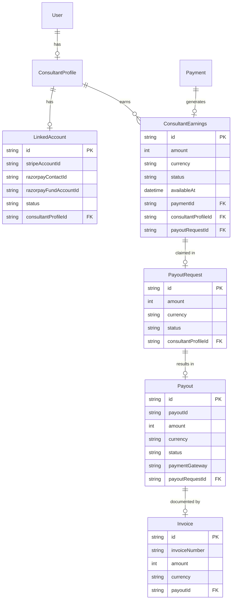
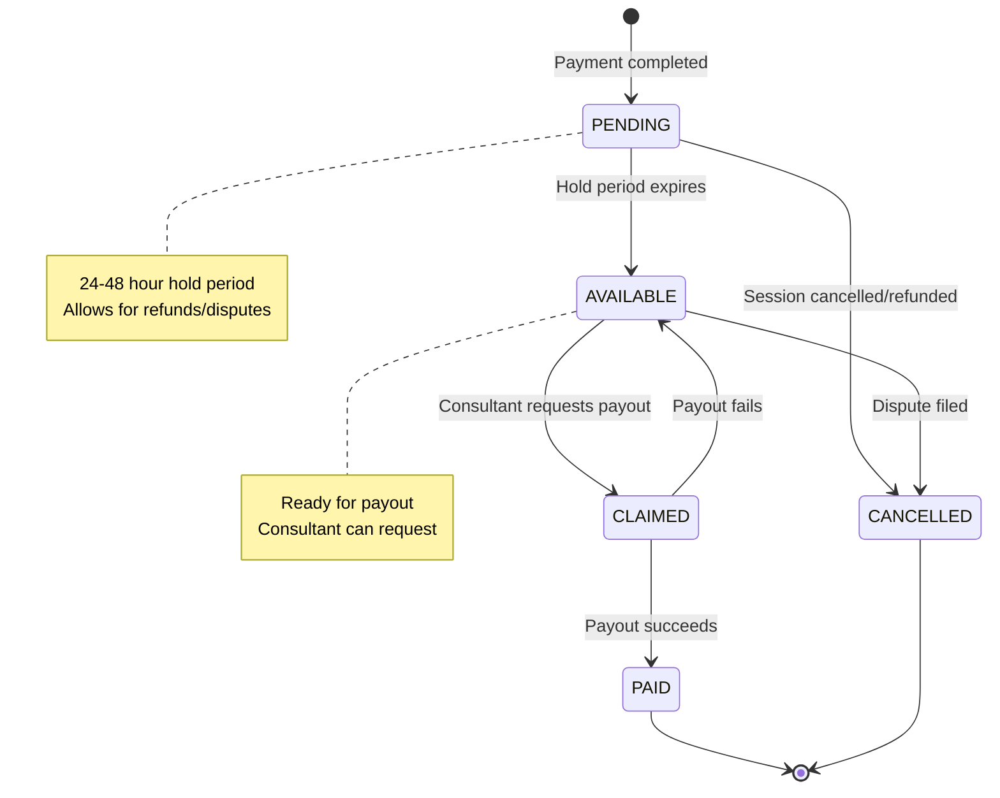
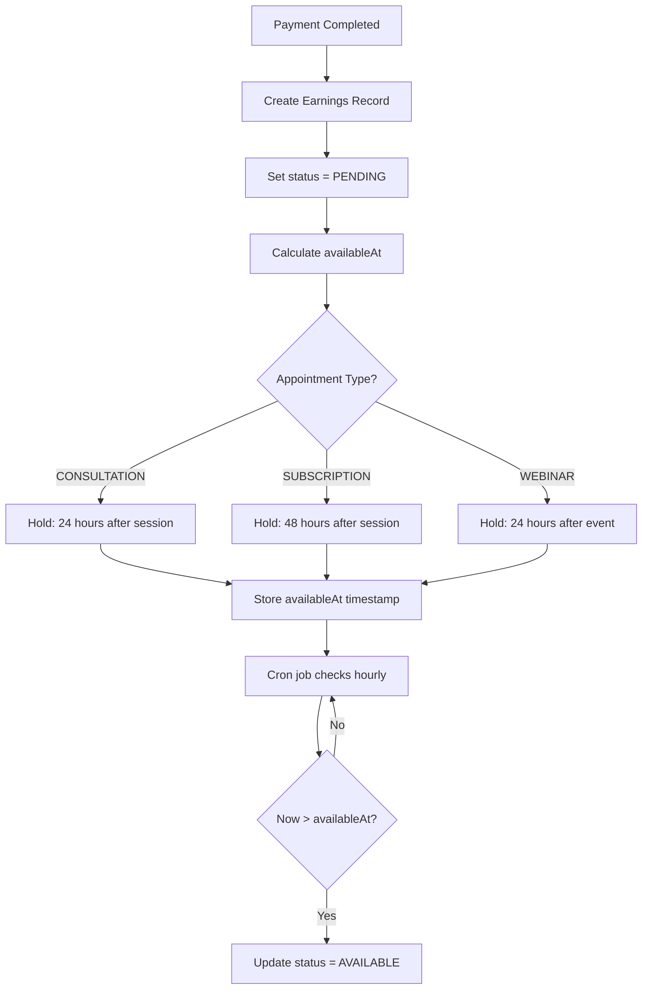
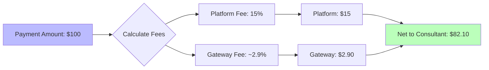
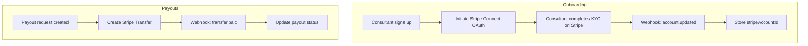
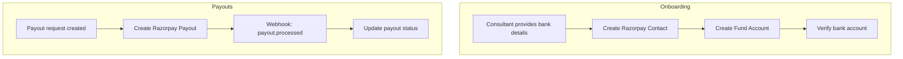

# Payouts Architecture

> **Status**: NOT IMPLEMENTED
>
> This document describes the planned payout system architecture. The actual implementation is pending.

## Overview

The payout system will enable transferring consultant earnings from platform-held funds to their bank accounts. This involves tracking earnings, applying hold periods, and executing transfers via payment gateways.

---

## Planned Data Model

### Entity Relationship Diagram (Planned)



---

## Planned Model Schemas

### LinkedAccount (TODO)

```
LinkedAccount {
  id                    String   @id @default(uuid())

  // Stripe Connect
  stripeAccountId       String?  // acct_xxx
  stripeAccountStatus   String?  // pending, verified, restricted

  // Razorpay
  razorpayContactId     String?  // cont_xxx
  razorpayFundAccountId String?  // fa_xxx

  // Verification
  kycVerified           Boolean  @default(false)
  bankAccountVerified   Boolean  @default(false)

  consultantProfileId   String   @unique @relation
  createdAt             DateTime @default(now())
  updatedAt             DateTime @updatedAt
}
```

### ConsultantEarnings (TODO)

```
ConsultantEarnings {
  id                   String   @id @default(uuid())
  amount               Int                     // Smallest currency unit
  currency             String
  status               EarningsStatus          // PENDING | AVAILABLE | CLAIMED | PAID
  availableAt          DateTime                // After hold period
  platformFee          Int                     // Platform cut
  netAmount            Int                     // After fee deduction

  paymentId            String   @relation      // Source payment
  consultantProfileId  String   @relation
  payoutRequestId      String?  @relation      // When claimed

  createdAt            DateTime @default(now())
  updatedAt            DateTime @updatedAt
}

enum EarningsStatus {
  PENDING     // Within hold period
  AVAILABLE   // Ready for payout
  CLAIMED     // In payout request
  PAID        // Payout completed
}
```

### PayoutRequest (TODO)

```
PayoutRequest {
  id                   String   @id @default(uuid())
  amount               Int                     // Total requested
  currency             String
  status               PayoutRequestStatus     // PENDING | PROCESSING | COMPLETED | FAILED

  consultantProfileId  String   @relation
  earnings             ConsultantEarnings[]
  payout               Payout?

  createdAt            DateTime @default(now())
  updatedAt            DateTime @updatedAt
}

enum PayoutRequestStatus {
  PENDING      // Awaiting processing
  PROCESSING   // Transfer in progress
  COMPLETED    // Successfully paid
  FAILED       // Transfer failed
  CANCELLED    // Cancelled by user/admin
}
```

### Payout (TODO)

```
Payout {
  id               String         @id @default(uuid())
  payoutId         String         @unique  // Gateway payout ID
  amount           Int
  currency         String
  status           PayoutStatus
  paymentGateway   PaymentGateway
  failureReason    String?

  payoutRequestId  String         @unique @relation
  invoice          Invoice?

  createdAt        DateTime       @default(now())
  updatedAt        DateTime       @updatedAt
}

enum PayoutStatus {
  PENDING      // Initiated
  IN_TRANSIT   // Processing by bank
  PAID         // Completed
  FAILED       // Failed
  CANCELLED    // Cancelled
}
```

---

## Earnings Flow (Planned)

### State Machine



### Hold Period Logic



---

## Platform Fee Structure (Planned)

### Fee Calculation



### Fee Configuration (Planned)

```dart
class FeeConfig {
  // Platform takes percentage of each transaction
  static const platformFeePercent = 15.0;

  // Gateway fees (estimated, actual deducted by gateway)
  static const stripeFeePercent = 2.9;
  static const stripeFeeFixed = 30; // cents
  static const razorpayFeePercent = 2.0;

  static int calculatePlatformFee(int amount) {
    return (amount * platformFeePercent / 100).round();
  }

  static int calculateNetEarnings(int amount) {
    return amount - calculatePlatformFee(amount);
  }
}
```

---

## Gateway Integration (Planned)

### Stripe Connect



### Stripe Connect Account Types

| Type | Use Case | Features |
|------|----------|----------|
| Express | Quick setup | Stripe handles KYC, limited customization |
| Standard | Full Stripe access | Consultant manages own Stripe account |
| Custom | Full control | Platform handles KYC (more work) |

**Recommendation**: Express accounts for simplicity

### Razorpay Payouts



### Razorpay Payout Modes

| Mode | Speed | Fee |
|------|-------|-----|
| NEFT | 2-4 hours | Lower |
| RTGS | 30 minutes | Higher |
| IMPS | Instant | Highest |
| UPI | Instant | Low |

---

## API Endpoints (Planned)

| Endpoint | Method | Description |
|----------|--------|-------------|
| `/api/payouts/accounts` | POST | Link payout account |
| `/api/payouts/accounts` | GET | Get linked account status |
| `/api/payouts/earnings` | GET | Get available earnings |
| `/api/payouts/request` | POST | Request payout |
| `/api/payouts/history` | GET | Get payout history |
| `/api/webhooks/stripe-connect` | POST | Stripe Connect webhooks |

---

## Invoice Generation (Planned)

### Invoice Fields

| Field | Description |
|-------|-------------|
| `invoiceNumber` | Sequential: FAM-2024-00001 |
| `consultantName` | Consultant legal name |
| `consultantPAN` | Tax ID (India) |
| `amount` | Gross payout amount |
| `platformFee` | Platform fee deducted |
| `netAmount` | Net amount transferred |
| `bankDetails` | Masked bank account |
| `period` | Earnings period covered |

---

## Implementation Checklist

### Phase 1: Account Linking
- [ ] LinkedAccount model
- [ ] Stripe Connect OAuth flow
- [ ] Razorpay Contact/FundAccount creation
- [ ] KYC verification tracking
- [ ] Account linking UI

### Phase 2: Earnings Tracking
- [ ] ConsultantEarnings model
- [ ] Earnings creation on payment success
- [ ] Hold period logic
- [ ] Platform fee calculation
- [ ] Earnings release cron job

### Phase 3: Payout Execution
- [ ] PayoutRequest model
- [ ] Payout model
- [ ] Stripe Transfer API integration
- [ ] Razorpay Payout API integration
- [ ] Payout webhooks

### Phase 4: Invoicing
- [ ] Invoice model
- [ ] Invoice generation service
- [ ] PDF generation
- [ ] Email delivery

### Phase 5: Consultant Dashboard
- [ ] Earnings overview
- [ ] Payout request UI
- [ ] Payout history
- [ ] Invoice downloads

---

## External Documentation

### Stripe Connect
- [Stripe Connect Overview](https://stripe.com/docs/connect)
- [Express Accounts](https://stripe.com/docs/connect/express-accounts)
- [Transfers](https://stripe.com/docs/connect/charges-transfers)

### Razorpay Payouts
- [Razorpay Payouts Overview](https://razorpay.com/docs/payouts/)
- [Contacts API](https://razorpay.com/docs/api/x/contacts/)
- [Fund Accounts](https://razorpay.com/docs/api/x/fund-accounts/)

---

## Key Files (To Be Created)

| File | Purpose |
|------|---------|
| `backend/lib/services/payout_service.dart` | Payout business logic |
| `backend/lib/services/earnings_service.dart` | Earnings tracking |
| `backend/routes/api/payouts/` | Payout API routes |
| `lib/features/payouts/` | Mobile payout UI |
