# Payout Flows

> **Status**: NOT IMPLEMENTED
>
> This document describes the planned payout flows. The actual implementation is pending.

## Overview

This document details the planned flows for consultant account onboarding, earnings tracking, payout requests, and payout execution.

---

## End-to-End Payout Lifecycle (Planned)

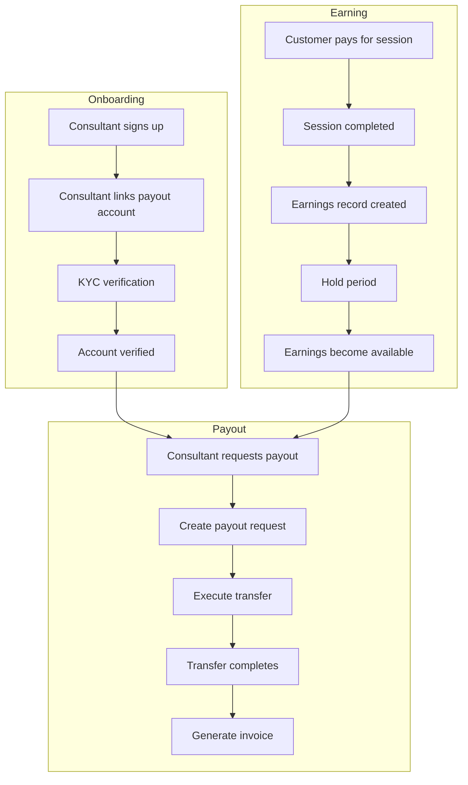

---

## Account Onboarding Flow (Planned)

### Stripe Connect Express

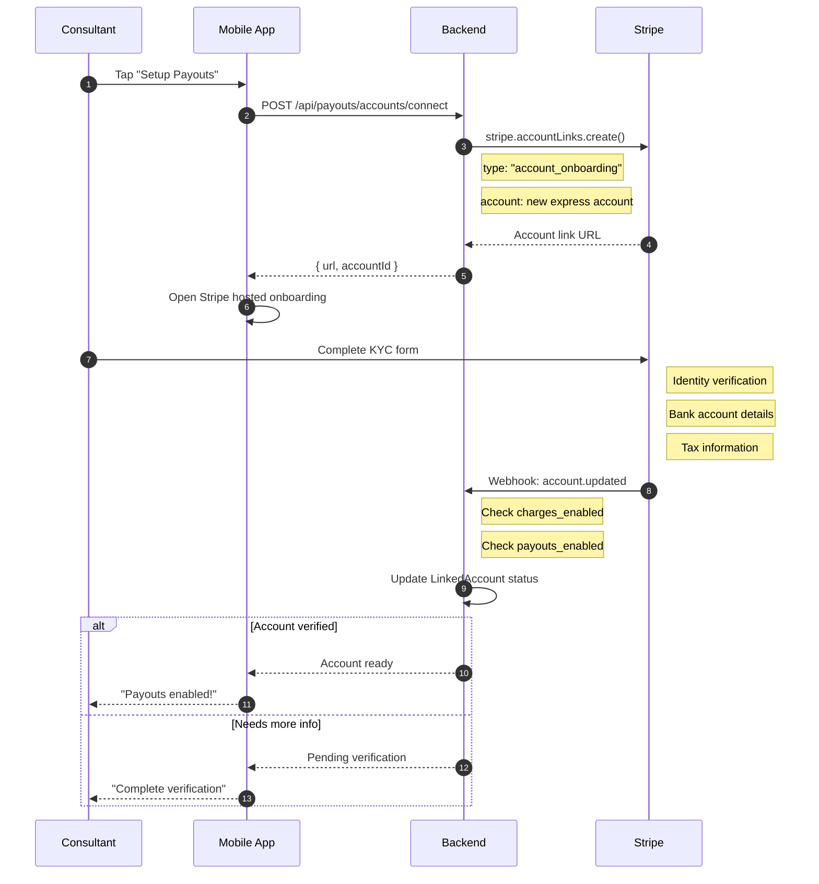

### Razorpay Contact + Fund Account

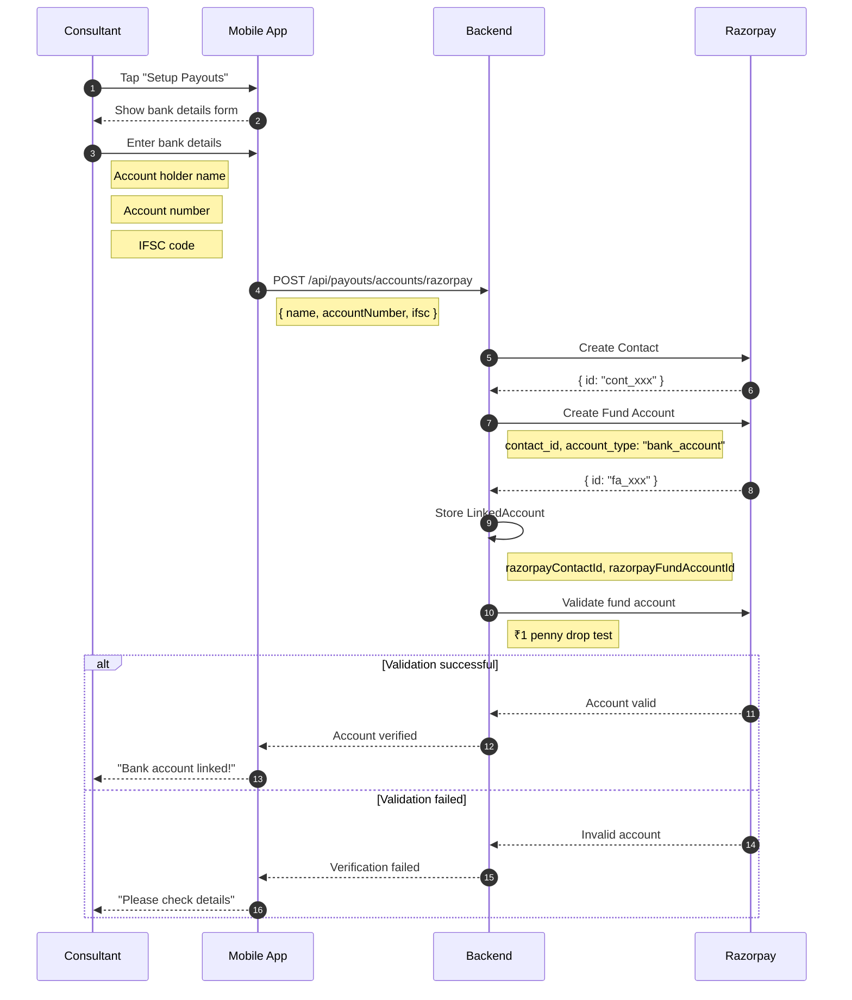

---

## Earnings Generation Flow (Planned)

### On Payment Success

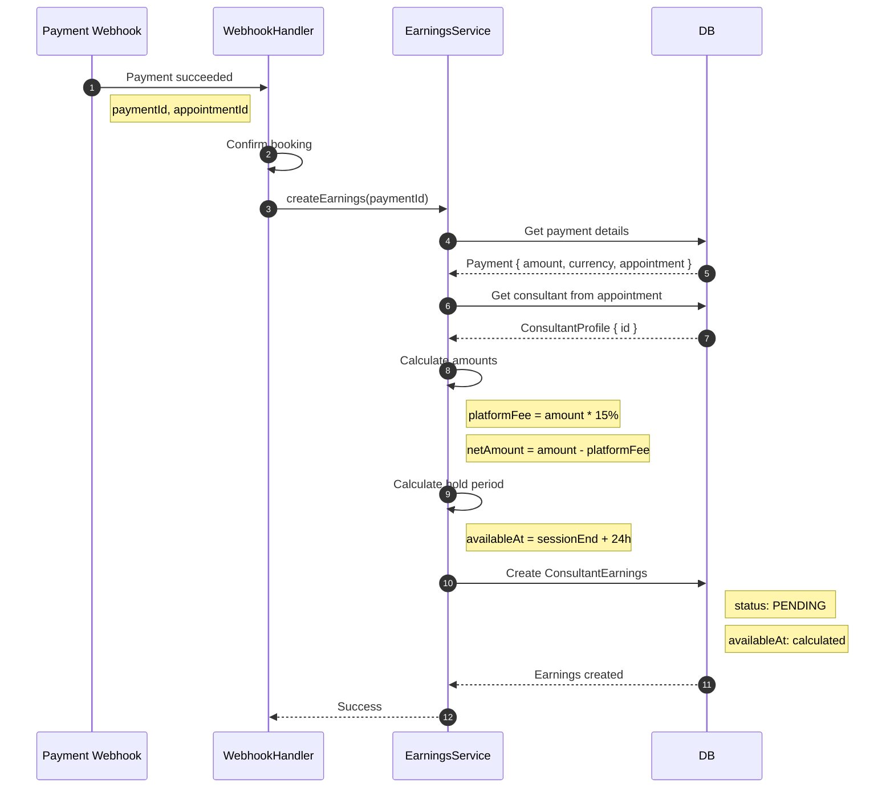

### Earnings Release Cron (Planned)

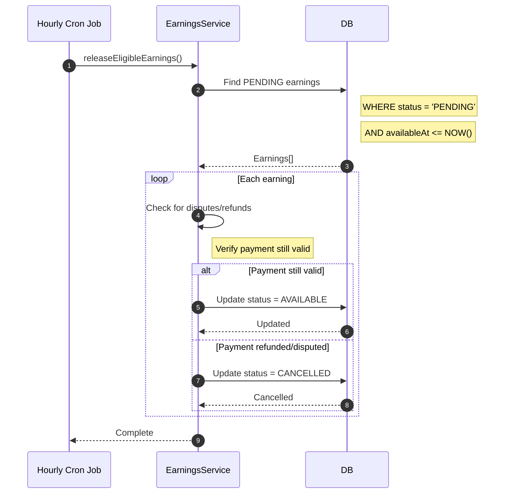

---

## Payout Request Flow (Planned)

### Consultant Requests Payout

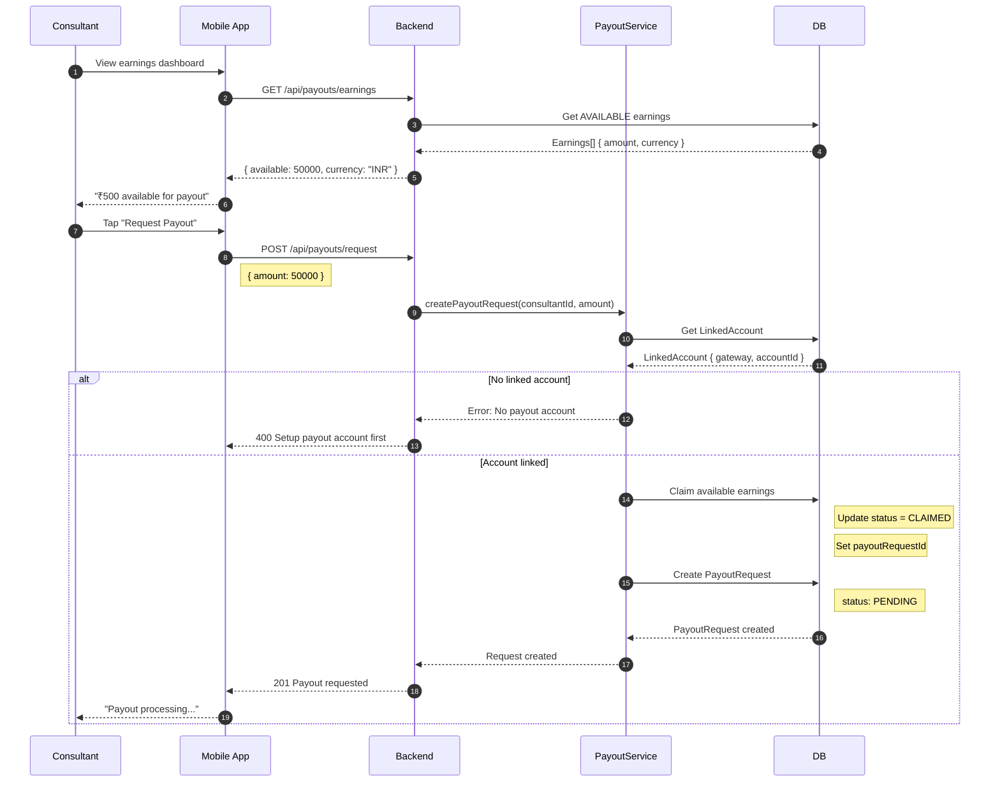

---

## Payout Execution Flow (Planned)

### Stripe Transfer

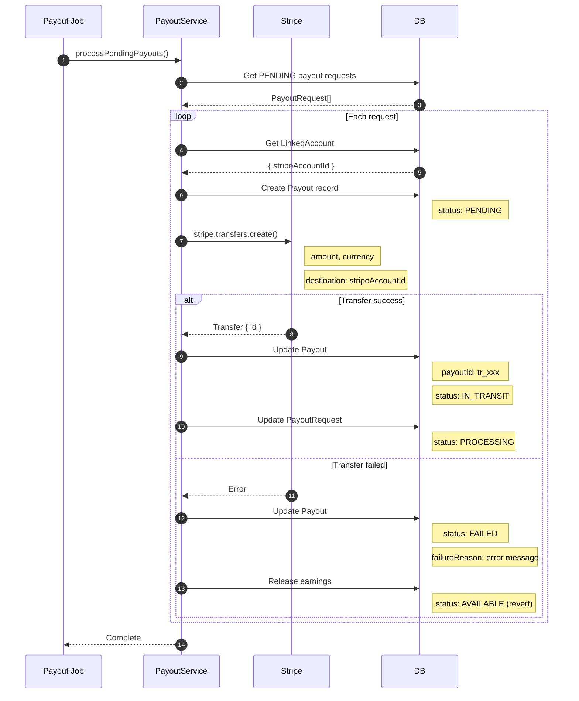

### Stripe Payout Webhook

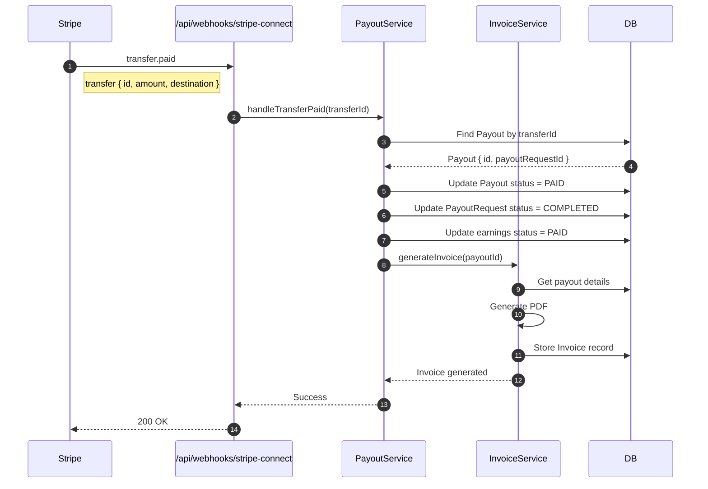

### Razorpay Payout

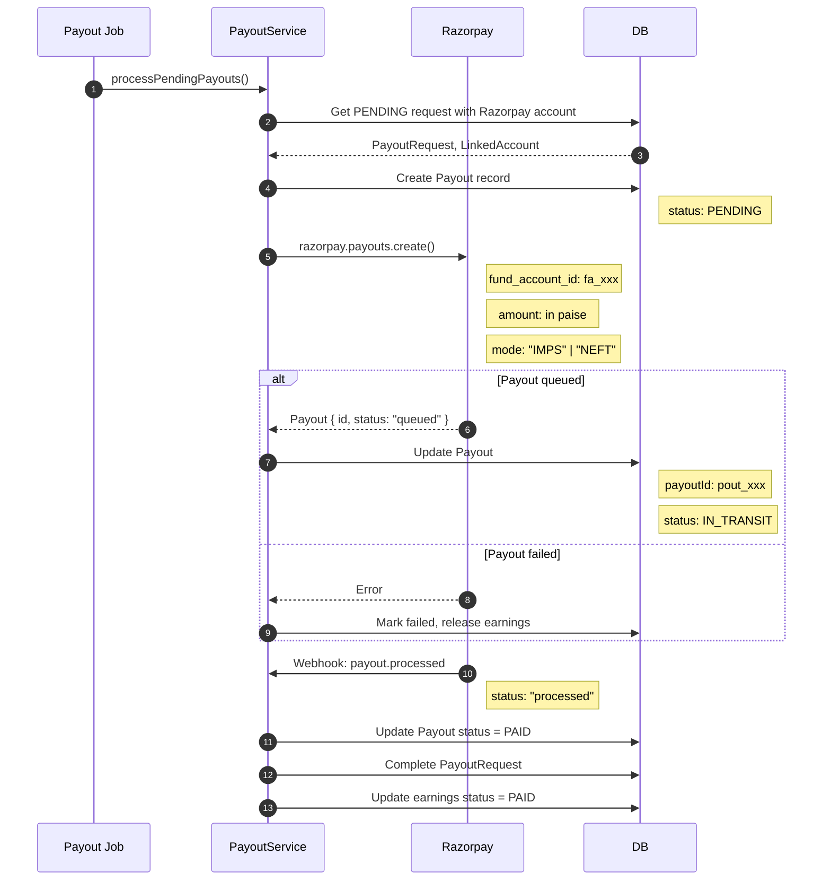

---

## Invoice Generation Flow (Planned)

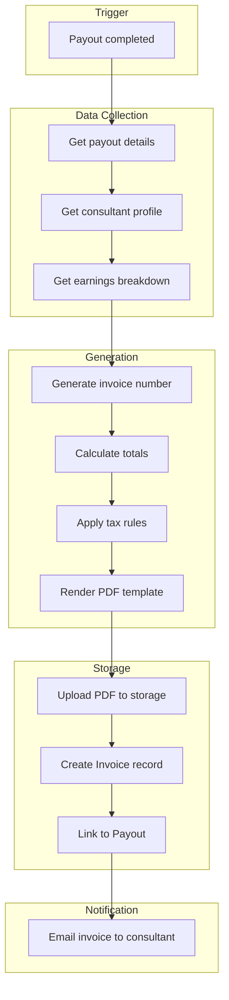

### Invoice Template (Planned)

```
╔════════════════════════════════════════════════════════════╗
║                       PAYOUT INVOICE                        ║
║                                                             ║
║  Invoice #: FAM-2024-00042                                  ║
║  Date: January 15, 2024                                     ║
║                                                             ║
╠═════════════════════════════════════════════════════════════╣
║  Consultant: Dr. Jane Smith                                 ║
║  PAN: ABCDE1234F                                            ║
║  Bank: HDFC ****1234                                        ║
╠═════════════════════════════════════════════════════════════╣
║                                                             ║
║  EARNINGS SUMMARY                                           ║
║  ─────────────────────────────────────────────────────────  ║
║  Consultations (5)              ₹10,000.00                  ║
║  Subscriptions (2)               ₹5,000.00                  ║
║                                 ───────────                  ║
║  Gross Earnings                 ₹15,000.00                  ║
║                                                             ║
║  DEDUCTIONS                                                  ║
║  ─────────────────────────────────────────────────────────  ║
║  Platform Fee (15%)             -₹2,250.00                  ║
║  TDS (10%)                      -₹1,275.00                  ║
║                                 ───────────                  ║
║  Total Deductions               -₹3,525.00                  ║
║                                                             ║
║  NET PAYOUT                     ₹11,475.00                  ║
║                                                             ║
╠═════════════════════════════════════════════════════════════╣
║  Transfer ID: pout_H2xWz3abc123def                          ║
║  Transfer Date: January 15, 2024 14:30 IST                  ║
║  Mode: IMPS                                                  ║
╚═════════════════════════════════════════════════════════════╝
```

---

## Error Handling (Planned)

### Payout Failure Recovery

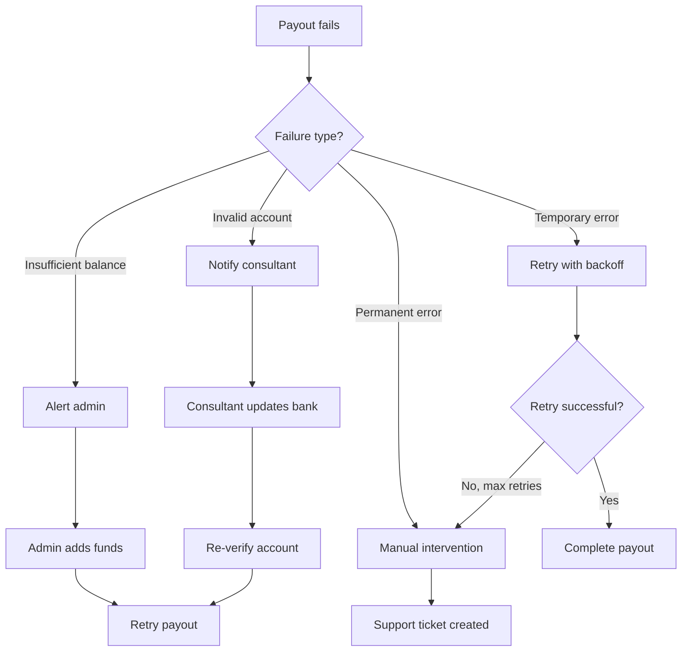

---

## Implementation Checklist

### Phase 1: Account Linking
- [ ] POST /api/payouts/accounts/connect (Stripe)
- [ ] POST /api/payouts/accounts/razorpay
- [ ] GET /api/payouts/accounts
- [ ] Stripe Connect webhook handling
- [ ] Account verification status tracking

### Phase 2: Earnings
- [ ] Earnings creation in payment webhook
- [ ] Platform fee calculation
- [ ] Hold period logic
- [ ] Earnings release cron job
- [ ] GET /api/payouts/earnings

### Phase 3: Payouts
- [ ] POST /api/payouts/request
- [ ] Payout execution job
- [ ] Stripe Transfer integration
- [ ] Razorpay Payout integration
- [ ] Payout webhooks

### Phase 4: Invoicing
- [ ] Invoice number generation
- [ ] PDF template
- [ ] Invoice storage
- [ ] Email delivery

### Phase 5: Dashboard
- [ ] Earnings overview UI
- [ ] Payout request UI
- [ ] Payout history
- [ ] Invoice downloads

---

## Key Files (To Be Created)

| File | Purpose |
|------|---------|
| `backend/lib/services/payout_service.dart` | Payout orchestration |
| `backend/lib/services/earnings_service.dart` | Earnings tracking |
| `backend/lib/services/invoice_service.dart` | Invoice generation |
| `backend/routes/api/payouts/accounts.dart` | Account linking endpoints |
| `backend/routes/api/payouts/request.dart` | Payout request endpoint |
| `backend/routes/api/payouts/earnings.dart` | Earnings endpoint |
| `backend/routes/api/webhooks/stripe-connect.dart` | Connect webhooks |
| `lib/features/payouts/` | Mobile payout UI |
