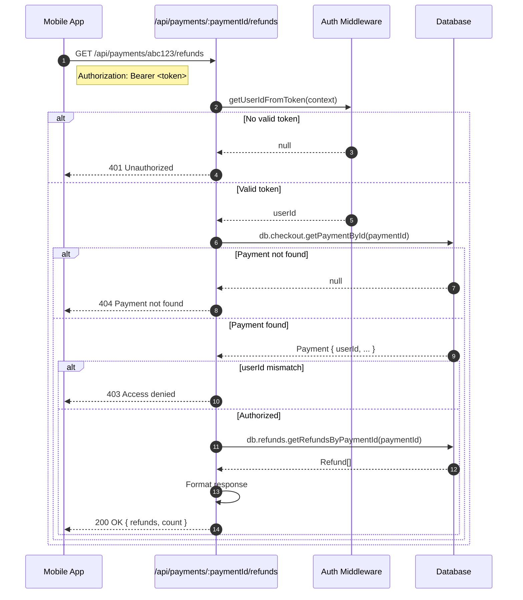

# Refunds API Reference

## Overview

This document covers the current refund API endpoints and planned future endpoints.

---

## Current Endpoints

### GET /api/payments/:paymentId/refunds

Retrieve all refunds associated with a payment.

#### Authentication

Requires valid JWT token in `Authorization` header.

#### Authorization

User must own the payment (payment.userId === authenticated user).

#### Request

```
GET /api/payments/abc123-def456/refunds
Authorization: Bearer <jwt_token>
```

#### Response (Success - 200)

```json
{
  "paymentId": "abc123-def456",
  "refunds": [
    {
      "id": "uuid-refund-1",
      "refundId": "re_3OdP1x2eZvKYlo2C0ABC123",
      "amount": 5000,
      "currency": "USD",
      "status": "SUCCEEDED",
      "reason": "requested_by_customer",
      "paymentGateway": "STRIPE",
      "createdAt": "2024-01-15T10:30:00Z"
    },
    {
      "id": "uuid-refund-2",
      "refundId": "re_3OdP1x2eZvKYlo2C0XYZ789",
      "amount": 2500,
      "currency": "USD",
      "status": "PENDING",
      "reason": null,
      "paymentGateway": "STRIPE",
      "createdAt": "2024-01-16T14:00:00Z"
    }
  ],
  "count": 2
}
```

#### Response (Unauthorized - 401)

```json
{
  "error": {
    "message": "Unauthorized"
  }
}
```

#### Response (Payment Not Found - 404)

```json
{
  "error": {
    "message": "Payment not found"
  }
}
```

#### Response (Access Denied - 403)

```json
{
  "error": {
    "message": "Access denied"
  }
}
```

#### Response (Server Error - 500)

```json
{
  "error": {
    "message": "Failed to fetch refunds",
    "details": "Error description..."
  }
}
```

---

### Sequence Diagram: GET Refunds



---

## Response Field Reference

### Refund Object

| Field | Type | Description |
|-------|------|-------------|
| `id` | string | Internal UUID for the refund record |
| `refundId` | string | Gateway-specific refund ID (e.g., `re_xxx` for Stripe) |
| `amount` | integer | Refund amount in smallest currency unit |
| `currency` | string | ISO 4217 currency code (e.g., "USD", "INR") |
| `status` | RefundStatus | Current refund status |
| `reason` | string? | Optional reason for the refund |
| `paymentGateway` | string | Gateway used: "STRIPE" or "RAZORPAY" |
| `createdAt` | ISO8601 | Timestamp when refund was recorded |

### RefundStatus Enum

| Value | Description |
|-------|-------------|
| `PENDING` | Refund initiated, awaiting processing |
| `SUCCEEDED` | Refund completed successfully |
| `FAILED` | Refund could not be processed |
| `CANCELLED` | Refund was cancelled |

---

## Future Endpoints (TODO)

### POST /api/refunds

> **Status**: Not Implemented

Initiate a refund programmatically from the backend.

#### Planned Request

```
POST /api/refunds
Authorization: Bearer <jwt_token>
Content-Type: application/json

{
  "paymentId": "abc123-def456",
  "amount": 5000,
  "reason": "Customer request"
}
```

#### Planned Validation Rules

| Rule | Description |
|------|-------------|
| Payment exists | Payment must exist in database |
| User owns payment | User must be payment owner or admin |
| Payment succeeded | Can only refund SUCCEEDED payments |
| Amount valid | `amount <= (payment.amount - totalRefunded)` |
| Currency match | Refund currency must match payment |

#### Planned Response (Success - 201)

```json
{
  "id": "uuid-refund-new",
  "refundId": "re_newrefund123",
  "amount": 5000,
  "currency": "USD",
  "status": "PENDING",
  "reason": "Customer request",
  "paymentGateway": "STRIPE",
  "createdAt": "2024-01-17T09:00:00Z"
}
```

#### Planned Error Responses

| Code | Condition |
|------|-----------|
| 400 | Invalid amount or missing fields |
| 403 | User doesn't own payment |
| 404 | Payment not found |
| 409 | Refund would exceed payment amount |
| 502 | Gateway API error |

---

### GET /api/refunds/:refundId

> **Status**: Not Implemented

Get a specific refund by ID.

#### Planned Request

```
GET /api/refunds/uuid-refund-1
Authorization: Bearer <jwt_token>
```

#### Planned Response

```json
{
  "id": "uuid-refund-1",
  "refundId": "re_3OdP1x2eZvKYlo2C0ABC123",
  "amount": 5000,
  "currency": "USD",
  "status": "SUCCEEDED",
  "reason": "requested_by_customer",
  "paymentGateway": "STRIPE",
  "paymentId": "abc123-def456",
  "createdAt": "2024-01-15T10:30:00Z",
  "updatedAt": "2024-01-15T10:31:00Z"
}
```

---

## Mobile App Usage

### Fetching Refunds (Dart)

```dart
// lib/data/datasources/remote/payment_remote_source.dart

Future<List<RefundModel>> getRefundsByPaymentId(String paymentId) async {
  final response = await dio.get(
    '/api/payments/$paymentId/refunds',
    options: Options(headers: {'Authorization': 'Bearer $token'}),
  );

  if (response.statusCode == 200) {
    final data = response.data;
    return (data['refunds'] as List)
        .map((r) => RefundModel.fromJson(r))
        .toList();
  }

  throw PaymentException('Failed to fetch refunds');
}
```

### RefundModel (Dart)

```dart
@freezed
class Refund with _$Refund {
  const factory Refund({
    required String id,
    required String refundId,
    required int amount,
    required String currency,
    required RefundStatus status,
    String? reason,
    required String paymentGateway,
    required DateTime createdAt,
  }) = _Refund;
}

enum RefundStatus {
  pending,
  succeeded,
  failed,
  cancelled,
}
```

---

## Error Codes

| HTTP Code | Error | Cause |
|-----------|-------|-------|
| 401 | Unauthorized | Missing or invalid JWT token |
| 403 | Access denied | User doesn't own the payment |
| 404 | Payment not found | Invalid paymentId |
| 500 | Internal server error | Database or server issue |

---

## Key Files

| File | Purpose |
|------|---------|
| `backend/routes/api/payments/[paymentId]/refunds.dart` | Current GET endpoint |
| `lib/data/datasources/remote/payment_remote_source.dart` | Mobile API client (TODO) |
| `lib/domain/entities/refund.dart` | Refund entity (TODO) |
