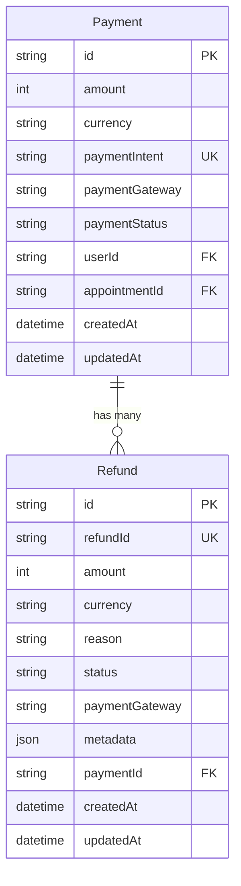
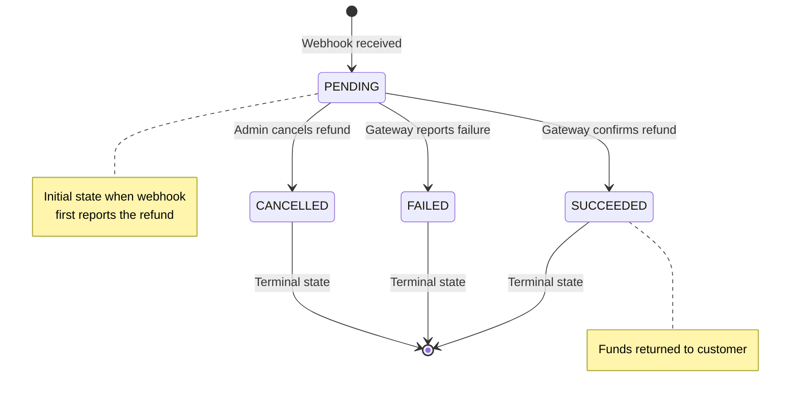
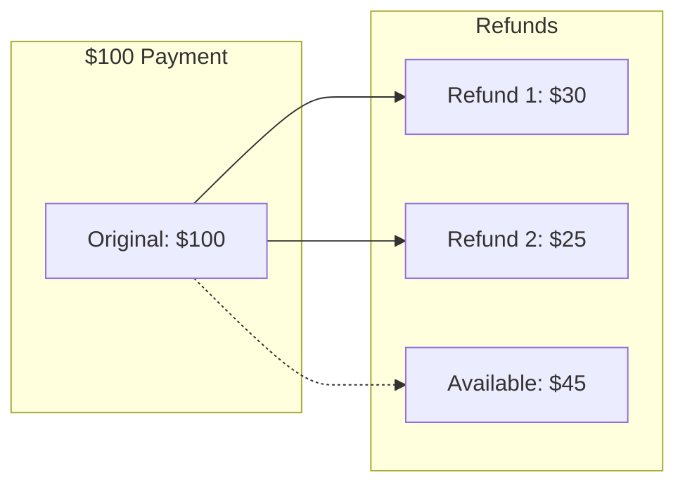

# Refunds Architecture

## Overview

The refund system tracks refunds initiated through payment gateway dashboards (Stripe/Razorpay) and received via webhooks. Currently, the system is **read-only** - refunds are initiated manually in gateway dashboards, not programmatically from the backend.

---

## Data Model

### Entity Relationship Diagram



### Refund Model Schema

```
Refund {
  id             String         @id @default(uuid())
  refundId       String         @unique    // Gateway-specific ID
  amount         Int                       // Smallest currency unit
  currency       String                    // ISO currency code
  reason         String?                   // Optional reason
  status         RefundStatus              // PENDING | SUCCEEDED | FAILED | CANCELLED
  paymentGateway PaymentGateway            // STRIPE | RAZORPAY
  metadata       Json?                     // Gateway-specific data
  paymentId      String         @relation  // Links to Payment
  createdAt      DateTime       @default(now())
  updatedAt      DateTime       @updatedAt
}
```

---

## RefundStatus State Machine



### Status Definitions

| Status | Description | Source |
|--------|-------------|--------|
| `PENDING` | Refund initiated but not yet processed by bank | Webhook event |
| `SUCCEEDED` | Refund completed, funds returned to customer | Webhook event |
| `FAILED` | Refund could not be processed | Webhook event |
| `CANCELLED` | Refund was cancelled before processing | Webhook event |

---

## Gateway ID Patterns

| Gateway | Refund ID Pattern | Example |
|---------|-------------------|---------|
| Stripe | `re_*` | `re_3OdP1x2eZvKYlo2C0ABC123` |
| Razorpay | `rfnd_*` | `rfnd_H2xWz3abc123def` |

These patterns help identify the source gateway when viewing refund records.

---

## Amount Handling

Refund amounts are stored in the **smallest currency unit**:

| Currency | Unit | Example: $50.00 |
|----------|------|-----------------|
| USD | cents | 5000 |
| EUR | cents | 5000 |
| GBP | pence | 5000 |
| INR | paise | 500000 |
| JPY | yen | 5000 (no decimals) |

### Conversion Functions (Pseudo-code)

```
convertToSmallestUnit(amount, currency):
  if currency in ['JPY', 'KRW', 'VND']:
    return amount  // No decimal currencies
  return amount * 100

convertFromSmallestUnit(amount, currency):
  if currency in ['JPY', 'KRW', 'VND']:
    return amount
  return amount / 100
```

---

## Partial Refunds

The system supports partial refunds:

- A single `Payment` can have multiple `Refund` records
- Total refunded amount should not exceed original payment amount
- Each refund is tracked independently with its own status



---

## Current Limitations

| Limitation | Description | Status |
|------------|-------------|--------|
| No programmatic refunds | Cannot initiate refunds from backend | TODO |
| No refund policies | No automatic validation of refund windows | TODO |
| No user notifications | Users not notified when refund completes | TODO |
| No reconciliation job | Stuck PENDING refunds not auto-recovered | TODO |

---

## Key Files

| File | Purpose |
|------|---------|
| `backend/lib/services/webhook_handlers.dart` | Refund webhook processing |
| `backend/routes/api/payments/[paymentId]/refunds.dart` | Refund visibility API |
| `backend/lib/generated/models/refund.dart` | Refund model |
| `backend/lib/generated/models/refund_status.dart` | RefundStatus enum |
