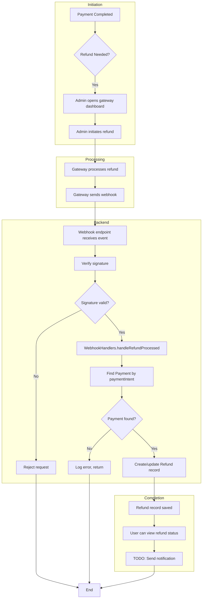
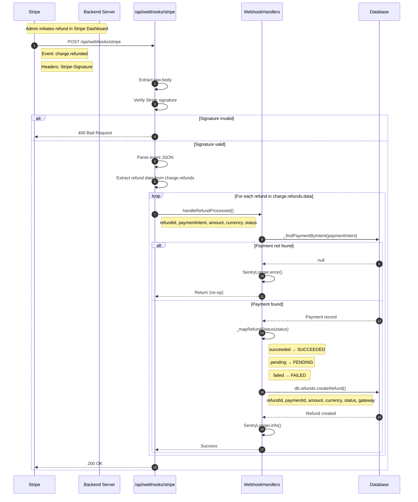
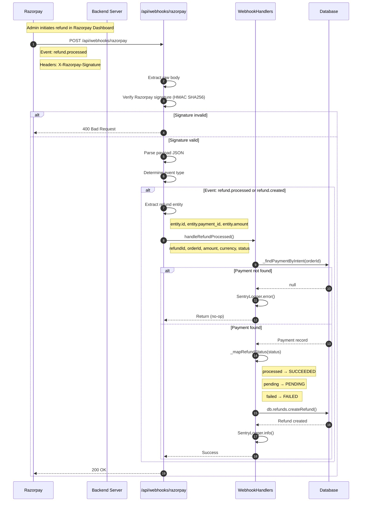
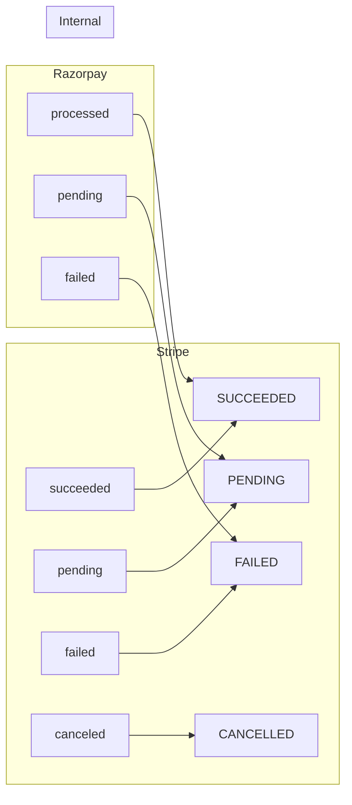
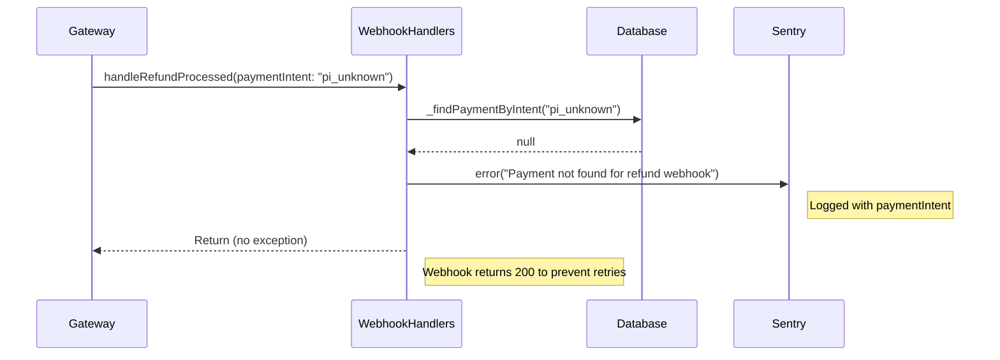
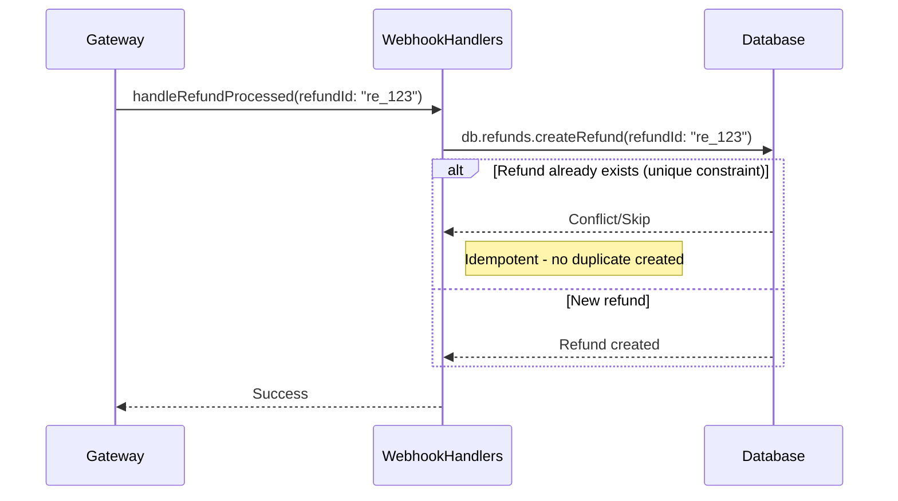
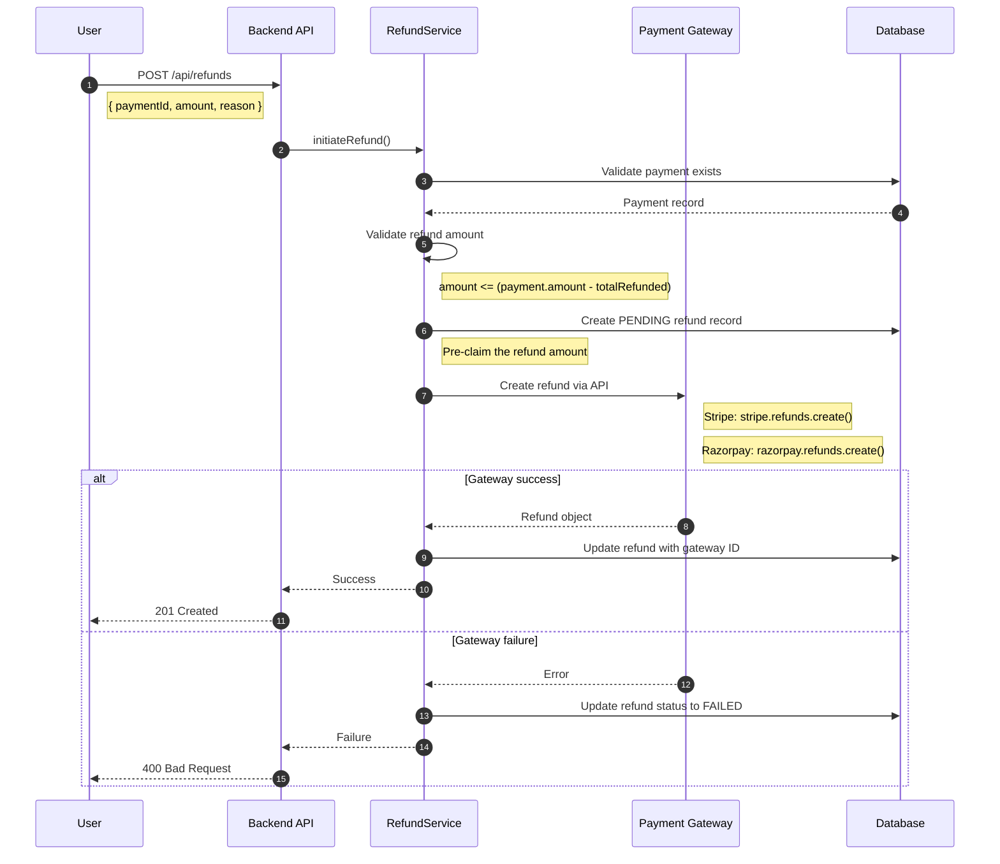

# Refund Flows

## Overview

This document details the refund processing flows for both Stripe and Razorpay gateways. Currently, refunds are initiated manually through gateway dashboards and processed via webhooks.

---

## End-to-End Refund Lifecycle



---

## Stripe Refund Webhook Flow

### Sequence Diagram



### Stripe Event Payload Structure

```
{
  "type": "charge.refunded",
  "data": {
    "object": {
      "id": "ch_xxx",
      "payment_intent": "pi_xxx",
      "refunds": {
        "data": [
          {
            "id": "re_xxx",
            "amount": 5000,
            "currency": "usd",
            "status": "succeeded",
            "reason": "requested_by_customer"
          }
        ]
      }
    }
  }
}
```

---

## Razorpay Refund Webhook Flow

### Sequence Diagram



### Razorpay Event Payload Structure

```
{
  "event": "refund.processed",
  "payload": {
    "refund": {
      "entity": {
        "id": "rfnd_xxx",
        "payment_id": "pay_xxx",
        "amount": 50000,
        "currency": "INR",
        "status": "processed",
        "notes": {}
      }
    },
    "payment": {
      "entity": {
        "id": "pay_xxx",
        "order_id": "order_xxx"
      }
    }
  }
}
```

---

## Status Mapping Logic



### Mapping Function (Pseudo-code)

```
_mapRefundStatus(gatewayStatus):
  switch gatewayStatus.toLowerCase():
    case 'succeeded':
    case 'processed':
      return 'SUCCEEDED'
    case 'pending':
      return 'PENDING'
    case 'failed':
      return 'FAILED'
    case 'cancelled':
    case 'canceled':
      return 'CANCELLED'
    default:
      return 'PENDING'  // Safe default
```

---

## Error Handling

### Scenario: Payment Not Found



### Scenario: Duplicate Refund Webhook



---

## Future Implementation: Programmatic Refunds

### Planned Flow (TODO)



---

## Key Files

| File | Purpose |
|------|---------|
| `backend/routes/api/webhooks/stripe.dart` | Stripe webhook endpoint |
| `backend/routes/api/webhooks/razorpay.dart` | Razorpay webhook endpoint |
| `backend/lib/services/webhook_handlers.dart` | Shared webhook processing logic |
| `backend/lib/database/repositories/refund_repository.dart` | Refund database operations |
